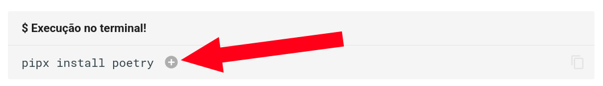
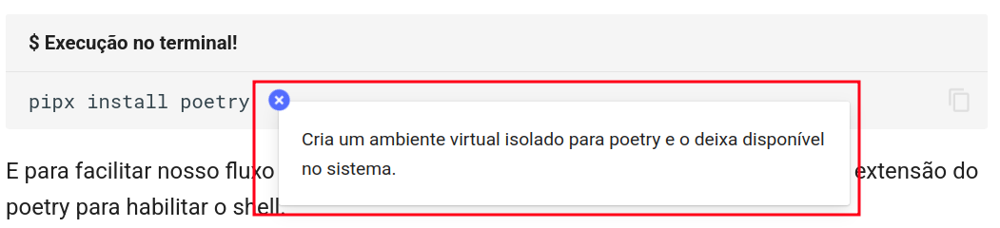
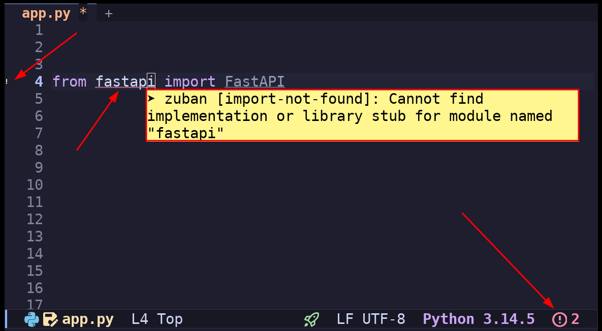
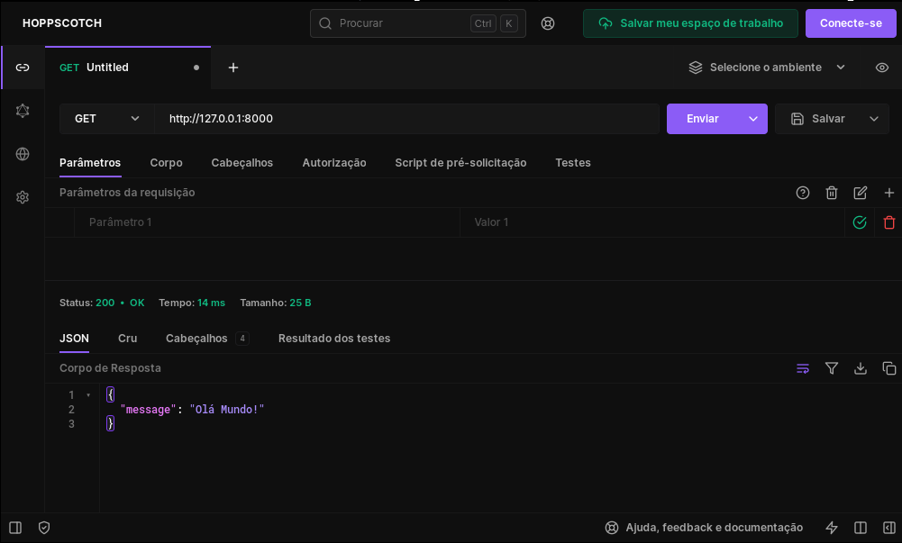
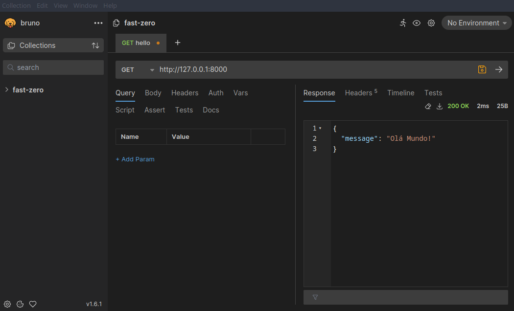
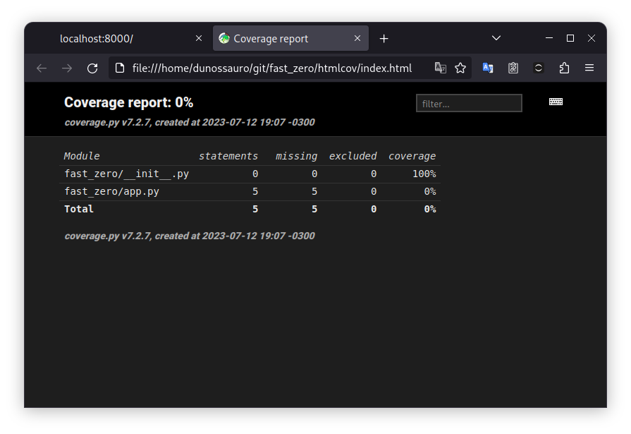
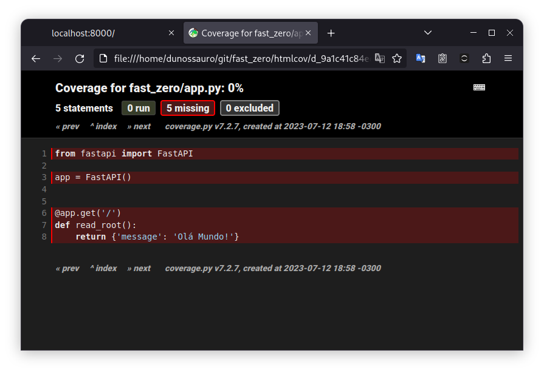
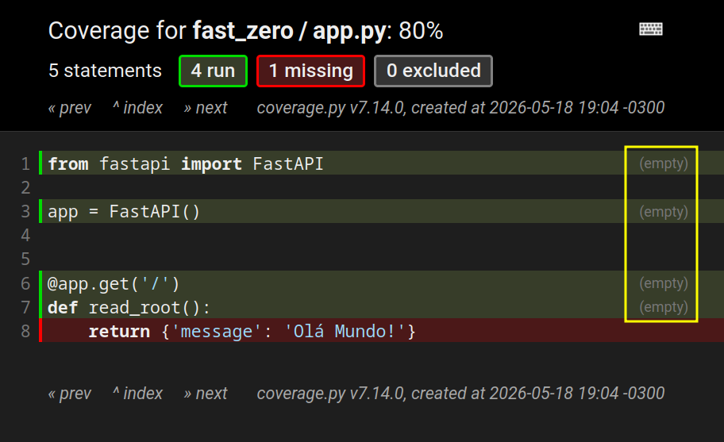
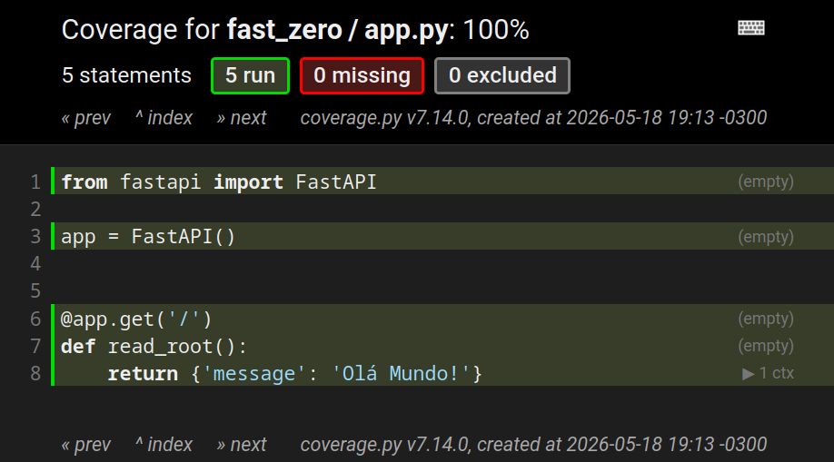
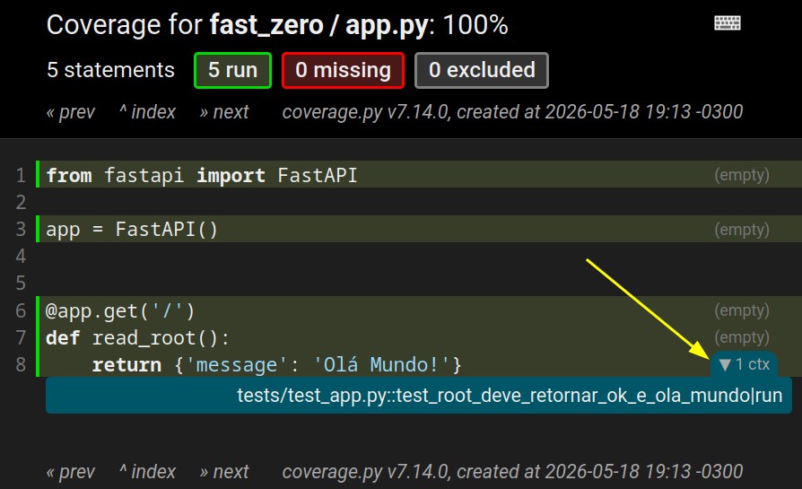

# Configurando el entorno de desarrollo


---
Objetivos de esta clase:

- Introducción al entorno de desarrollo (terminal, herramientas, etc.)
- Instalación de FastAPI y sus dependencias
- Configuración de las herramientas de desarrollo
- Ejecución del primer "Hello, World!" con FastAPI con tests!



---

En esta sección, iniciaremos nuestro recorrido para la construcción de una API con FastAPI. Partiremos de lo básico, configurando nuestro entorno de desarrollo. Discutiremos desde la elección e instalación de la versión correcta de Python hasta la instalación y configuración de Poetry, un gestor de paquetes y dependencias para Python. Además, instalaremos y configuraremos una serie de herramientas de desarrollo útiles, como Ruff, pytest y poethepoet.

Después de configurar nuestro entorno, crearemos nuestro primer programa "Hello, World!" con FastAPI. Esto nos permitirá verificar que todo esté funcionando correctamente. Y, finalmente, exploraremos una parte crucial del Desarrollo Orientado por Tests (TDD), escribiendo nuestro primer test con Pytest.

## Entorno de Desarrollo

Necesitas algunas herramientas instaladas:

1. Un editor de texto a tu elección 
2. Una terminal a tu elección 
3. Python, en una versión [oficialmente soportada](https://devguide.python.org/versions/).
4. [Git](https://git-scm.com/){:target="_blank"}: Para gestionar versiones del proyecto.
5. [Docker](https://www.docker.com/){:target="_blank"}: Para crear un container de la aplicación.
6. **OPCIONAL (extremadamente recomendado)**: El [gh](https://cli.github.com/){:target="_blank"} para crear el repositorio y hacer cambios sin necesitar acceder a la página de Github

## pipx

El [pipx](https://pipx.pypa.io/latest/){:target="_blank"} es una herramienta usada para instalar y ejecutar herramientas Python globalmente en el sistema de forma segura. Diferente del **pip**, que instala herramientas sin un entorno virtual (por defecto) y puede "ensuciar" nuestro entorno, el `pipx` crea un entorno virtual y aísla cada herramienta dentro de él, facilitando la instalación de paquetes globales.

Podemos usar el **pipx** para instalar herramientas globales y ejecutar algunas que se usarán solo una vez.

Para instalar el pipx:

```shell title="$ Ejecución en la terminal!"
pip install --user pipx
```

De esta forma, la única dependencia global que tendremos en nuestro sistema será el propio `pipx`.

???+ warning "Existen otras formas de instalar el pipx"
	En caso de que tengas un gestor de paquetes en tu sistema operativo, es **extremadamente** recomendado que instales el `pipx` por él.
	
	Las instrucciones de instalación para cada sistema están disponibles en la [documentación del proyecto](https://pipx.pypa.io/latest/how-to/install-pipx.html){:target="_blank"}.


Para que nuestro sistema reconozca el camino de las herramientas instaladas vía `pipx` podemos ejecutar el comando:

```shell title="$ Ejecución en la terminal!" 
pipx ensurepath #(1)!
```

1. Agrega el directorio de los entornos virtuales del `pipx` al `PATH` del sistema.

Este comando agrega al `PATH` del sistema todos los binarios instalados por el `pipx` 🚨. Por lo tanto, recuerda reiniciar el shell después de ejecutarlo.


## Poetry

El [Poetry](https://python-poetry.org/){:target="_blank"} es un gestor de proyectos para Python. Puede ayudarnos en diversas etapas del ciclo de desarrollo, como la instalación de versiones específicas de Python, la creación y mantenimiento de proyectos (incluyendo la definición de estructuras de carpetas, la gestión de entornos virtuales y la instalación de bibliotecas), además de permitir la publicación de paquetes y mucho más.

En nuestro proyecto, será el componente central para agrupar y ejecutar todas las tareas relacionadas al proyecto.


### Instalación de Poetry

La instalación de Poetry puede hacerse de diversas maneras, pero para una instalación global y aislada en un entorno virtual, debe hacerse vía `pipx`:


```shell title="$ Ejecución en la terminal!"
pipx install poetry #(1)!
```

1. Crea un entorno virtual aislado para poetry y lo deja disponible en el sistema.

???+ danger "Comentarios en bloques"
	Los bloques de código suelen tener comentarios con informaciones adicionales, como este:
	{: .center .shadow }

    ---

	Al hacer clic en :material-plus-circle: un bloque de comentario se abrirá, exhibiendo más informaciones:

	{: .center .shadow }

### Gestión de versiones de Python

Después de la instalación de Poetry, podemos utilizarlo para gestionar e instalar versiones de Python que deseamos usar en un proyecto. Para este curso, la versión mínima de Python que debes tener es la `#!python 3.11`, porque algunos recursos que utilizaremos fueron introducidos en esa versión.

Puedes, sin embargo, instalar cualquier versión más nueva. Mi recomendación es **siempre que sea posible**, usa la versión más actualizada posible:

=== "Versión 3.14"



=== "Versión 3.13"



=== "Versión 3.12"



=== "Versión 3.11"




De esta forma, garantizamos que tenemos una versión compatible de Python instalada.

### Entorno virtual local [opcional]

!!! warning "¡Paso opcional!"
	¡Este paso es opcional! En caso de que ya utilices Poetry con frecuencia o tengas familiaridad con la configuración de tu editor de texto, puedes saltar esta etapa.

	Si quieres saber más sobre esto, consulta la [documentación de Poetry](https://python-poetry.org/docs/configuration#virtualenvsin-project){:target="_blank"} sobre esta configuración.

Por defecto, Poetry crea entornos virtuales en un directorio centralizado fuera del proyecto. Esto es genial en diversos escenarios, principalmente en el desarrollo de bibliotecas y cuando trabajamos con múltiples proyectos.

Sin embargo, algunos editores de texto pueden exigir configuraciones adicionales para reconocer automáticamente el entorno virtual creado por Poetry. Cuando esto no sucede, es común que aparezcan avisos de importación o errores falsos en el editor, incluso con el proyecto funcionando correctamente. El síntoma más común son aquellas "gusanitos" rojos apareciendo debajo de los imports. Algo como:

{: .center .shadow }

Para evitar este tipo de problema, podemos configurar Poetry para crear el entorno virtual dentro del propio proyecto, en un directorio llamado `.venv`:

```bash
poetry config virtualenvs.in-project true
```

Con esto, muchos editores consiguen detectar automáticamente el entorno virtual del proyecto, reduciendo la necesidad de configuraciones adicionales.


## Creando un proyecto

Ahora que tenemos Poetry y la versión de Python que usaremos disponible, podemos iniciar la creación de nuestro proyecto. El primer paso es crear un nuevo proyecto utilizando Poetry, con el comando `poetry new`. A continuación, navegaremos hasta el directorio creado:

```shell title="$ Ejecución en la terminal!"
poetry new --flat fast_zero #(1)!
cd fast_zero
```

1. Crea un paquete python llamado `fast_zero` en el formato `flat`. Por defecto, Poetry utiliza el formato `src`. Más informaciones sobre esto [aquí](https://packaging.python.org/en/latest/discussions/src-layout-vs-flat-layout/){:target="_blank"}

Creará una estructura de archivos y carpetas como esta:

```
.
├── fast_zero
│  └── __init__.py
├── pyproject.toml
├── README.md
└── tests
   └── __init__.py
```

Con la estructura inicial del proyecto creada y estando en el directorio del proyecto, podemos informar a Poetry que queremos usar la versión de Python que instalamos. Para eso, utilizamos el siguiente comando:

=== "Versión 3.14"


=== "Versión 3.13"


=== "Versión 3.12"


=== "Versión 3.11"




De esta forma, garantizamos que Poetry usará la versión correcta de Python al crear el entorno virtual para nuestro proyecto.


### Instalando FastAPI

Con toda la base de nuestro proyecto lista, podemos finalmente instalar FastAPI:

```shell title="$ Ejecución en la terminal!"
poetry install #(1)!
poetry add 'fastapi[standard]' #(2)!
```

1. Crea el entorno virtual con la versión que seteamos en el `env use`
2. Agrega FastAPI en nuestro proyecto y entorno virtual

### Primera Ejecución de un "Hello, World!"

Una cosa bastante interesante sobre FastAPI es que es un framework web basado en funciones. De la misma forma en que creamos funciones tradicionalmente en python, podemos extender esas funciones para que sean servidas por el servidor. Por ejemplo:

```py title="fast_zero/app.py" linenums="1"
def read_root():
    return {'message': '¡Hola Mundo!'}
```

Esta función en python básicamente retorna un diccionario con una clave llamada `#!python 'message'` y un mensaje `#!python '¡Hola Mundo!'`. Si agregamos esta función en un nuevo archivo llamado `app.py` en el directorio `fast_zero`. Podemos hacer la llamada de ella por el terminal interactivo (**REPL**):

```py title=">>> Terminal interactivo!"
>>> read_root()
{'message': '¡Hola Mundo!'}
```

De forma tradicional, como todas las funciones en python.

??? tip "Consejo: Cómo abrir el terminal interactivo (REPL)"
	Para abrir el terminal interactivo con tu código cargado, debes llamar a Python en la terminal usando `-i`:

	```shell title="$ Ejecución en la terminal!"
	python -i <tu_archivo.py>
	```

	El intérprete de Python ejecuta el código del archivo y retorna el shell después de ejecutar todo lo que está escrito en el archivo.

	Para nuestro caso específico, como el nombre del archivo es `fast_zero/app.py`, debemos ejecutar este comando en la terminal:

	```shell title="$ Ejecución en la terminal!"
	python -i fast_zero/app.py
	```

Usando un decorador de FastAPI, podemos hacer que una determinada función sea accesible por la red:

```python title="fast_zero/app.py" linenums="1" hl_lines="5"
from fastapi import FastAPI #(1)!

app = FastAPI() #(2)!

@app.get('/') #(3)!
def read_root(): #(4)!
	return {'message': '¡Hola Mundo!'} #(5)!
```

1. Importando de la biblioteca fastapi el objeto FastAPI
2. Iniciando una aplicación FastAPI
3. Definiendo un endpoint con la dirección `/` accesible por el método HTTP `GET`
4. Función que será ejecutada cuando la dirección `/` sea accedida por un cliente
5. Los datos que serán retornados por la dirección, cuando el endpoint sea llamado

La línea destacada `#!python @app.get('/')` expone nuestra función para ser servida por FastAPI. Cuando un cliente acceda a nuestra dirección de red en el camino `/`, usando el método HTTP GET[^2], la función será ejecutada. De esta manera, tenemos todo el código necesario para crear nuestra primera aplicación web con FastAPI.

[^2]: Exploraremos más a fondo la relación de métodos y el protocolo HTTP en la próxima clase.

Así podemos iniciar el servidor de desarrollo:

```shell title="$ Ejecución en la terminal!"
poetry run fastapi dev fast_zero/app.py #(1)!
```

1. `poetry run` ejecuta un comando de shell usando el virtualenv activado.

La respuesta del comando en la terminal debe ser parecida a esta:

```shell title="Respuesta del comando `fastapi dev fast_zero/app.py`" hl_lines="27 38-42"
INFO     Using path fast_zero/app.py
INFO     Resolved absolute path /home/dunossauro/git/fastapi-do-zero/codigo_das_aulas/01/fast_zero/app.py
INFO     Searching for package file structure from directories with __init__.py files
INFO     Importing from /home/dunossauro/git/fastapi-do-zero/codigo_das_aulas/01

 ╭─ Python package file structure ─╮
 │                                 │
 │  📁 fast_zero                   │
 │  ├── 🐍 __init__.py             │
 │  └── 🐍 app.py                  │
 │                                 │
 ╰─────────────────────────────────╯

INFO     Importing module fast_zero.app
INFO     Found importable FastAPI app

 ╭──── Importable FastAPI app ─────╮
 │                                 │
 │  from fast_zero.app import app  │
 │                                 │
 ╰─────────────────────────────────╯

INFO     Using import string fast_zero.app:app

 ╭────────── FastAPI CLI - Development mode ───────────╮
 │                                                     │
 │  Serving at: http://127.0.0.1:8000                  │
 │                                                     │
 │  API docs: http://127.0.0.1:8000/docs               │
 │                                                     │
 │  Running in development mode, for production use:   │
 │                                                     │
 │  fastapi run                                        │
 │                                                     │
 ╰─────────────────────────────────────────────────────╯

INFO:     Will watch for changes in these directories: ['/home/dunossauro/git/fastapi-do-zero/codigo_das_aulas/01']
INFO:     Uvicorn running on http://127.0.0.1:8000 (Press CTRL+C to quit)
INFO:     Started reloader process [893203] using WatchFiles
INFO:     Started server process [893207]
INFO:     Waiting for application startup.
INFO:     Application startup complete.
```

El mensaje de respuesta del CLI: `serving: http://127.0.0.1:8000` tiene una información bastante importante.

{: .center }
{: .center  }

1. Nos muestra qué protocolo está siendo utilizado, en este caso el HTTP, que es el protocolo estándar de la web;
2. La dirección de red (IP) que está escuchando, en este caso `127.0.0.1`, dirección especial ([loopback](https://es.wikipedia.org/wiki/Loopback){:target="_blank"}) que apunta a nuestra propia máquina;
3. El puerto `:8000`, que es el puerto de nuestra máquina que está reservado para nuestra aplicación.

Ahora, con el servidor inicializado, podemos usar un cliente para acceder a la dirección [http://127.0.0.1:8000](http://127.0.0.1:8000){:target="_blank"}.

El cliente más tradicional de la web es el navegador. Podemos escribir la dirección en la barra de navegación y si todo ocurrió correctamente, debes ver el mensaje "¡Hola Mundo!" en formato JSON.

{: .center .shadow }

> Para detener la ejecución de fastapi en el shell, escribe ++ctrl+c++ y el mensaje `Shutting down` aparecerá, mostrando que el servidor fue finalizado.

??? example "Diferentes clientes para nuestra aplicación"
	Existen otros clientes HTTP que no son el browser. Hay aplicaciones de línea de comando como [curl](https://curl.se/){:target="_blank"}:

	```shell title="$ Ejecución en la terminal!"
	curl 127.0.0.1:8000
	{"message":"¡Hola Mundo!"}
	```

	También existe un cliente HTTP escrito en python, el [HTTPie](https://httpie.io/){:target="_blank"}:

	```shell title="$ Ejecución en la terminal!"
	http 127.0.0.1:8000
	HTTP/1.1 200 OK
	content-length: 25
	content-type: application/json
	date: Thu, 11 Jan 2024 11:46:32 GMT
	server: uvicorn

	{
		"message": "¡Hola Mundo!"
	}
	```

	Existen incluso aplicaciones gráficas de código abierto pensadas para ser clientes HTTP para APIs. Como el [hoppscotch](https://hoppscotch.io/){:target="_blank"}:

	{: .center .shadow }

	O como el [Bruno](https://www.usebruno.com/){:target="_blank"}:
	{: .center .shadow }


### Uvicorn

FastAPI es genial para crear APIs, pero no puede hacer que estén disponibles en la red solo. Para que podamos acceder a esas APIs por un navegador u otras aplicaciones clientes, es necesario un servidor. Es ahí donde Uvicorn entra en escena. Actúa como ese servidor, disponibilizando la API de FastAPI en red. Esto permite que la API sea accedida desde otros dispositivos o programas.

Como notamos en la respuesta del comando `fastapi dev fast_zero/app.py`:

```bash title="Fin de la respuesta de `fastapi dev fast_zero/app.py`"
INFO:     Uvicorn running on http://127.0.0.1:8000 (Press CTRL+C to quit)
INFO:     Started reloader process [893203] using WatchFiles
INFO:     Started server process [893207]
INFO:     Waiting for application startup.
INFO:     Application startup complete.
```

Siempre que usemos fastapi para inicializar la aplicación en el shell, hace una llamada interna para inicializar uvicorn. Por ese motivo, aparece en las respuestas HTTP y también en la ejecución del comando.

??? tip "Podrías llamar a la aplicación directamente por Uvicorn también"
	```shell title="$ Ejecución en la terminal!"
	uvicorn fast_zero.app:app
	```
	Este comando le dice a uvicorn lo siguiente: en la carpeta fast_zero existe un archivo llamado app. Dentro de ese archivo, tenemos una aplicación para ser servida con el nombre de app. El comando está compuesto por uvicorn carpeta.archivo:variable.

	La respuesta del comando en la terminal debe ser parecida a esta:
	
	```shell title="Resultado del comando"
	INFO:     Started server process [127946]
	INFO:     Waiting for application startup.
	INFO:     Application startup complete.
	INFO:     Uvicorn running on http://127.0.0.1:8000 (Press CTRL+C to quit)
	```

## Instalando las herramientas de desarrollo

Las elecciones de herramientas de desarrollo, de forma general, son elecciones bastante personales. No suelen ser consensuales ni siquiera en equipos de desarrollo. Dicho esto, instalaremos algunas herramientas que nos parecen que son útiles para el desarrollo del proyecto.

Las herramientas elegidas son:

- [poethepoet](https://poethepoet.natn.io/index.html){:target="_blank"}: herramienta usada para creación de comandos. Como ejecutar la aplicación, correr los tests, etc.
- [pytest](https://docs.pytest.org/){:target="_blank"}: herramienta para tests
- [coverage](https://coverage.readthedocs.io/){:target="_blank"}: herramienta para medir la cobertura de tests
- [ruff](https://docs.astral.sh/ruff/){:target="_blank"}: Una herramienta que tiene dos funciones en nuestro código:
    1. Un analizador estático de código (un [linter](https://en.wikipedia.org/wiki/Lint_(software)){:target="_blank"}), para avisarnos si estamos infringiendo alguna [buena práctica de programación](https://docs.astral.sh/ruff/rules/){:target="_blank"};
	2. Un formateador de código. Para seguir un estilo único de código. Vamos a basarnos en [PEP-8](https://peps.python.org/pep-0008/){:target="_blank"}.
- [typos](https://github.com/crate-ci/typos){:target="_blank"}: detector de errores tipográficos en inglés, lo cual es útil para los hablantes nativos de castellano

### Instalando las herramientas de desarrollo

Todas las herramientas de desarrollo se instalan como dependencias de desarrollo (grupo `dev`):

```shell title="$ Ejecución en la terminal!"
poetry add --group dev pytest pytest-cov ruff typos httpx2
```

## Configurando las herramientas de desarrollo

Después de la instalación de las herramientas de desarrollo, necesitamos definir las configuraciones de cada una individualmente en el archivo `pyproject.toml`.

### Ruff

[Ruff](https://docs.astral.sh/ruff/){:target="_blank"} es una herramienta moderna en python, escrita en rust, compatible[^3] con los proyectos de análisis estático escritos y mantenidos originalmente por la comunidad en el proyecto [PYCQA](https://github.com/PyCQA/){:target="_blank"}[^4] y tiene dos funciones principales:

[^3]: En algunos casos, existe una divergencia de opiniones entre los linters más tradicionales. Pero, en general, funciona bien.
[^4]: En versiones antiguas del texto, usábamos las herramientas del PyCQA como el pylint y el isort.

1. Analizar el código de forma estática (Linter): Efectuar la verificación si estamos programando de acuerdo con buenas prácticas de python.
2. Formatear el código (Formatter): Efectuar la verificación del código para estandarizar un estilo de código predefinido.


Para configurar el ruff armamos la configuración en 3 [tablas](https://toml.io/es/v1.0.0#tabla){:target="_blank"} distintas en el archivo `pyproject.toml`. Una para las configuraciones globales, una para el linter y una para el formateador.

**Configuración global**

En la configuración global del Ruff queremos alterar solamente dos cosas. La longitud de línea a 79 caracteres (conforme sugerido en la [PEP-8](https://peps.python.org/pep-0008/){:target="_blank"}) y, a continuación, informaremos que el directorio de migraciones de base de datos será ignorado en la verificación y en el formateo:

```toml title="pyproject.toml" linenums="22"
--8<-- "aulas/codigos/01/pyproject.toml:22:25"
```

???+ example "Nota sobre "migrations""
	En esta fase de configuración, excluiremos la carpeta `migrations`, esto puede no tener mucho sentido en este momento. Sin embargo, cuando iniciemos el trabajo con la base de datos, la herramienta `Alembic` hace generación de código automático. Por ser códigos generados automáticamente, no queremos alterar la configuración hecha por ella.

**Linter**

Durante el análisis estático del código, queremos buscar por cosas específicas. En Ruff, necesitamos decir exactamente qué debe analizar. Esto se hace por códigos. Usaremos estos:

- `I` ([Isort](https://pycqa.github.io/isort/){:target="_blank"}): Verificación de ordenamiento de imports en orden alfabético
- `F` ([Pyflakes](https://github.com/PyCQA/pyflakes){:target="_blank"}): Busca por algunos errores en relación a buenas prácticas de código
- `E` (Errores [pycodestyle](https://pycodestyle.pycqa.org/en/latest/){:target="_blank"}): Errores de estilo de código
- `W` (Avisos [pycodestyle](https://pycodestyle.pycqa.org/en/latest/){:target="_blank"}): Avisos de cosas no recomendadas en el estilo de código
- `PL` ([Pylint](https://pylint.pycqa.org/en/latest/index.html){:target="_blank"}): Como el `F`, también busca por errores en relación a buenas prácticas de código
- `PT` ([flake8-pytest](https://pypi.org/project/flake8-pytest-style/){:target="_blank"}): Verificación de buenas prácticas de Pytest

```toml title="pyproject.toml" linenums="26"
--8<-- "aulas/codigos/01/pyproject.toml:26:29"
```

> Para más información sobre la configuración y sobre los códigos del ruff y de los proyectos del PyCQA, puedes chequear la [documentación del ruff](https://docs.astral.sh/ruff/rules){:target="_blank"} o las documentaciones originales de los proyectos [PyQCA](https://github.com/PyCQA){:target="_blank"}.

**Formatter**

El formateo del Ruff prácticamente no necesita ser alterado. Pues va a seguir las buenas prácticas y usar la configuración global de `79` caracteres por línea. La única alteración que haremos es el uso de comillas simples `'` en lugar de comillas dobles `"`:

```toml title="pyproject.toml" linenums="30"
--8<-- "aulas/codigos/01/pyproject.toml:30:33"
```

> Recordando que la opción de usar comillas simples es totalmente personal, puedes usar comillas dobles si quieres.

### pytest

El [Pytest](https://docs.pytest.org/){:target="_blank"} es un framework de tests, que usaremos para escribir y ejecutar nuestros tests. Lo configuraremos para reconocer el camino base para ejecución de los tests en la raíz del proyecto `.`:

```toml title="pyproject.toml" linenums="34"
--8<-- "aulas/codigos/01/pyproject.toml:34:37"
```

En la segunda línea, usamos la opción `addopts` del pytest. Esta opción le dice que todas las veces en que el pytest sea llamado, va a agregar esos parámetros a la llamada, sin que tengamos que declararlos explícitamente.

Quedando algo como:

```bash
pytest -p no:warnings --cov=fast_zero --cov-context=test
```

Cada parámetro de esos tiene un significado importante:

- `-p no:warnings`: decimos que no queremos mensajes de "warnings" en la salida de los tests. Suele dejar más limpio.
- `--cov=fast_zero`: directorio donde está nuestro código que será testeado, para mostrar por dónde pasan los tests
- `--cov-context=test`: aísla tests en contextos, para decir exactamente qué test ejecuta cada línea de código.

De esta forma, al testear, tendremos una visualización buena y coherente de lo que testean.

> Vamos a ver estas cosas en acción [aquí](#introduccion-al-pytest-testeando-el-hello-world){:target="_blank"}.

### Typos

El [typos](https://github.com/crate-ci/typos){:target="_blank"} nos va a ayudar con algunos errores que terminan sucediendo cuando escribimos código en inglés.

Vamos a suponer que nuestro código esté así:

```python title="fast_zero/app.py" linenums="1" hl_lines="7"
from fastapi import FastAPI

app = FastAPI()

@app.get('/')
def read_root():
	return {'{++messsage++}': '¡Hola Mundo!'} #(1)!
```

1. Subraya como un error de grafía la escritura del string `#!py 'messsage'`. Escrita con una S de más.

Subraya como un error de grafía la escritura del string `#!py 'messsage'`. La palabra debería ser escrita con dos "me-ss-age", no con tres "me-sss-age".

Este tipo de errores triviales son los que el Typos nos ayuda a detectar. Si lo ejecutamos, `typos`, en la terminal:

```shell title="$ Ejecución en la terminal!"
typos
```

Nos presentará una respuesta como esta:

```shell title="$ Ejecución en la terminal!"
error: `messsage` should be `message`
  ╭▸ ./fast_zero/app.py:7:14
  │
7 │     return {'messsage': '¡Hola Mundo!'}
  ╰╴             ━━━━━━━━
```

Diciéndonos que el string contenido en la línea `#!py 8` columna `#!py 14` tiene un error: `messsage` debería ser `message`.

#### Configurando el análisis

Como hablantes de español, no siempre queremos escribir todo en inglés, como la documentación o el `README.md` del repositorio.

En estos casos, podemos configurar el `typos` para ignorar determinados archivos:

```py title="pyproject.toml"
[tool.typos.files]
extend-exclude = ["*.md", "migrations"] #(1)!
```

1. Aquí todos los archivos (`*`) con la extensión `.md` están siendo ignorados. El directorio `#!py "migrations"` va a ser ignorado preventivamente. Pero, este directorio solo será insertado en la clase 05.

De esta forma, el `typos` dejará de analizar archivos Markdown, por ejemplo.

### Poe the Poet

La idea del [Poe the Poet](https://github.com/nat-n/poethepoet){:target="_blank"} (o simplemente `poe`) es ser un ejecutor de tareas (*task runner*) integrado a nuestro ecosistema de desarrollo. En lugar de tener que recordar comandos largos y complejos, como los de FastAPI que vimos en la ejecución de la aplicación, ¿qué tal substituir todo simplemente por `poetry serve`?

Esto funciona para cualquier comando complicado en nuestra aplicación, simplificando las llamadas y centralizando el flujo de trabajo en el archivo de configuración del proyecto.

Poe tiene diversas formas de ser instalado, en el proyecto vía `pyproject.toml`, globalmente vía `pipx`, o directamente como un plugin de poetry. Vamos a inyectarlo vía `pipx`:

```shell title="$ Ejecución en la terminal!"
pipx inject poetry poethepoet[poetry_plugin] #(1)!
```

1. Instala el poethepoet en el mismo venv del pipx con el poetry, extendiendo las funcionalidades de él.

??? example "¿puedo instalar de otras formas?"
	Sí, puedes: [Guía de instalación del poethepoet](https://poethepoet.natn.io/installation.html), pero para el curso, el mejor camino tal vez sea vía pipx, como lo instalamos.


```toml title="pyproject.toml" linenums="55"
[tool.poe] #(1)!
poetry_command = ""
```

1. Configuración para que el poe entienda que debe integrarse directamente como un comando nativo de Poetry (permitiendo correr `poetry serve` en vez de `poetry poe serve`).

Después de esta configuración inicial, podemos definir diversos comandos y agrupar diversas de nuestras herramientas simplificando bastante nuestro flujo de desarrollo:

```toml title="pyproject.toml"
[tool.poe.tasks]
lint = { cmd = "ruff check" }
format.sequence = [
  { cmd = "ruff check --fix" },
  { cmd = "ruff format" },
]
serve = "fastapi dev fast_zero/app.py"
test.sequence = [
  "lint",
  { cmd = "pytest -s -x -vv $POE_EXTRA_ARGS" },
  { cmd = "coverage html --show-contexts" },
]
```

Donde cada comando es responsable de una, o un grupo de operaciones:

- `lint`: ejecuta el `ruff check` para garantizar las buenas prácticas
- `format`: ejecuta una secuencia que primero corrige lo que sea posible automáticamente (`ruff check --fix`) y después formatea el estilo del código (`ruff format`).
- `serve`: ejecuta el servidor de desarrollo de FastAPI.
- `test`: ejecuta una secuencia completa de tests: corre el `lint`, ejecuta los tests con pytest de forma verbosa (`-vv`), permite pasar argumentos extras por la terminal a través de la variable `$POE_EXTRA_ARGS` y, por último, genera el informe de cobertura.

Para ejecutar un comando, es bastante más simple, necesitando solamente pasar la palabra `poetry <comando>`.

#### Entendiendo Tareas en Secuencia

Observa que para los comandos `format` y `test` utilizamos la propiedad `.sequence` en vez de pasar una string directa de comando. 

En el **Poe the Poet**, una secuencia nos permite encadenar múltiples comandos que serán ejecutados de forma lineal (uno después del otro). Un detalle crucial sobre el comportamiento de las secuencias es que como se ejecutan en cadena, si una falla, el poe no va a ejecutar las siguientes.

---

??? warning "Ejemplo de un archivo de configuración pyproject.toml completo"

	

	```toml title="pyproject.toml" linenums="1"
	--8<-- "aulas/codigos/01/pyproject.toml"
	```

	Un punto importante es que las versiones de los paquetes pueden variar dependiendo de la fecha en que hagas la instalación de los paquetes. Este archivo es solamente un ejemplo.


### Los efectos de estas configuraciones de desarrollo

En caso de que hayas copiado el código que usamos para definir `fast_zero/app.py`, puedes testear los comandos que creamos para el `poe`:

```shell title="$ Ejecución en la terminal!"
poetry lint
```

De esta forma, veremos que cometimos algunas infracciones en el formateo de la PEP-8. El ruff nos informará que deberíamos haber agregado dos líneas antes de una definición de función:

```python
fast_zero/app.py:5:1: E302 [*] Expected 2 blank lines, found 1
  |
3 | app = FastAPI()
4 | 
5 | @app.get('/')
  | ^ E302
6 | def read_root():
7 |     return {'message': '¡Hola Mundo!'}
  |
  = help: Add missing blank line(s)

Found 1 error.
[*] 1 fixable with the `--fix` option.
```

Para corregir esto, podemos usar nuestro comando de formateo de código:

=== "Comando"
	```shell title="$ Ejecución en la terminal!"
	poetry format
	Found 1 error (1 fixed, 0 remaining).
	3 files left unchanged
	```

=== "Resultado"
	```py title="fast_zero/app.py" linenums="1" hl_lines="5"
	from fastapi import FastAPI

	app = FastAPI()


	@app.get('/')
	def read_root():
		return {'message': '¡Hola Mundo!'}
	```

## Introducción al Pytest: Testeando el "Hello, World!"

Antes de entender la dinámica de los tests, necesitamos entender el efecto que tienen en nuestro código. Podemos comenzar analizando la cobertura (cuánto de nuestro código está siendo efectivamente testeado). Vamos a ejecutar los tests:

```shell title="$ Ejecución en la terminal!"
poetry test
```

Tendremos una respuesta como esta:

```shell title="$ Ejecución en la terminal!" hl_lines="7"
=========================== test session starts ===========================
platform linux -- Python 3.11.7, pytest-7.4.4, pluggy-1.3.0
cachedir: .pytest_cache
rootdir: /home/dunossauro/git/fast_zero
configfile: pyproject.toml
plugins: cov-4.1.0, anyio-4.2.0
collected 0 items

---------- coverage: platform linux, python 3.11.7-final-0 -----------
Name                    Stmts   Miss  Cover
-------------------------------------------
fast_zero/__init__.py       0      0   100%
fast_zero/app.py            5      5     0%
-------------------------------------------
TOTAL                       5      5     0%
```

Las líneas en la terminal son referentes al pytest, que dijo que recolectó 0 ítems. Ningún test fue ejecutado.


La parte importante de este Mensaje está en la tabla generada por el `coverage`. Que dice que tenemos 5 líneas de código (Stmts) en el archivo `fast_zero/app.py` y ninguna de ellas está cubierta por nuestros tests. Como podemos ver en la columna `Miss`.

Por no encontrar ningún test, el pytest retornó un "error". Esto significa que nuestra tarea secuencial `test` no fue ejecutada. Podemos ejecutarla manualmente:

```shell title="$ Ejecución en la terminal!"
poetry run coverage html --show-contexts
Wrote HTML report to htmlcov/index.html
```

Esto genera un informe de cobertura de tests en formato HTML. Podemos abrir ese archivo en nuestro navegador y entender exactamente qué líneas del código no están siendo testeadas.

{: .center }

Si hacemos clic en el archivo `fast_zero/app.py` podemos ver en rojo las líneas que no están siendo testeadas:

{: .center  }

Esto significa que necesitamos testear todo ese archivo.

### Escribiendo el test

Ahora, escribiremos nuestro primer test con Pytest. Pero, antes de escribir el test, necesitamos crear un archivo específico para ellos. En la carpeta `tests`, vamos a crear un archivo llamado `test_app.py`.

> Por convención, todos los archivos de test del pytest deben iniciar con un prefijo test_<algo>.py

Para testear el código hecho con FastAPI, necesitamos un cliente de test. La gran ventaja es que el FastAPI ya cuenta con un cliente de tests en el módulo `fastapi.testclient` con el objeto `TestClient`, que necesita recibir nuestro app como parámetro:

```python title="tests/test_app.py" linenums="1"
--8<-- "aulas/codigos/01/tests/test_app.py::5"
```

1. Importa del módulo `testclient` el objeto `TestClient`
2. Importa nuestro `app` definido en `fast_zero`
3. Crea un cliente de tests usando nuestra aplicación como base

Solo el hecho de haber definido un cliente ya nos muestra una cobertura bastante diferente:

```shell title="$ Ejecución en la terminal!" hl_lines="3 9"
poetry test
# parte del mensaje fue omitida
collected 0 items

---------- coverage: platform linux, python 3.11.3-final-0 -----------
Name                    Stmts   Miss  Cover
-------------------------------------------
fast_zero/__init__.py       0      0   100%
fast_zero/app.py            5      1    80%
-------------------------------------------
TOTAL                       5      1    80%
```


Por no recolectar ningún test, el pytest todavía retornó un "error". Para ver la cobertura, necesitaremos ejecutar nuevamente el paso de cobertura manualmente:

```shell title="$ Ejecución en la terminal!"
poetry run coverage html --show-contexts
Wrote HTML report to htmlcov/index.html
```

En el navegador, podemos ver que la única línea no "testeada" es aquella donde tenemos la lógica (el cuerpo) de la función `read_root`. Las líneas de definición están todas verdes:

{: .center  }

En verde vemos lo que fue ejecutado cuando la herramienta de cobertura corrió, y en rojo lo que no fue. Otra información importante, destacada en amarillo, es el texto `(empty)`. Indica que ningún test ejecutó de hecho esas líneas. Fueron solo cargadas durante el import del archivo, y no por un test específico. Por eso, no exhiben información de contexto.

Para resolver esto, tenemos que crear un test de hecho, haciendo una llamada a nuestra API usando el cliente de test que definimos:

```python title="tests/test_app.py" linenums="1"
--8<-- "aulas/codigos/01/tests/test_app.py:8:22"
```

1. En el nombre de la función, escribimos generalmente lo que el test de hecho hace. Aquí estamos diciendo que root debe retornar el status OK y el mensaje "hola mundo". Root es el nombre dado a la raíz de la URL. El camino `/`, que colocamos en la definición del `#!python @app.get('/')`. OK es el status que dice que la solicitud ocurrió con éxito en el protocolo HTTP.
2. Aquí creamos el cliente de test de nuestro app
3. En este punto, el `client` hace una solicitud. De la misma forma que el browser, un cliente de la API. En eso, llamamos a la dirección de root, usando el método GET.
4. Aquí hacemos la validación del código de respuesta, para saber si la respuesta es referente al código `200`, que significa `OK`. Más informaciones sobre este tópico [aquí](02.md#buenas-practicas-para-constantes){:target="_blank"}.
5. Al final, validamos si el diccionario que enviamos en la función es el mismo que recibimos cuando hicimos la solicitud.
6. Importación de la biblioteca nativa de python que abstrae los códigos de respuesta y nos presenta el status. Más informaciones sobre este tópico [aquí](02.md#buenas-practicas-para-constantes){:target="_blank"}.

Este test hace una solicitud GET en el endpoint `/` y verifica si el código de status de la respuesta es 200 y si el contenido de la respuesta es `{'message': '¡Hola Mundo!'}`.

```shell title="$ Ejecución en la terminal!" hl_lines="3 5 11 16"
poetry test
# parte del mensaje fue omitida
collected 1 item

tests/test_app.py::test_root_deve_retornar_ok_e_ola_mundo PASSED

---------- coverage: platform linux, python 3.11.3-final-0 -----------
Name                    Stmts   Miss  Cover
-------------------------------------------
fast_zero/__init__.py       0      0   100%
fast_zero/app.py            5      0   100%
-------------------------------------------
TOTAL                       5      0   100%

================ 1 passed in 1.39s ================
Wrote HTML report to htmlcov/index.html
```

De esta forma, tenemos un test que recolectó 1 ítem (1 test). Este test fue aprobado y la cobertura no dejó de abarcar ninguna línea de código.

Como conseguimos recolectar un ítem, la secuencia de la task `test` fue ejecutada y también generó un HTML con la cobertura actualizada.

{: .center }

Las líneas con `(empty)` continúan, pues son importadas sin ningún test. Sin embargo, la última línea tiene una flechita con `1 ctx`. Eso quiere decir que nuestro test ejecutó aquella línea en específico.

Al hacer clic en ella:

{: .center }

Podemos ver exactamente el archivo de test y qué test en específico ejecutó la línea en cuestión: `tests/test_app.py::test_root_deve_retornar_ok_e_ola_mundo`. Esto facilita bastante el entendimiento de qué test pasa por determinado camino en la aplicación.

## Estructura de un test

Ahora que escribimos nuestro primer test intuitivamente, podemos entender qué hace cada paso del test. Esta comprensión es vital, pues nos ayudará a escribir tests con más confianza y eficacia. Para desvendar el método detrás de nuestro enfoque, exploraremos una estrategia conocida como [AAA](https://xp123.com/articles/3a-arrange-act-assert/){:target="_blank"}, que divide el test en tres fases distintas: Arrange, Act, Assert.


Para analizar todas las etapas de un test, usaremos como ejemplo este primer test que escribimos:

```python title="tests/test_app.py" linenums="1"
--8<-- "aulas/codigos/01/tests/test_app.py:24"
```

Con base en este código, podemos observar las tres fases:

### Fase 1 - Organizar (Arrange)

En esta primera etapa, estamos preparando el entorno para el test. En el ejemplo, la línea con el comentario `Arrange` no es el test en sí, ella monta el entorno para que el test pueda ser ejecutado. Estamos configurando un `client` de tests para hacer la solicitud al `app`.

### Fase 2 - Actuar (Act)

Aquí es la etapa donde sucede la acción principal del test, que consiste en llamar al Sistema Bajo Test ([SUT](http://xunitpatterns.com/SUT.html){:target="_blank"}). En nuestro caso, el SUT es la ruta `/`, y la acción es representada por la línea `response = client.get('/')`. Estamos ejercitando la ruta y almacenando su respuesta en la variable `response`. Es la fase en que el código de tests ejecuta el código de producción que está siendo testeado. Actuar aquí significa interactuar directamente con la parte del sistema que queremos evaluar, para ver cómo se comporta.

### Fase 3 - *Afirmar* (Assert)

Esta es la etapa de verificar si todo ocurrió como se esperaba. Es fácil notar dónde estamos haciendo la verificación, pues esa línea siempre tiene la palabra reservada `assert`. La verificación es booleana, o está correcta, o no está. Por eso, un test debe siempre incluir un `assert` para verificar si el comportamiento esperado está correcto.

---

Ahora que comprendemos qué hace cada línea de test en específico, podemos orientarnos de forma clara en los tests que escribiremos en el futuro. Cada una de las líneas usadas tiene una razón de estar en el test, y conocer esta estructura no solo nos da una comprensión más profunda de lo que estamos haciendo, sino que también nos da confianza para explorar y escribir tests más complejos.


## Creando nuestro repositorio en git

Antes de concluir, necesitamos ejecutar algunos pasos:

1. Crear un archivo `.gitignore` para no agregar el entorno virtual y otros archivos innecesarios en el versionado de código.
2. Crear un nuevo repositorio en GitHub para versionar el código.
3. Subir el código que hicimos a GitHub.

**Creando el archivo .gitignore**

Vamos a iniciar con la creación de un archivo `.gitignore` específico para Python. Existen diversos modelos disponibles en internet, como los [disponibles por el propio GitHub](https://github.com/github/gitignore){:target="_blank"}, o el [gitignore.io](https://gitignore.io){:target="_blank"}. Una herramienta útil es la [`ignr`](https://github.com/Antrikshy/ignr.py){:target="_blank"}, hecha en Python, que hace el download automático del archivo para nuestra carpeta de trabajo actual:

```shell title="$ Ejecución en la terminal!"
pipx run ignr -p python > .gitignore #(1)!
```

1. El comando `pipx run` va a descargar el `ignr`, va a ejecutar el comando y va a desinstalarlo. No existe la necesidad de tenerlo instalado en el sistema, pues solo será ejecutado esta vez.

El `.gitignore` es importante porque nos ayuda a evitar que archivos innecesarios o sensibles sean enviados al repositorio. Esto incluye el entorno virtual, archivos de configuración personal, entre otros.

**Creando un repositorio en github**

Ahora, con nuestros archivos indeseados ignorados, podemos iniciar el versionado de código usando el `git`. Para crear un repositorio local, usamos el comando `git init .`. Para crear ese repositorio en GitHub, utilizaremos el `gh`, un utilitario de línea de comando que nos auxilia en este proceso:

```shell title="$ Ejecución en la terminal!"
git init .
gh repo create
```

Al ejecutar `gh repo create`, se solicitarán algunas informaciones, como el nombre del repositorio y si será público o privado. Esto creará un repositorio tanto localmente como en GitHub.

**Subiendo nuestro código a github**

Con el repositorio listo, vamos a versionar nuestro código. Primero, agregamos el código al próximo commit con `git add .`. A continuación, creamos un punto en la historia del proyecto con `git commit`. Por último, sincronizamos el repositorio local con el remoto en GitHub usando `git push`:

```shell title="$ Ejecución en la terminal!"
git add .
git commit -m "chore: configuración inicial del proyecto"
git push
```

> En caso de que sea la primera vez que estás utilizando el `git push`, tal vez sea necesario configurar tus credenciales de GitHub.

Estos pasos garantizan que todo el código que creamos esté versionado y disponible para compartirlo en GitHub.

### Estándares en commits

Puedes haber notado algo diferente en este mensaje de commit:

```bash
chore: configuración inicial del proyecto
```

Este `chore:` al comienzo no es adorno, forma parte de un estándar llamado [**Conventional Commits**](https://www.conventionalcommits.org/es/v1.0.0/).

La idea de este tipo de commit es bastante simple: dar significado a los commits, dejando claro *el tipo de cambio que fue hecho*, solo mirando el mensaje.

En vez de commits con mensajes genéricos como:

- `"arregla cosa"`
- `"agregando clase XPTO"`
- `"update"`

pasamos a escribir algo más estructurado:

```bash
feat: agrega ruta de usuarios
fix: corrige error en la validación
chore: ajustes de configuración
```

Cada prefijo tiene un papel:

- `feat`: una nueva funcionalidad
- `fix`: corrección de bug
- `chore`: cambios sin impacto directo en el comportamiento del sistema (infra, tooling, dependencias, scripts)
- `refactor`: reorganización de código sin cambiar comportamiento
- `test`: adición o ajuste de tests
- `docs`: cambios en la documentación

En nuestro caso:

```bash
chore: configuración inicial del proyecto
```

tiene sentido porque no estamos creando una feature ni corrigiendo un bug. Estamos solo preparando el terreno: dependencias, herramientas, estructura inicial.

Esto ayuda en dos cosas bien prácticas:

1. Histórico más legible: se puede entender la evolución del proyecto sin descifrar commits genéricos.
2. Automatización futura: en proyectos más grandes, estos estándares ayudan a generar changelog automáticamente y hasta facilitar [versionado semántico](https://semver.org/lang/es/).

Esto no es obligatorio en repositorios git, pero, como estamos buscando construir buenas prácticas de desarrollo de código, es importante practicarlas para interiorizarlas.

## Ejercicios

Agrega el `typos` para analizar gramática en inglés para ser ejecutado antes de la etapa de lint, transformándola en una secuencia que corra el `typos` y el `ruff check` en la tabla `[tool.poe.tasks]` de tu archivo `pyproject.toml`.



## Código de esta lección



## Conclusión

¡Listo! Ahora tenemos un entorno de desarrollo totalmente configurado para comenzar a trabajar con FastAPI y ya hicimos nuestra primera inmersión en el Desarrollo Orientado por Tests. En la próxima sección, profundizaremos en la estructura de nuestra aplicación FastAPI.


