# Introducción al desarrollo WEB

---

Objetivos de esta sección:

- Dar una base teórica sobre desarrollo web
- Presentar el protocolo HTTP
- Introducir los conceptos de APIs JSON
- Presentar el OpenAPI
- Introducir los schemas usando Pydantic



---

Ahora que ya tenemos el entorno preparado, con algún código escrito y testeado, es el momento ideal para entender qué vinimos a hacer aquí. Hasta este punto, ya debes saber que FastAPI es un framework para el desarrollo de aplicaciones web, más específicamente para el desarrollo de APIs web. Es aquí donde tener una buena base teórica se vuelve importante para comprender exactamente lo que el framework es capaz de hacer.


## La web

Siempre que nos referimos a aplicaciones web, estamos hablando de aplicaciones que funcionan en red. Esa red puede ser privada, como tu red doméstica o una red empresarial, o podemos estar refiriéndonos a la [World Wide Web](https://es.wikipedia.org/wiki/World_Wide_Web){:target="_blank"} (WWW), comúnmente conocida como "internet". La internet, que tiene una larga historia iniciada en la década de 1960, posee diversos estándares definidos y se viene perfeccionando desde entonces. Comprender completamente su complejidad es un desafío, especialmente 6 décadas después de su inicio.

Cuando hablamos de comunicación en red, generalmente nos referimos a la comunicación entre dos o más dispositivos interconectados. La idea es que podamos comunicarnos con otros dispositivos usando la red.

### El modelo cliente-servidor

En el contexto de aplicaciones web, generalmente nos referimos a un modelo específico de comunicación: el cliente-servidor. En este modelo, tenemos clientes, como aplicaciones móviles, terminales de comando, navegadores, etc., accediendo a recursos proporcionados por otro computador, conocido como servidor.

En este modelo, hacemos llamadas de un cliente, vía red, [siguiendo algunos estándares](#el-modelo-estandar-de-la-web), y recibimos respuestas de nuestra aplicación, el servidor. Por ejemplo, podemos enviar un comando al servidor: "Crea un usuario para mí". En respuesta, él nos proporciona un retorno, sea una confirmación de éxito o un mensaje de error.

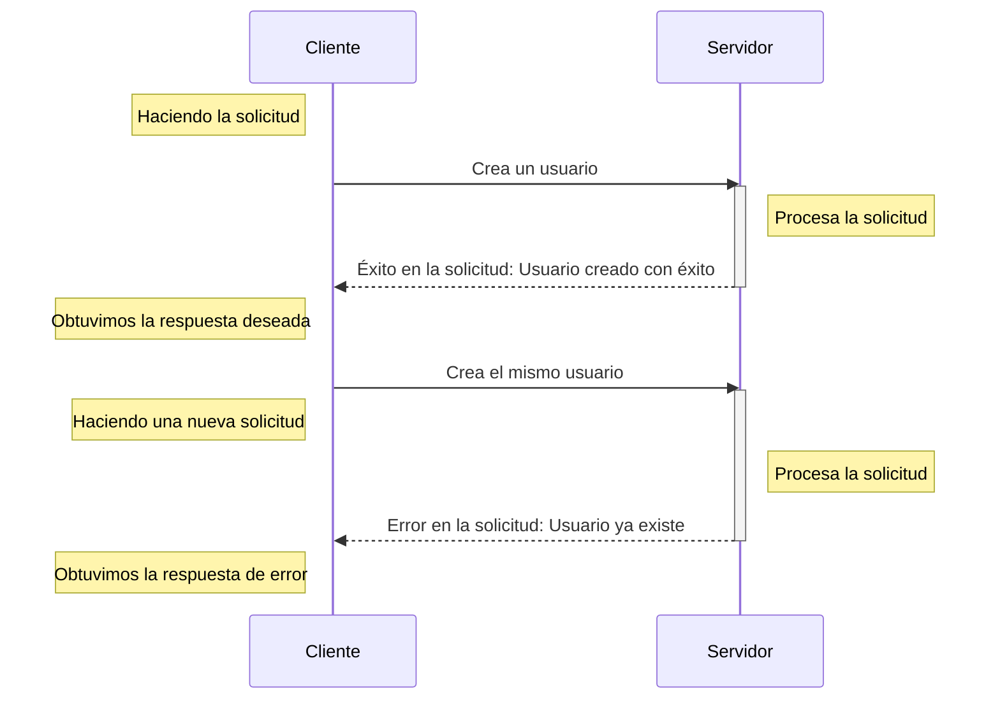

La comunicación es bidireccional: un cliente hace una solicitud al servidor, que a su vez emite una respuesta.

Por ejemplo, al construir un servidor, necesitamos una biblioteca que consiga "servir" nuestra aplicación. Es ahí donde entra Uvicorn, responsable de servir nuestra aplicación con FastAPI.

Cuando ejecutamos:

```shell title="$ Ejecución en la terminal!"
poetry run fastapi dev fast_zero/app.py
```

Cuando ejecutamos este comando, FastAPI hace una llamada a `uvicorn` e inicia un servidor en loopback, accesible solo internamente en nuestra computadora (la computadora localmente cuando se dirige a sí misma tiene la dirección IP 127.0.0.1). Al acceder a [http://127.0.0.1:8000/](http://127.0.0.1:8000/) en el navegador, estamos haciendo una solicitud al servidor en `127.0.0.1:8000`.

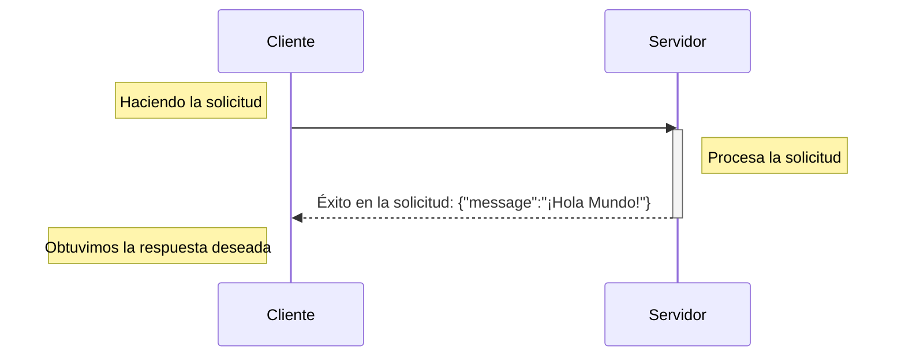

#### Usando FastAPI en la red local

Hablando de redes, Uvicorn en tu PC también puede servir FastAPI en tu red local:

```shell title="$ Ejecución en la terminal!"
poetry run fastapi dev fast_zero/app.py --host 0.0.0.0
```

Así, puedes acceder a la aplicación desde otro computador en tu red usando la dirección IP de tu máquina.

??? tip "Descubriendo tu dirección local usando python"
	En caso de que no estés familiarizado con la terminal o herramientas para descubrir tu dirección IP:

	```py title=">>> Terminal interactivo!"
	>>> import socket
	>>> s = socket.socket(socket.AF_INET, socket.SOCK_DGRAM)
	>>> s.connect(("8.8.8.8", 80))
	>>> s.getsockname()[0]
	'192.168.0.100'# (1)!
	```

	1. La dirección de mi computador en la red local

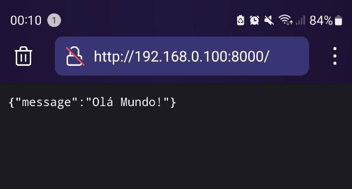{: .center .shadow }

### El modelo estándar de la web

Ignorando mucha historia y diversas capas de estándares, podemos concentrarnos en los tres estándares principales que serán más importantes para nosotros ahora:

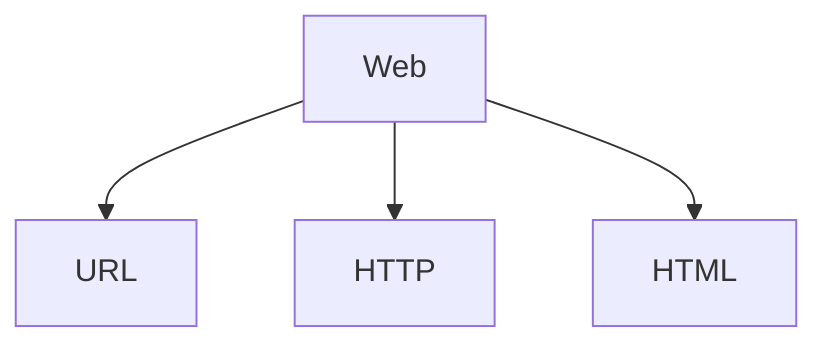

- [URL](https://es.wikipedia.org/wiki/Localizador_de_recursos_uniforme){:target="_blank"}: *Localizador Uniforme de Recursos*. Una dirección de red por la cual podemos comunicarnos con un computador en la red.
- [HTTP](https://es.wikipedia.org/wiki/Protocolo_de_transferencia_de_hipertexto){:target="_blank"}: un protocolo que especifica cómo debe ocurrir la comunicación entre dispositivos.
- [HTML](https://es.wikipedia.org/wiki/HTML){:target="_blank"}: el lenguaje usado para crear y estructurar páginas en la web.

#### URL

Una URL (Uniform Resource Locator) es como una dirección que nos ayuda a encontrar un recurso específico en una red, como la URL `http://127.0.0.1:8000` que usamos para acceder a nuestra aplicación.

Una URL está compuesta por varias partes, como en este ejemplo: `protocolo://dirección:puerto/camino/recurso?query_string#fragmento`. En este primer momento, nos enfocaremos en los primeros cuatro componentes, esenciales para el avance de la clase:

1. **Protocolo**: La primera parte de la URL, terminando con "://". Los más comunes son "http://" y "https://". Este protocolo define cómo se intercambian los datos entre tu computador y el lugar donde está almacenado el recurso, sea en internet o en una red local.

2. **Dirección del Host**: Puede ser una dirección IP (como "192.168.1.10") o una dirección de [DNS](https://es.wikipedia.org/wiki/Sistema_de_nombres_de_dominio){:target="_blank"} (como "youtube.com"). Identifica el dispositivo en la red que contiene el recurso deseado.

3. **Puerto (opcional)**: Después de la dirección del host, puede haber un número después de dos puntos, como en "192.168.1.10:8080". Este número es el puerto, usado para dirigir tu solicitud al servicio específico en el dispositivo. Por defecto, los puertos son `80` para HTTP y `443` para HTTPS, cuando no se especifican.

4. **Camino**: Indica la ubicación exacta del recurso en el servidor o dispositivo. Por ejemplo, en "192.168.1.10:8000/busca", `/busca` es el nombre del recurso. Cuando no se especifica, el servidor responde con el recurso en la raíz (`/`).

Al acceder vía navegador a la URL `http://127.0.0.1:8000`, estamos accediendo al servidor vía protocolo `HTTP`, en la dirección de nuestro propio computador, en el puerto `8000`, solicitando el recurso `/`.

#### HTTP

Cuando el cliente inicia una solicitud hacia una dirección en la red, esto se hace vía un protocolo y se dirige al servidor del recurso. En aplicaciones web, la mayoría de la comunicación ocurre vía protocolo HTTP o su versión segura, el HTTPS.

HTTP, o *Hypertext Transfer Protocol* (Protocolo de Transferencia de Hipertexto), es el protocolo fundamental en la web para la transferencia de datos y comunicación entre clientes y servidores. Se basa en el modelo de solicitud-respuesta: donde el cliente hace una solicitud al servidor, que responde a esa solicitud. Estas solicitudes y respuestas están formateadas conforme a las reglas del protocolo HTTP.

##### Mensajes

En el contexto del HTTP, tanto solicitudes como respuestas se denominan **mensajes**. Los mensajes HTTP en la versión 1 tienen una estructura textual similar al siguiente ejemplo.

Un ejemplo de mensaje HTTP enviado por el cliente:

```http title="Ejemplo del mensaje emitido por el cliente" linenums="1"
GET / HTTP/1.1
Accept: */*
Accept-Encoding: gzip, deflate
Connection: keep-alive
Host: 127.0.0.1:8000
User-Agent: HTTPie/3.2.2
```

En la primera línea, tenemos el [verbo](#verbos) GET, que solicita un recurso, en este caso, el recurso es `/`. Las líneas siguientes componen el [encabezado](#encabezado) del mensaje. Informan que el cliente acepta cualquier tipo de respuesta (`Accept: */*`), indican la URL destino (`Host: 127.0.0.1:8000`) e identifican el cliente que generó la solicitud (`User-Agent: HTTPie/3.2.2`), que en este caso fue el cliente [HTTPie](https://httpie.io/cli){:target="_blank"}.

En respuesta a este mensaje, el servidor envió lo siguiente:

```http title="Ejemplo del mensaje de respuesta del servidor" linenums="1"
HTTP/1.1 200 OK
content-length: 24
content-type: application/json
date: Fri, 19 Jan 2024 04:05:50 GMT
server: uvicorn

{
    "message": "Hola mundo"
}
```

Aquí, en la primera línea de la respuesta, tenemos la versión del protocolo HTTP utilizada y el [código de respuesta](#codigos-de-respuesta) `200 OK`, indicando que la solicitud fue exitosa. El encabezado de la respuesta incluye información como el `content-length` y `content-type`, que especifican el tamaño y el tipo del contenido de la respuesta, respectivamente. La fecha y el servidor que procesó la solicitud también se indican. Finalmente, el [cuerpo de la respuesta](#cuerpo), formateado en JSON, contiene el mensaje `"Hola mundo"`.

??? example "¿Cómo se generaron los mensajes del HTTP?"
	La visualización de los mensajes se generó con el cliente CLI de HTTPie: `http GET http://127.0.0.1:8000 -v`:

	```http
	GET / HTTP/1.1
	Accept: */*
	Accept-Encoding: gzip, deflate
	Connection: keep-alive
	Host: 127.0.0.1:8000
	User-Agent: HTTPie/3.2.2

	HTTP/1.1 200 OK
	content-length: 24
	content-type: application/json
	date: Fri, 19 Jan 2024 04:05:50 GMT
	server: uvicorn

	{
		"message": "Hola mundo"
	}
	```


###### Encabezado

El encabezado de un mensaje HTTP contiene metadatos esenciales sobre la solicitud o respuesta. Algunos elementos comunes que pueden incluirse en el encabezado son:

- **Content-Type**: Especifica el tipo de medio en el cuerpo del mensaje. Por ejemplo, `Content-Type: application/json` indica que el cuerpo del mensaje está en formato JSON. O `Content-Type: text/html`, para mensajes que contienen [HTML](#html).
- **Authorization**: Usado para autenticación, como tokens o credenciales. (veremos más de esto en las clases siguientes)
- **Accept**: Especifica el tipo de medio que el cliente acepta, como `application/json`.
- **Server**: Proporciona información sobre el software del servidor.

###### Cuerpo

El cuerpo del mensaje contiene los datos propiamente dichos, variando conforme al tipo de medio. Ejemplos pueden incluir un objeto JSON o una estructura HTML.

##### Verbos

Cuando un cliente hace una solicitud HTTP, indica su intención al servidor utilizando verbos. Estos verbos señalan diferentes acciones en el protocolo HTTP. Veamos algunos ejemplos:


- **GET**: utilizado para recuperar recursos. Empleamos este verbo cuando queremos solicitar un dato ya existente en el servidor.
- **POST**: permite crear un nuevo recurso. Por ejemplo, enviar datos para registrar un nuevo usuario.
- **PUT**: Actualiza un recurso existente. Como, por ejemplo, actualizar las informaciones de un usuario existente.
- **DELETE**: Elimina un recurso. Por ejemplo, remover un usuario específico del sistema.

En nuestra aplicación FastAPI, definimos que la función `read_root` será ejecutada cuando una solicitud GET sea hecha por un cliente en el camino `/`:

```py title="fast_zero/app.py" linenums="5" hl_lines="1"
@app.get('/')
def read_root():
    return {'message': '¡Hola Mundo!'}
```

Cuando realizamos la solicitud vía navegador, el verbo por defecto es el GET. Por eso, obtenemos en la pantalla el mensaje `#!python {'message': '¡Hola Mundo!'}`.

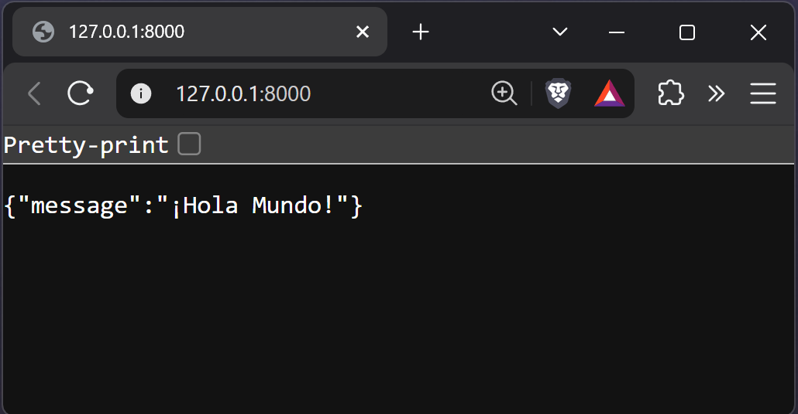{: .center .shadow }

Esta es exactamente la respuesta proporcionada por la ejecución de la función `read_root`. En el futuro, crearemos funciones para lidiar con los otros verbos HTTP.

##### Códigos de respuesta

En el mundo de las solicitudes usando el protocolo HTTP, además de la respuesta obtenida cuando nos comunicamos con el servidor, también recibimos un código de respuesta (*status code*). Los códigos son formas de mostrar al cliente cómo el servidor lidió con su solicitud. Los códigos se dividen en clases y las clases se distribuyen por centenas:

- 1xx: informativo — utilizada para enviar información al cliente de que su solicitud fue recibida y está siendo procesada.
- 2xx: éxito — Indica que la solicitud fue exitosa (por ejemplo, 200 OK, 201 Created).
- 3xx: redireccionamiento — Informa que más acciones son necesarias para completar la solicitud (por ejemplo, 301 Moved Permanently, 302 Found).
- 4xx: error en el **cliente** — Significa que hubo un error en la solicitud hecha por el cliente (por ejemplo, 400 Bad Request, 404 Not Found).
- 5xx: error en el **servidor** — Indica un error en el servidor al procesar la solicitud válida del cliente (por ejemplo, 500 Internal Server Error, 503 Service Unavailable).

> Para más información acerca del *status code* accede a la documentación de [iana](https://www.iana.org/assignments/http-status-codes/http-status-codes.xhtml){:target="_blank"}

Siempre que hacemos una solicitud, obtenemos un código de respuesta. Por ejemplo, en nuestro archivo de test, cuando efectuamos la solicitud, hacemos la verificación para ver si recibimos un código de éxito, el código `#!python 200 OK`:

```py title="tests/test_app.py" linenums="5" hl_lines="6"
def test_root_deve_retornar_ok_e_ola_mundo():
    client = TestClient(app)

    response = client.get('/')

    assert response.status_code == 200
```

###### **Buenas prácticas para constantes**

Cuando comparamos valores, la buena práctica es que nunca sean explícitos en el código como `#!python status_code == 200`. En este caso en específico es fácil saber qué significa `#!python 200` porque estamos estudiando exactamente esta parte. Pero, en algunos momentos podemos encontrarnos con códigos que no sabemos el significado. Por ejemplo un código `#!python 209`. ¿Qué significa?[^1]

Cuando trabajamos con "valores mágicos" en el código, la [PEP-8](https://peps.python.org/pep-0008/#constants){:target="_blank"} recomienda que creemos constantes que representen esos valores. Como por ejemplo `#!python OK = 200`.

La buena práctica para lidiar con códigos de status es usar la clase `#!python http.HTTPStatus`, que ya mapea todos los status code en un único objeto. Haciendo que la comparación se haga de forma simple, como:


```py title="tests/test_app.py" linenums="5" hl_lines="6"
def test_root_deve_retornar_ok_e_ola_mundo():
    client = TestClient(app)

    response = client.get('/')

    assert response.status_code == HTTPStatus.OK
```


[^1]: El código 209 no es un status code válido en el http, por eso lo usé como ejemplo.

###### El lado del servidor

Para garantizar que la respuesta obtenida por el cliente sea considerada un éxito, FastAPI, por defecto, envía el código de éxito `200` para el método GET. Sin embargo, también podemos dejarlo explícito en la definición de la ruta:

=== "Solo el dígito"
	```py title="fast_zero/app.py" linenums="5" hl_lines="1"
	@app.get("/", status_code=200)
	def read_root():
		return {'message': '¡Hola Mundo!'}
	```

=== "Usando HTTPStatus"
	```py title="fast_zero/app.py" linenums="5" hl_lines="1"
	@app.get("/", status_code=HTTPStatus.OK)
	def read_root():
		return {'message': '¡Hola Mundo!'}
	```

Lista de los códigos más comunes:

- **200 OK**: la solicitud fue exitosa. El significado exacto depende del método HTTP utilizado en la solicitud.
- **201 Created**: la solicitud fue exitosa y un nuevo recurso fue creado como resultado.
- **404 Not Found**: el recurso solicitado no pudo ser encontrado, siendo frecuentemente usado cuando el recurso es inexistente.
- **422 Unprocessable Entity**: usado cuando la solicitud está bien formada, pero no puede ser seguida debido a errores semánticos. Es común en APIs al validar datos de entrada.

Así, podemos ir al tercer pilar del desarrollo web que son los contenidos relacionados a las respuestas.

#### HTML


El tercer pilar fundamental de la web es el HTML, sigla de *Hypertext Markup Language*. Se trata del lenguaje de marcado estándar usado para crear y estructurar páginas en internet. Cuando accedemos a un sitio, lo que vemos en nuestros navegadores es el resultado de la interpretación del HTML. Este lenguaje utiliza una serie de 'tags' – como `#!html <html>`, `#!html <head>`, `#!html <body>`, `#!html <h1>`, `#!html <p>` y otras – para definir la estructura y el contenido de una página web.

La belleza del HTML reside en su simplicidad y eficacia. Más que un lenguaje, es una forma de organizar y presentar información en la web. Cada tag tiene un propósito específico: `#!html <h1>` a `#!html <h6>` se usan para títulos y subtítulos; `#!html <p>` para párrafos; `#!html <a>` para links; mientras `#!html <div>` y `#!html <span>` auxiliar en la organización y estilo del contenido. Juntas, estas tags forman la columna vertebral de casi todas las páginas de internet.

Si nuestro objetivo fuera presentar un HTML simple, podríamos usar la clase de respuesta `HTMLResponse`:

```py linenums="1" hl_lines="2 7"
from fastapi import FastAPI
from fastapi.responses import HTMLResponse

app = FastAPI()


@app.get('/', response_class=HTMLResponse)
def read_root():
    return """
    <html>
      <head>
        <title> ¡Nuestro hola mundo!</title>
      </head>
      <body>
        <h1> Hola Mundo </h1>
      </body>
    </html>"""
```

Al acceder a nuestra URL en el navegador, podemos ver el HTML siendo renderizado:

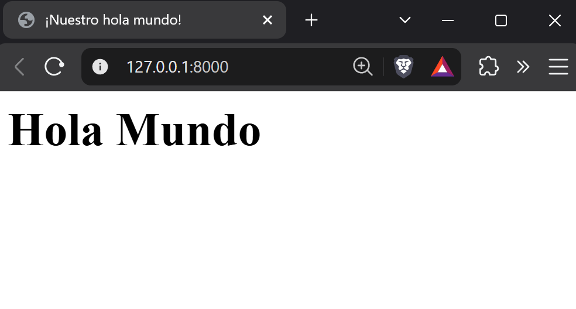{: .center }

Aunque el HTML sea crucial para la estructuración de páginas web, nuestro curso se enfoca en una perspectiva diferente: la transferencia de datos. Mientras el HTML se usa para presentar datos visualmente en los navegadores, existe otra capa enfocada en la transferencia de información entre sistemas y servidores. Aquí entra el concepto de APIs (Application Programming Interfaces), que frecuentemente utilizan JSON (JavaScript Object Notation) para el intercambio de datos. JSON es un formato ligero de intercambio de datos, fácil de leer y escribir para humanos, y simple de interpretar y generar para máquinas.

Por lo tanto, aunque no profundicemos en el HTML como lenguaje, es importante entender su papel como la capa de presentación estándar de la web. Ahora, dirigiremos nuestra atención hacia las APIs y el intercambio de datos en JSON, explorando cómo estas tecnologías permiten la comunicación eficiente entre diferentes sistemas y aplicaciones.

## APIs

Cuando hablamos sobre aplicaciones web que no involucran una capa de visualización, como HTML, generalmente nos referimos a APIs. La sigla API viene de *Application Programming Interface* (Interfaz de Programación de Aplicaciones). Una API está diseñada para ser una interfaz claramente definida y documentada, que facilita la interacción por medio del protocolo HTTP.

La esencia de las APIs reside en el modelo cliente-servidor, donde el cliente intercambia datos con el servidor a través de [*endpoints*](#endpoint), respetando las reglas establecidas por el protocolo HTTP. Por ejemplo, para solicitar datos al servidor, usamos el verbo GET, dirigiendo la solicitud a un endpoint específico del servidor, que en respuesta nos proporciona el dato o recurso solicitado.

### Endpoint

El término "endpoint" se refiere a un punto específico en una API hacia donde se envían las solicitudes. Básicamente, es una dirección en la web (URL) donde el servidor o la API está activo y listo para responder a solicitudes de los clientes. Cada endpoint está asociado a una función específica de la API, como recuperar datos, crear nuevos registros, actualizar o eliminar datos existentes.

La ubicación y estructura de un endpoint, que incluyen el camino en la URL y los métodos HTTP permitidos, definen cómo los clientes deben formatear sus solicitudes para ser comprendidas y procesadas por el servidor. Por ejemplo, un endpoint para recuperar informaciones de un usuario puede tener una dirección como `https://api.ejemplo.com/usuarios/{id}`, donde `{id}` es el identificador único del usuario deseado.

Actualmente, en nuestra aplicación, tenemos solo un endpoint disponible: el `/`. Veamos el ejemplo:

```py title="Código de Ejemplo" linenums="1" hl_lines="1"
@app.get('/')
def read_root():
    return {'message': '¡Hola Mundo!'}
```

Cuando utilizamos el decorador `#!python @app.get('/')`, estamos instruyendo a nuestra API que, para llamadas de método `GET` en el endpoint `/`, la función `read_root` será ejecutada. El resultado de esa función, en este caso `{'message': '¡Hola Mundo!'}`, es lo que será retornado al cliente.

### Documentación

Una pregunta común en esta etapa es: "Ok, pero ¿cómo descubrir o conocer los endpoints disponibles en una API?". La respuesta reside en la documentación. Una documentación eficaz es esencial en APIs, especialmente cuando muchos clientes diferentes necesitan comunicarse con el servidor. La mejor práctica es proporcionar una documentación detallada, clara y accesible sobre los endpoints disponibles, incluyendo información sobre el formato y la estructura de los datos que pueden ser enviados y recibidos.

La documentación de una API sirve como una guía o un manual, facilitando el entendimiento y la utilización por desarrolladores y usuarios finales. Desempeña un papel crucial al:

- Definir claramente los endpoints y sus funcionalidades.
- Especificar los métodos HTTP soportados (GET, POST, PUT, DELETE, etc.).
- Describir los parámetros esperados en solicitudes y respuestas.
- Proporcionar ejemplos de solicitudes y respuestas para facilitar el entendimiento.

#### OpenAPI y documentación automática

Una de las soluciones más eficaces para la documentación de APIs es la utilización de la especificación OpenAPI, disponible en [OpenAPI Specification](https://swagger.io/specification/){:target="_blank"}. Esta especificación proporciona un estándar robusto para describir APIs, permitiendo a los desarrolladores crear documentaciones precisas y testeables de forma automática. Este enfoque no solo simplifica el proceso de documentación, sino que también garantiza que la documentación sea consistentemente actualizada y precisa.

Para visualizar e interactuar con esa documentación, herramientas como [Swagger UI](https://swagger.io/tools/swagger-ui/){:target="_blank"} y [Redoc](https://redocly.github.io/redoc/){:target="_blank"} son ampliamente utilizadas. Transforman la especificación OpenAPI en visualizaciones interactivas, proporcionando una interfaz fácil de navegar donde los usuarios pueden no solo leer la documentación, sino también experimentar la API directamente en la interfaz. Esta funcionalidad interactiva es fundamental para una comprensión práctica de cómo funciona la API, además de ofrecer una manera eficiente de testear sus funcionalidades en tiempo real.

En el contexto de FastAPI, hay soporte automático tanto para Swagger UI como para Redoc. Para explorar la documentación actual de nuestra aplicación, basta iniciar el servidor con el siguiente comando:

```shell title="$ Ejecución en la terminal!"
poetry serve
```

#### Swagger UI

Al acceder a la dirección [http://127.0.0.1:8000/docs](http://127.0.0.1:8000/docs){:target="_blank"}, nos encontramos con la interfaz de Swagger UI:

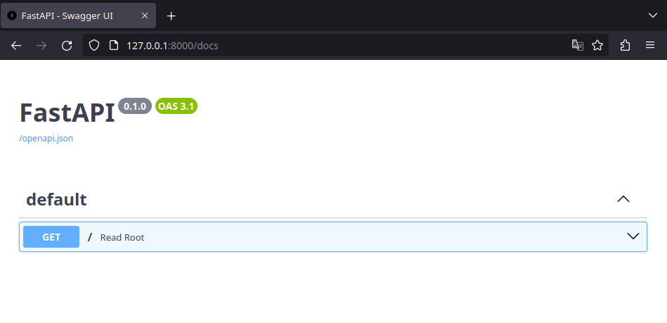{: .center .shadow }

Esta imagen nos da una visión general de los endpoints disponibles en nuestra aplicación, en este caso, el endpoint `/` que acepta el verbo HTTP `GET`. Al explorar más a fondo y hacer clic en ese método:

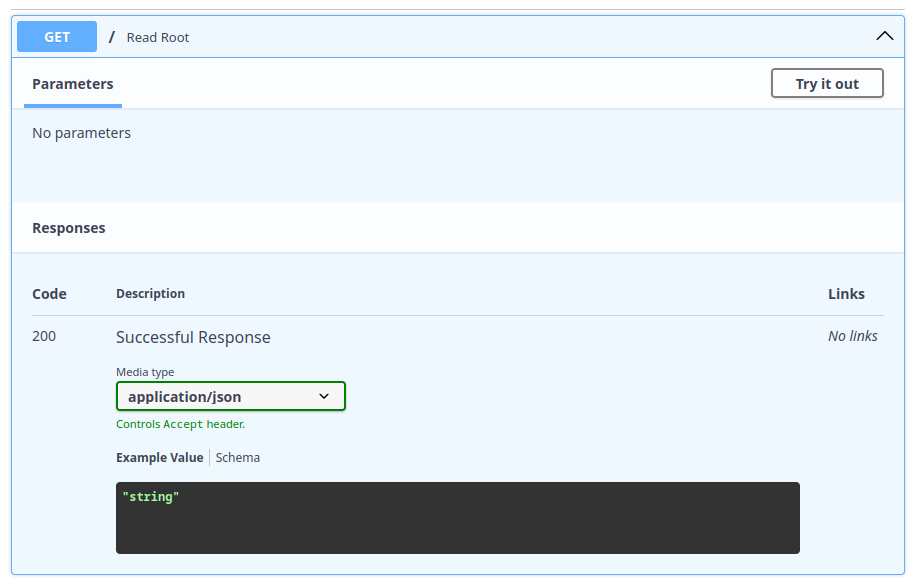{: .center .shadow }

En la documentación, es posible observar diversas informaciones cruciales, como el [código de respuesta](#codigos-de-respuesta) `200`, que indica éxito, el tipo de dato retornado por el [encabezado](#encabezado) (`application/json`) y un ejemplo del valor de retorno. Sin embargo, la documentación actual sugiere, incorrectamente, que el retorno es una `string`, cuando, en realidad, nuestra aplicación retorna un objeto [JSON](#comunicacion-en-json){:target="_blank"}. Esa diferencia será abordada en breve.

Un aspecto interesante de Swagger UI es la posibilidad de interactuar directamente con la API a través de la interfaz. Al hacer clic en `Try it out`, un botón `Execute` se vuelve disponible:

{: .center .shadow }

Hacer clic en `Execute` convierte a Swagger en un cliente temporal de nuestra API, enviando una solicitud al servidor y exhibiendo la respuesta:

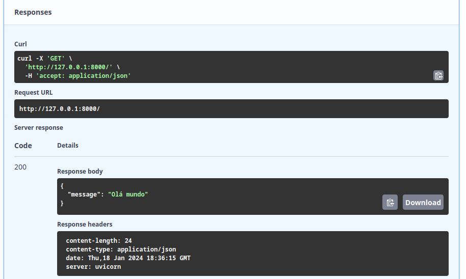{: .center .shadow }

La respuesta ilustra cómo hacer la llamada usando [Curl](https://curl.se/docs/manpage.html){:target="_blank"}, la [URL](#url){:target="_blank"} utilizada, el [código de respuesta](#codigos-de-respuesta) 200, y detalles de la respuesta del servidor, incluyendo el cuerpo del mensaje ([body](#cuerpo){:target="_blank"}) y los encabezados ([headers](#encabezado){:target="_blank"}).

#### Redoc

Así como Swagger UI, [Redoc](https://redocly.github.io/redoc/){:target="_blank"} es otra herramienta popular para visualizar la documentación de APIs OpenAPI, pero con un foco en una presentación más limpia y legible. Para acceder a la documentación Redoc de nuestra aplicación, podemos visitar la dirección [http://127.0.0.1:8000/redoc](http://127.0.0.1:8000/redoc){:target="_blank"}. Redoc organiza la documentación de una manera más lineal y de fácil lectura, destacando las descripciones de los endpoints, los métodos HTTP disponibles, los schemas de los datos de entrada y salida, además de ejemplos de solicitudes y respuestas.

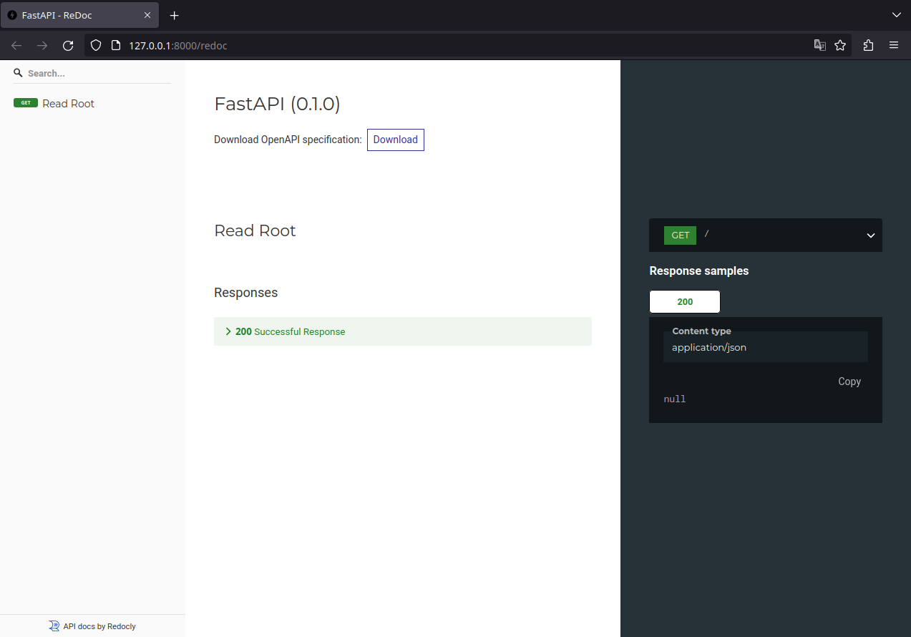{: .center .shadow }

#### ¿Cuál elegir?

Con dos opciones nativas y automáticas en FastAPI, surge la duda: ¿cuál de ellas utilizar? La elección entre Swagger UI y Redoc depende principalmente de tu objetivo en el momento:

- Swagger UI y tests rápidos: como posee el botón *Try it out*, es la herramienta perfecta durante la fase de desarrollo. Funciona como un "playground", permitiendo que testees los endpoints en tiempo real sin necesitar herramientas externas para enviar las solicitudes.

- Redoc, foco en lectura: es interesante cuando la API ya está madura y necesitas disponibilizar una documentación para clientes externos o partners de negocios. Su interfaz de tres columnas es ampliamente considerada más profesional, elegante y fácil de leer para quien necesita solo entender la arquitectura y los schemas de la API, sin necesariamente disparar solicitudes allí en el momento.

En la práctica, no necesitas renunciar a ninguno de los dos. Como el framework genera ambos automáticamente, puedes usar, por ejemplo, Swagger UI en tu día a día de desarrollo y disponibilizar el link de Redoc en la documentación final del producto.

???+ tip "Desactivar documentación automática"
	En caso de que creas que para tu aplicación tenga sentido desactivar la documentación pública automática, podrías desactivarla en la instancia de FastAPI en la aplicación:
	
	```python title="Código de ejemplo"
	from fastapi import FastAPI

    app = FastAPI(docs_url=None, redoc_url=None)
	```

	De esta forma podrías desactivar los dos, uno u otro. Este es un código de ejemplo, en caso de que quieras hacer eso. Vamos a usar bastante el swagger durante el desarrollo del curso, entonces es importante que no lo desactives.


## Comunicación en JSON

Cuando discutimos APIs "modernas"[^2], nos referimos a APIs que priorizan el tráfico de datos, dejando de lado la capa de presentación, como el [HTML](#html). El objetivo es transmitir datos de forma agnóstica para diferentes tipos de clientes. En ese contexto, el JSON (JavaScript Object Notation) se volvió el medio estándar, gracias a su ligereza y facilidad de lectura tanto por humanos como por máquinas.

[^2]: A pesar de la noción común de que las APIs modernas están diseñadas para comunicarse en JSON, existen debates intensos sobre las mejores prácticas para la transferencia de datos en APIs. Una lectura recomendada es el libro [hypermedia systems](https://hypermedia.systems/){:target="_blank"}, que es gratuito y ofrece percepciones valiosas.

El JSON es apreciado por su simplicidad, presentando datos en estructuras de documento clave-valor, donde los valores pueden ser strings, números, booleanos, arrays, entre otros.

A continuación, un ejemplo ilustra el formato JSON:

```json title="Ejemplo de un JSON"
{
    "libros": [
	    {
		    "titulo": "El guardián entre el centeno",
			"autor": "J.D. Salinger",
			"año": 1945,
			"disponible": false
        },
		{
			"titulo": "El maestro y Margarita",
			"autor": "Mijaíl Bulgákov",
			"año": 1966,
			"disponible": true
		}
	]
}
```

Este ejemplo demuestra cómo el JSON organiza datos de forma intuitiva y accesible, haciéndolo ideal para la comunicación de datos en una amplia variedad de aplicaciones.

### Contratos en APIs JSON

Cuando hablamos sobre la comunicación en JSON entre cliente y servidor, es crucial establecer un entendimiento mutuo sobre la estructura de los datos que serán intercambiados. A este entendimiento lo denominamos *schema*, que actúa como un contrato definiendo la forma y el contenido de los datos transferidos.

El schema de una API desempeña un papel fundamental al asegurar que ambos, cliente y servidor, estén alineados cuanto a la estructura de los datos. Este "contrato" especifica:

- Campos de Datos Esperados: cuáles campos son esperados en el mensaje JSON, incluyendo nombres de campos y tipos de datos (como strings, números, booleanos).
- Restricciones Adicionales: como validaciones para tamaños de strings, formatos de números y otros tipos de validación de datos.
- Estructura de Objetos Anidados: cómo los objetos están estructurados dentro del JSON, incluyendo arrays y sub-objetos.

Por ejemplo, para nuestro mensaje simple retornado por `read_root` (`#!python {'message': '¡Hola mundo!'}`), tendríamos un schema así:

```json
{
  "type": "object",
  "properties": {
    "message": {
      "type": "string"
    }
  },
  "required": ["message"]
}
```

Donde estamos diciendo al cliente que al llamar a la API, será retornado un objeto, ese objeto contiene la propiedad `#!python "message"`, el mensaje será del tipo `string`. Al final, vemos que el campo `message` es requerido. Eso quiere decir que siempre será enviado en la respuesta.

??? example "¿Y en casos más complicados, cómo quedaría el schema?"
	Para el ejemplo que hicimos antes, sobre los libros, el schema sería así:
	```json
	{
	  "type": "object",
      "properties": {
        "libros": {
          "type": "array",
          "items": {
            "type": "object",
            "properties": {
              "titulo": {
                "type": "string"
              },
              "autor": {
                "type": "string"
              },
              "año": {
                "type": "integer"
              },
              "disponible": {
                "type": "boolean"
              }
            },
            "required": ["titulo", "autor", "año", "disponible"]
          }
        }
	  },
	  "required": ["libros"]
    }
	```

### Pydantic

En el universo de APIs y contratos de datos, especialmente al trabajar con Python, [Pydantic](https://docs.pydantic.dev/latest/){:target="_blank"} se destaca como una herramienta poderosa y versátil. Esta biblioteca, altamente integrada al ecosistema Python, se especializa en la creación de schemas de datos y en la validación de tipos. Con Pydantic, es posible expresar schemas JSON de manera elegante y eficiente a través de clases Python, proporcionando un puente robusto entre la flexibilidad del JSON y la seguridad de tipos de Python.

!!! note "Sobre la terminología"
	Aunque el término `schema` sea bastante utilizado en python para referirse al formato de los objetos transferidos, en algunos otros contextos y lenguajes podemos referirnos a estos modelos como [DTOs](https://es.wikipedia.org/wiki/Objeto_de_Transferencia_de_Datos){:target="_blank"} (objetos de transferencia de datos). 

Por ejemplo, el schema JSON `{'message': '¡Hola mundo!'}`. Con Pydantic, podemos representar ese schema en la forma de una clase Python llamada `Message`. Esto se hace de manera intuitiva y directa:

```py title="fast_zero/schemas.py" linenums="1"
from pydantic import BaseModel


class Message(BaseModel):
    message: str
```

Para iniciar el desarrollo con schemas en el contexto de FastAPI, podemos crear un archivo llamado `fast_zero/schemas.py` y definir la clase `Message`. Vale resaltar que Pydantic es una dependencia integrada de FastAPI (no necesita ser instalado), reflejando la importancia de esta biblioteca en el proceso de validación de datos y en la generación de documentación automática para APIs, como la documentación OpenAPI.

#### Integrando Pydantic con FastAPI

La integración del modelo Pydantic (o schema JSON) con FastAPI se hace al especificar el modelo en el campo `response_model` del decorador del endpoint. Esto garantiza que la respuesta de la API esté alineada con el schema definido, además de auxiliar en la validación de los datos retornados:

```python title="fast_zero/app.py" linenums="1" hl_lines="10"
from http import HTTPStatus

from fastapi import FastAPI

from fast_zero.schemas import Message

app = FastAPI()


@app.get('/', status_code=HTTPStatus.OK, response_model=Message)
def read_root():
    return {'message': '¡Hola Mundo!'}
```

Con este enfoque, al iniciar el servidor (`poetry serve`) y acceder a Swagger UI en [http://127.0.0.1:8000/docs](http://127.0.0.1:8000/docs){:target="_blank"}, observamos una evolución significativa en la documentación. Un nuevo campo `Schemas` es exhibido, destacando la estructura del modelo `Message` que definimos:

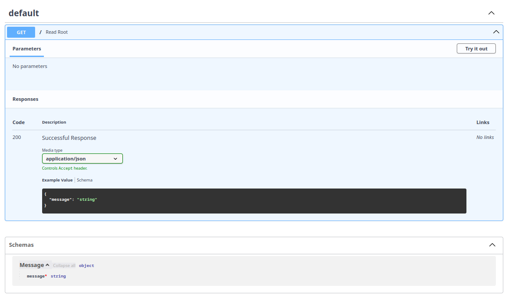{: .center .shadow }

Además, en la sección de `Responses`, tenemos un ejemplo claro de la salida esperada del endpoint: `#!python {"message": "string"}`. Esto ilustra cómo la API responderá, especificando que el campo obligatorio `"message"` será retornado con un valor del tipo `"string"`.

## Ejercicio

1.Crea un nuevo endpoint en `fast_zero/app.py` que retorne "hola mundo" usando HTML y escribe su test en `tests/test_app.py`.

> Consejo: para capturar la respuesta del HTML del cliente de tests, puedes usar `#!python response.text`



## Código de esta lección



## Conclusión

En esta clase, navegamos brevemente por el vasto mundo del desarrollo web con foco en APIs, abrazando desde los fundamentos de la comunicación en la web hasta las prácticas de intercambio de datos. Exploramos el modelo cliente-servidor, entendimos algunos detalles de los mensajes HTTP y tuvimos una introducción sobre URLs y HTML. Aunque el HTML desempeña un papel central en la capa de presentación, nuestro foco recayó sobre las APIs, particularmente aquellas que intercambian JSON, un formato de datos.

Profundizamos en el uso de herramientas y conceptos vitales para la creación de APIs, como FastAPI y Pydantic, que juntos ofrecen una poderosa combinación para la validación de datos y la generación automática de documentación. La exploración de Swagger UI y Redoc enriqueció nuestro entendimiento sobre la importancia de la documentación accesible y clara para APIs, facilitando tanto el desarrollo como la usabilidad.

Esta clase nos dio una fundamentación básica para avanzar en la construcción de APIs. Aunque hayamos ejemplificado los conceptos con FastAPI, estos conceptos teóricos pueden ayudarte a desarrollar herramientas web en cualquier tecnología o lenguaje.

¡Nos vemos en las próximas clases para aplicar todos estos conceptos de forma más profundizada!
