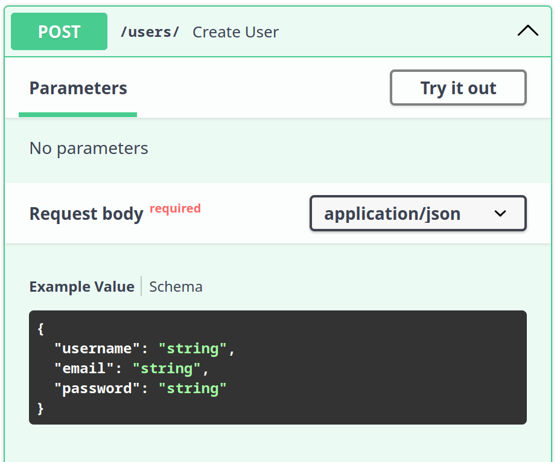
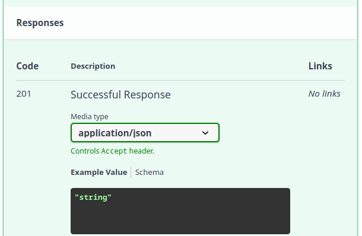
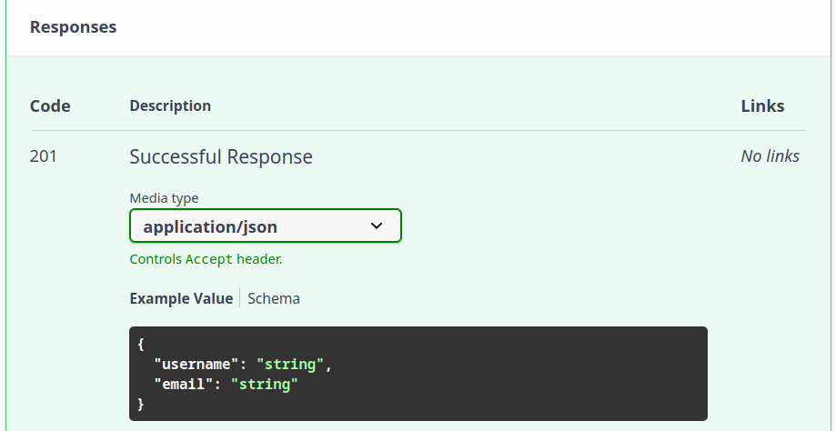
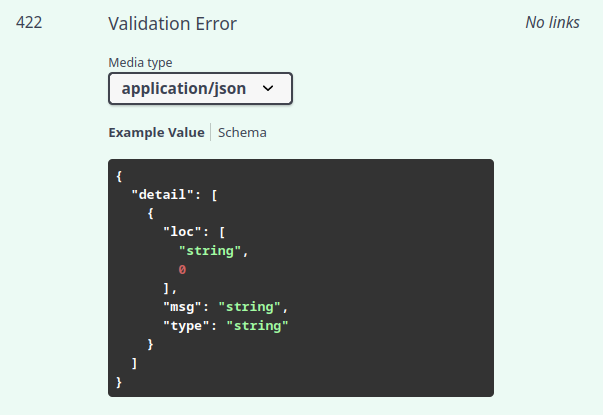
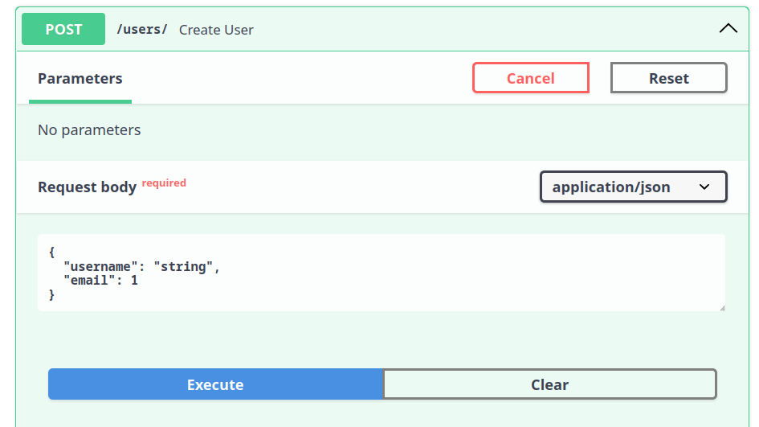
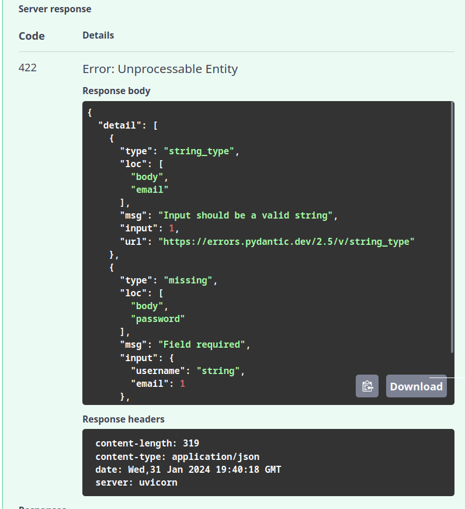
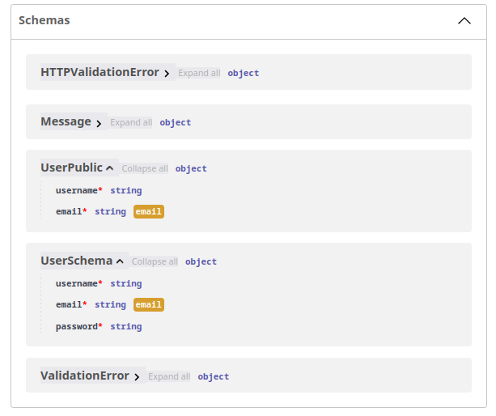
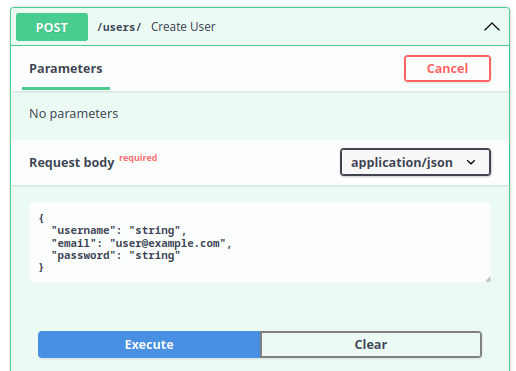
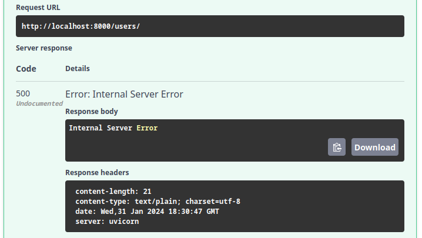
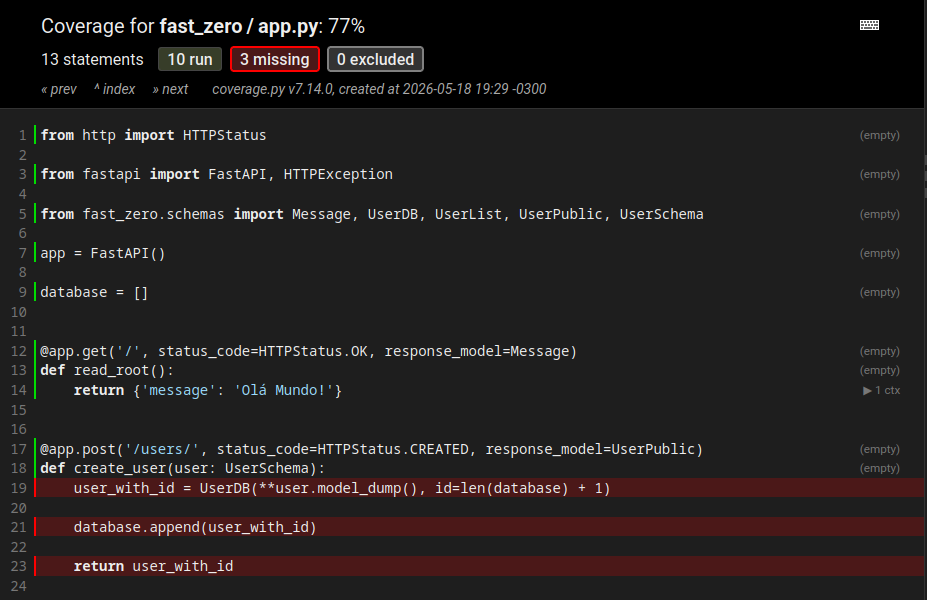

# Estructurando el proyecto y creando rutas CRUD

---

Objetivos de esta clase:

- Comprender la estructura de un proyecto FastAPI y cómo estructurar rutas CRUD (Crear, Leer, Actualizar, Eliminar)
- Mejorar nuestro conocimiento sobre Pydantic y su utilidad en la validación y serialización de datos
- Implementación de rutas CRUD en FastAPI
- Escritura y ejecución de tests para validar el comportamiento de las rutas



---

Bienvenidos de nuevo a nuestra serie de clases sobre la construcción de una aplicación utilizando FastAPI. En la última clase, abordamos conceptos básicos del desarrollo web y finalizamos la configuración de nuestro entorno. Hoy avanzaremos en la estructuración de los primeros endpoints de nuestra API, concentrándonos en las cuatro operaciones fundamentales de **CRUD** - Crear, Leer, Actualizar y Eliminar. Exploraremos cómo estas operaciones se aplican tanto a la comunicación web como a la interacción con la base de datos.

El objetivo de esta clase es implementar un sistema de registro de usuarios en nuestra aplicación. Al final, podrás registrar, listar, modificar y eliminar usuarios, además de realizar tests para validar estas funcionalidades.

??? note "Nota para personas **más experimentadas** sobre esta clase"
	El principio detrás de esta clase es demostrar cómo construir los endpoints y los tests más básicos posibles.

	Tal vez te cause extrañeza el uso de una base de datos en una lista y los tests construidos a partir de efectos colaterales. Pero el objetivo principal es que las personas puedan concentrarse en la creación de los primeros tests sin mucho roce.

	Estas cuestiones se resolverán en las clases siguientes.

## CRUD y HTTP

En el desarrollo de APIs, existen cuatro acciones principales que hacemos con los datos: crear, leer, actualizar y eliminar. Estas acciones ayudan a gestionar los datos en la base de datos y en la aplicación web. Nos enfocaremos en este primer momento en las relaciones entre los datos.

CRUD es un acrónimo que representa las cuatro operaciones básicas que puedes realizar en cualquier base de datos persistente:

- **C**reate (Crear): agregar nuevos registros a la base de datos.
- **R**ead (Leer): recuperar registros existentes de la base de datos.
- **U**pdate (Actualizar): modificar registros existentes en la base de datos.
- **D**elete (Eliminar): eliminar registros existentes de la base de datos.

Con estas operaciones podemos realizar cualquier tipo de comportamiento en una base de datos. Podemos crear un registro, luego modificarlo y, tal vez después de todo eso, eliminarlo.

Cuando hablamos de APIs que sirven datos, todas estas operaciones tienen alguna forma similar en el protocolo HTTP. El protocolo tiene verbos para indicar esas mismas acciones que queremos representar en la base de datos.

- **POST**: se usa para solicitar que el servidor acepte un dato (recurso) enviado por el cliente.
- **GET**: se usa cuando el cliente desea solicitar una información del servidor.
- **PUT**: se usa en el momento en que el cliente desea informar alguna modificación de los datos al servidor.
- **DELETE**: se usa para decirle al servidor que elimine determinado recurso.

De esta forma podemos crear asociaciones entre los endpoints y la base de datos. Por ejemplo: cuando queramos insertar un dato en la base de datos, nosotros como clientes debemos comunicar esa intención al servidor usando el método POST enviando los datos (en nuestro caso en formato JSON) que deben persistirse en la base de datos. Con esto iniciamos el proceso de *create* en la base de datos.

### Respuestas de la API

Usamos códigos de estado para informar al cliente el resultado de las operaciones en el servidor, como si un dato fue creado, encontrado, actualizado o eliminado con éxito. 

Los códigos a los que debemos prestar atención para responder correctamente las solicitudes incluyen:

- **200 OK**: Indica éxito en la solicitud.
	- **GET**: Cuando un dato es solicitado y devuelto con éxito.
	- **PUT**: Cuando los datos son modificados con éxito.
- **201 CREATED**: Significa que la solicitud resultó en la creación de un nuevo recurso.
	- **POST**: Aplicable cuando un dato es enviado y creado con éxito.
	- **PUT**: Usado cuando una modificación resulta en la creación de un nuevo recurso.
- **204 NO CONTENT**: Retorno del servidor sin contenido en el mensaje.
	- **PUT**: Aplicable si la modificación no genera un retorno.
	- **DELETE**: Usado cuando la acción de eliminar no genera un retorno.

Los códigos de error más comunes que tenemos que conocer para manejar posibles errores en la aplicación son:

- **404 NOT FOUND**: El recurso solicitado no pudo ser encontrado.
- **422 UNPROCESSABLE ENTITY**: la petición estaba bien formada (es decir, sintácticamente correcta), pero no pudo ser procesada.
- **500 INTERNAL SERVER ERROR**: Un mensaje de error genérico, dado cuando se encontró una condición inesperada. Generalmente ocurre cuando nuestra aplicación presenta un error.

Comprendiendo estos códigos, estamos listos para iniciar la implementación de algunos endpoints y poner estos conceptos en práctica.

## Implementando endpoints

Para facilitar el aprendizaje, podemos dividir la creación de nuevos endpoints en tres etapas:

1. Relación con el HTTP: Determinar el verbo HTTP esperado y los códigos de respuesta para situaciones de éxito y error.
2. Modelos de Datos: Definir el formato del JSON esperado, campos y sus tipos, y pensar en los modelos de respuesta para situaciones de éxito y error.
3. Implementación del Cuerpo: Decidir el tratamiento de los datos recibidos y el tipo de procesamiento aplicado.

Las dos primeras etapas nos ayudan a definir la interfaz de comunicación y cómo será documentada. La tercera etapa es más específica e involucra decisiones sobre la interacción con la base de datos, validaciones adicionales y la definición de lo que constituye éxito o error en la solicitud.

Estas etapas nos orientan en la implementación completa del endpoint, garantizando que nada sea olvidado.

## Iniciando la implementación de la ruta POST

En esta clase, nuestro foco principal será desarrollar un sistema de registro de usuarios. Para eso, la implementación de una forma eficiente para crear nuevos usuarios en la base de datos es esencial. Exploraremos cómo utilizar el verbo HTTP POST, fundamental para comunicar al servidor nuestra intención de enviar nuevos datos, como en el registro de usuarios.

### Implementación del endpoint

Para iniciar, crearemos un endpoint que acepta el verbo `POST` con datos en formato JSON. Este endpoint responderá con el status `201` en caso de éxito en la creación del recurso. Con esto, establecemos la base para nuestra funcionalidad de registro.

Usaremos el decorador `#!python @app.post()` de FastAPI para definir nuestro endpoint, que comenzará con la URL `/users/`, indicando dónde recibiremos los datos para crear nuevos usuarios:

```python title="fast_zero/app.py" linenums="15"
--8<-- "aulas/codigos/03/fast_zero/app.py:6:9"
```

#### Status code de respuesta

Es crucial definir que, al registrar un usuario con éxito, el sistema debe devolver el código de respuesta `#!python 201 CREATED`, indicando la creación exitosa del recurso. Para eso, agregamos el parámetro `status_code` al decorador:

```python title="fast_zero/app.py" hl_lines="1" linenums="15"
--8<-- "aulas/codigos/03/fast_zero/app.py:15:18"
```

> Conversaremos en breve sobre los códigos de respuesta en el tópico de [pydantic](#validacion-y-pydantic){:target="_blank"}

### Modelado de datos

El modelado de datos es una parte fundamental, donde consideramos tanto los datos recibidos del cliente como los datos que serán devueltos a él. Este enfoque asegura una comunicación eficaz y clara.

#### Modelo de entrada de datos

Para los datos de entrada, como estamos pensando en un registro de usuario en la aplicación, es importante que tengamos insumos para identificarlo como el `email`, una contraseña (`password`) para que pueda hacer login en el futuro y su nombre de usuario (`username`). De esta forma, podemos imaginar un modelo de entrada de esta manera:

```json
{
    "username": "joao123",
    "email": "joao123@email.com",
    "password": "segredo123"
}
```

Para que la aplicación pueda exponer este modelo en la documentación, debemos crear una clase de pydantic en nuestro archivo de schemas (`fast_zero/schemas.py`) que represente ese schema:

```python title="fast_zero/schemas.py" linenums="8"
--8<-- "aulas/codigos/03/fast_zero/schemas.py:28:31"
```

Como ya tenemos el endpoint definido, necesitamos hacer la asociación del modelo con él. Para hacer eso basta que el endpoint reciba un parámetro y ese parámetro esté asociado a un modelo vía anotación de parámetros:

```python title="fast_zero/app.py" hl_lines="6"
--8<-- "aulas/codigos/03/fast_zero/app.py:20:26"
```

De esta forma, el modelo de entrada, lo que el endpoint espera recibir, ya está documentado y aparecerá en el swagger UI.

Para visualizarlo, tenemos que iniciar el servidor:

```shell title="$ Ejecución en la terminal!"
poetry serve
```

Y acceder a la página [http://127.0.0.1:8000/docs](http://localhost:8000/docs){:target="_blank"}. Esto nos mostrará las definiciones de nuestro endpoint usando el modelo en el swagger:

{: .center width="400" }

#### Modelo de salida de datos

El modelo de salida explica al cliente qué datos serán devueltos cuando se haga la llamada a este endpoint. Para que la API tenga un uso fluido, tenemos que especificar el retorno correctamente en la documentación.

Si miramos el estado actual de respuesta de nuestra API, podemos ver que la respuesta en el swagger es `#!python "string"` para el código de respuesta `#!python 201`:

{: .center .shadow }

Cuando hacemos una llamada con el método POST lo esperado es que los datos creados sean devueltos al cliente. Podríamos usar el mismo modelo de antes, el `UserSchema`, sin embargo, por una cuestión de seguridad, sería ideal no devolver la contraseña del usuario. Cuanto menos trafique en la red, mejor.

De esta forma, podemos pensar en el mismo schema, pero sin la contraseña. Algo como:

```json
{
    "username": "joao123",
    "email": "joao123@email.com"
}
```

Transcribiendo esto en un modelo de pydantic en nuestro archivo de schemas (`fast_zero/schemas.py`) tenemos esto:

```python title="fast_zero/schemas.py" linenums="14"
--8<-- "aulas/codigos/03/fast_zero/schemas.py:34:37"
```

Para aplicar un modelo a la respuesta del endpoint, tenemos que pasar el modelo al parámetro `response_model`, como hicimos en la [clase pasada](02.md#integrando-pydantic-con-fastapi){:target="_blank"}:

```python title="fast_zero/app.py" hl_lines="1 5"
--8<-- "aulas/codigos/03/fast_zero/app.py:29:36"
```

Teniendo un modelo descriptivo de respuesta para el cliente en la documentación:

{: .center .shadow }


## Validación y pydantic

Un punto crucial de Pydantic es su habilidad para verificar si los datos son correctos mientras el programa está corriendo, garantizando que todo esté conforme a lo esperado. Haciendo que, en caso de que el cliente envíe un dato que no corresponde con el schema definido, se levante un error `#!python 422`. Y en caso de que nuestra respuesta como servidor tampoco siga el schema, se levantará un error `#!python 500`. Haciendo que sea una garantía de dos vías: nuestra API sigue la especificación de la documentación.

Cuando relacionamos un modelo a la respuesta del endpoint, Pydantic de forma automática crea un schema llamado `HTTPValidationError`:

{: .center .shadow }

Este modelo se usa cuando el JSON enviado en la solicitud no cumple con los requisitos del schema.

Por ejemplo, si hacemos una solicitud que se aparta de los patrones definidos en el schema:

{: .center .shadow width=500}

Esta solicitud se aparta de los patrones, ya que no envía el campo `password` y envía el tipo de dato erróneo para `email`.

Con esto, recibiremos un error `422 UNPROCESSABLE ENTITY`, diciendo que nuestro schema fue violado y la respuesta contiene los detalles de los campos faltantes o mal formateados:

{: .center .shadow width=500}

El mensaje completo de retorno del servidor muestra de forma detallada los errores de validación encontrados en cada campo, individualmente en el campo `details`:

```python
{
  "detail": [
    {
      "type": "string_type", # (1)!
      "loc": [
        "body",
        "email" # (2)!
      ],
      "msg": "Input should be a valid string", #(3)!
      "input": 1,
      "url": "https://errors.pydantic.dev/2.5/v/string_type"
    },
    {
      "type": "missing", #(4)!
      "loc": [
        "body",
        "password" #(5)!
      ],
      "msg": "Field required", #(6)!
      "input": {
        "username": "string",
        "email": 1
      },
      "url": "https://errors.pydantic.dev/2.5/v/missing"
    }
  ]
}
```

1. Tipo de error en el campo: Se esperaba que el valor fuera string (*string_type*)
2. Campo notificado
3. Mensaje que acompaña al error
4. Tipo de error en el campo: Se esperaba que el valor fuera enviado (*missing*)
5. Campo notificado
6. Mensaje que acompaña al error

Vemos que pydantic desempeña un papel bastante importante en el funcionamiento y seguridad de la API. Puede “bloquear” el request antes de que sea expuesto a nuestra función de endpoint, evitando que casos extraños ingresen a la API. Pydantic valida tanto en relación a los tipos de los campos, como en relación a los campos que deberían ser enviados, pero no lo fueron.

### Extendiendo la validación con e-mail

Otro punto que debe ser considerado es la capacidad de extender los campos usados por pydantic en las anotaciones de tipo.

Para garantizar que el campo `email` realmente contenga un e-mail válido, podemos usar una herramienta especial de Pydantic que verifica si el e-mail tiene el formato correcto, como la presencia de `@` y un dominio válido.

Para eso, pydantic tiene un tipo de dato específico, el [`EmailStr`](https://docs.pydantic.dev/latest/api/networks/#pydantic.networks.EmailStr){:target="_blank"}. Que garantiza que el valor que será recibido por el schema sea de hecho un e-mail en formato válido. Podemos agregarlo al campo `email` en los modelos `UserSchema` y `UserPublic`:


```python
from pydantic import BaseModel, EmailStr

# Código omitido

class UserSchema(BaseModel):
    username: str
    email: EmailStr
    password: str

class UserPublic(BaseModel):
    username: str
    email: EmailStr
```

Con esto, pydantic ofrecerá un ejemplo de email en el swagger `"user@example.com"` y ajustará los schemas para hacer esas validaciones:

{: .center .shadow }

De esta forma, el campo esperará no solamente un string como antes, sino una dirección de email válida.

### Validación de la respuesta

Después de perfeccionar nuestros modelos de Pydantic para garantizar que los datos de entrada y salida estén correctamente validados, llegamos a un punto crucial: la implementación del cuerpo de nuestro endpoint. Hasta ahora, nuestro endpoint está definido, pero sin una lógica de procesamiento real, como se muestra a continuación:

```python title="fast_zero/app.py" hl_lines="3" linenums="13"
--8<-- "aulas/codigos/03/fast_zero/app.py:32:35"
```

Este es el momento perfecto para realizar un request y observar directamente la actuación de Pydantic en la validación de la respuesta. Al intentar ejecutar un request válido, sin la implementación adecuada del endpoint, nos encontramos con una situación interesante: Pydantic intenta validar la respuesta que nuestro endpoint debería proporcionar, pero, como todavía no implementamos esa lógica, el resultado no cumple con el schema definido.

{: .center .shadow }

El intento resulta en un mensaje de error mostrado directamente en el Swagger, indicando un error de servidor interno (HTTP 500). Este tipo de error sugiere que algo salió mal del lado del servidor, pero no ofrece detalles específicos sobre la naturaleza del problema para el cliente. El error 500 es una respuesta genérica para indicar fallos en el servidor.

{: .center .shadow }

Para investigar la causa exacta del error 500, es necesario consultar la consola o los logs de nuestra aplicación, donde se registran los detalles del error. En este caso, el error presentado en los logs es el siguiente:

```python
raise ResponseValidationError( # (1)!
fastapi.exceptions.ResponseValidationError: 1 validation errors:
{
  "type":"model_attributes_type",
  "loc": ("response"),
  "msg":"Input should be a valid dictionary or object to extract fields from",#(2)!
  "input":"None", #(3)!
  "url":"https://errors.pydantic.dev/2.6/v/model_attributes_type"
}
```

1. El json de este mensaje de error aparece en una única línea. Yo hice el salto de línea para que fuera más fácil de leer la respuesta.
2. El mensaje de error dice que el input pasado al modelo de pydantic debería ser un diccionario válido o un objeto del cual se pudieran extraer los campos.
3. El objeto enviado al modelo

Esencialmente, el error nos informa que el modelo esperaba recibir un objeto válido para procesamiento, pero, en cambio, recibió `None`. Esto ocurre porque todavía no implementamos la lógica para procesar el input recibido y devolver una respuesta adecuada que corresponda al modelo `UserPublic`.

Ahora, habiendo identificado la capacidad de Pydantic para validar las respuestas y encontrarnos con un error debido a la falta de implementación, podemos proceder con una solución simple. Para comenzar, podemos utilizar directamente los datos recibidos en `user` y devolverlos. Esta acción simple ya es suficiente para satisfacer el schema, ya que el objeto `user` contiene los atributos `email` y `username`, esperados por el modelo `UserPublic`:

```python title="fast_zero/app.py" hl_lines="3"
--8<-- "aulas/codigos/03/fast_zero/app.py:38:41"
```

Este retorno simple del objeto `user` garantiza que el schema sea cumplido. Ahora, al realizar nuevamente la llamada en el Swagger, el objeto que enviamos es devuelto conforme a lo esperado, pero sin exponer la contraseña, alineado al modelo `UserPublic` y emitiendo una respuesta con el código 201:

{: .center }

Este enfoque nos permite cerrar el ciclo de validación, demostrando la eficacia de Pydantic en la garantía de que los datos de respuesta estén correctos. Con esta implementación simple, establecemos la base para el desarrollo real del código del endpoint POST, preparando el terreno para una lógica más compleja que involucrará la creación y el manejo de usuarios dentro de nuestra aplicación.

## De vuelta al POST

Ahora que ya dominamos la definición de los modelos, podemos continuar con la clase y la implementación de los endpoints. Vamos a retomar la implementación del POST, agregando una base de datos falsa/simulada en memoria. Esto nos permitirá explorar las operaciones del CRUD sin la complejidad de la implementación de una base de datos real, facilitando la asimilación de los muchos conceptos discutidos en esta clase.

### Creando una base de datos falsa

Para interactuar con estas rutas de manera práctica, vamos a crear una lista provisional que simulará una base de datos. Esto nos permitirá agregar datos y entender el funcionamiento de FastAPI. Por lo tanto, introducimos una lista provisional para actuar como nuestra “base” y modificamos nuestro endpoint para insertar nuestros modelos de Pydantic en esa lista:


```python title="fast_zero/app.py" hl_lines="5 11-15"
--8<-- "aulas/codigos/03/fast_zero/app.py:43:58"
```

1. La lista `database` es provisional. Está aquí solo para que entendamos los conceptos de crud; en las próximas clases trabajaremos con la creación de la base de datos definitiva.

2. `.model_dump()` es un método de modelos de pydantic que convierte el objeto en diccionario. Por ejemplo, `user.model_dump()` haría la conversión en `#!python {'username': 'nombre del usuario', 'password': 'contraseña del usuario', 'email': 'email del usuario'}`. Los `**` quieren decir que el diccionario será desempaquetado en parámetros. Haciendo que la llamada sea equivalente a `#!python UserDB(username='nombre del usuario', password='contraseña del usuario', email='email del usuario',  id=len(database) + 1)`

Para simular una base de datos de forma más realista, es esencial que cada usuario tenga un ID único. Por lo tanto, ajustamos nuestro modelo de respuesta pública (`UserPublic`) para incluir el ID del usuario. También introducimos un nuevo modelo, `UserDB`, que incluye tanto la contraseña del usuario como su identificador único:

```python title="fast_zero/schemas.py" linenums="14"
--8<-- "aulas/codigos/03/fast_zero/schemas.py:14:21"
```

Este enfoque simple nos permite avanzar en la construcción de los otros endpoints. Es crucial probar este endpoint para asegurar su correcto funcionamiento.


### Implementando el test de la ruta POST

Antes de continuar, vamos a verificar la cobertura de nuestros tests:

```shell title="$ Ejecución en la terminal!"
poetry test

# parte de la respuesta fue omitida

---------- coverage: platform linux, python 3.11.3-final-0 -----------
Name                    Stmts   Miss  Cover
-------------------------------------------
fast_zero/__init__.py       0      0   100%
fast_zero/app.py           12      3    75%
fast_zero/schemas.py       11      0   100%
-------------------------------------------
TOTAL                      23      3    87%

# parte de la respuesta fue omitida
```

Vemos que tenemos 3 Miss. Posiblemente de las líneas que acabamos de escribir. Podemos mirar el HTML del coverage para estar seguros:

{: .center .shadow width=700}

Entonces, vamos a escribir nuestro test. Este test para la ruta POST necesita verificar si la creación de un nuevo usuario funciona correctamente. Enviamos una solicitud POST con un nuevo usuario a la ruta /users/. Luego, verificamos si la respuesta tiene el status HTTP 201 (Creado) y si la respuesta contiene el nuevo usuario creado.

```python title="tests/test_app.py" linenums="17"
def test_create_user():
    client = TestClient(app)

    response = client.post(
        '/users/',
        json={
            'username': 'alice',
            'email': 'alice@example.com',
            'password': 'secret',
        },
    )
	assert response.status_code == HTTPStatus.CREATED
    assert response.json() == {
        'username': 'alice',
        'email': 'alice@example.com',
        'id': 1,
    }
```

Al ejecutar el test:

```shell title="$ Ejecución en la terminal!"
poetry test

# parte de la respuesta fue omitida

tests/test_app.py::test_root_deve_retornar_ok_e_ola_mundo PASSED
tests/test_app.py::test_create_user PASSED

---------- coverage: platform linux, python 3.11.3-final-0 -----------
Name                    Stmts   Miss  Cover
-------------------------------------------
fast_zero/__init__.py       0      0   100%
fast_zero/app.py           12      0   100%
fast_zero/schemas.py       11      0   100%
-------------------------------------------
TOTAL                      23      0   100%

# parte de la respuesta fue omitida
```

#### No te repitas (DRY)

Debes haber notado que la línea `client = TestClient(app)` está repetida en la primera línea de los dos tests que hicimos. Repetir código puede hacer que la gestión de tests sea más compleja a medida que crece, y es aquí donde el principio de “No te repitas” ([DRY](https://es.wikipedia.org/wiki/No_te_repitas){:target="_blank"}) entra en juego. DRY incentiva la reducción de la repetición, creando un código más limpio y mantenible.

Para solucionar esa repetición, podemos usar una funcionalidad de pytest llamada Fixture. Una fixture es como una función que prepara datos o estado necesarios para el test. Puede pensarse como una forma de no repetir la fase de Arrange de un test, simplificando la llamada y no repitiendo código.

En este caso, crearemos una fixture que retorna nuestro `client`. Para hacer eso, necesitamos crear el archivo `tests/conftest.py`. El archivo `conftest.py` es un archivo especial reconocido por pytest que permite definir fixtures que pueden ser reutilizadas en diferentes módulos de test en un proyecto. Es una forma de centralizar recursos comunes de test.


```python title="tests/conftest.py" linenums="1"
--8<-- "aulas/codigos/03/tests/conftest.py"
```

Ahora, en lugar de repetir la creación del `client` en cada test, podemos simplemente pasar la fixture como un argumento en nuestros tests:

```python title="tests/test_app.py" linenums="1" hl_lines="4 11"
--8<-- "aulas/codigos/03/tests/test_app.py::26"
```

Con este simple cambio, logramos hacer nuestro código más limpio y fácil de mantener, siguiendo el principio DRY.

---

Vemos que estamos en el camino correcto. Ahora que la ruta POST está implementada, seguiremos con la próxima operación CRUD: Read.

## Implementando la Ruta GET

La ruta GET se usa para recuperar información de uno o más usuarios de nuestro sistema. En el contexto del CRUD, el verbo HTTP GET está asociado a la operación “Read”. Si la solicitud es exitosa, la ruta debe devolver el status HTTP 200 (OK).

Para estructurar la respuesta de esta ruta, podemos crear un nuevo modelo llamado `UserList`. Este modelo representará una lista de usuarios y contiene solo un campo llamado `users`, que es una lista de `UserPublic`. Esto nos permite devolver múltiples usuarios a la vez.

```python title="fast_zero/schemas.py" linenums="24"
--8<-- "aulas/codigos/03/fast_zero/schemas.py:24:26"
```

Con este modelo definido, podemos crear nuestro endpoint GET. Este endpoint devolverá una instancia de `UserList`, que a su vez contiene una lista de `UserPublic`. Cada `UserPublic` se crea a partir de los datos de un usuario en nuestra base de datos ficticia.

```python title="fast_zero/app.py"
--8<-- "aulas/codigos/03/fast_zero/app.py:60:67"
```

Con esta implementación, nuestra API ahora puede devolver una lista de usuarios. Sin embargo, nuestro trabajo todavía no terminó. El siguiente paso es escribir tests para garantizar que nuestra ruta GET está funcionando correctamente. Esto nos ayudará a identificar y corregir cualquier problema antes de continuar con la implementación de otras rutas.

#### Implementando el test de la ruta GET

Nuestro test de la ruta GET tiene que verificar si la recuperación de los usuarios está funcionando correctamente. Enviamos una solicitud GET a la ruta /users/. Luego, verificamos si la respuesta tiene el status HTTP 200 (OK) y si la respuesta contiene la lista de usuarios.

```python title="tests/test_app.py" linenums="28"
--8<-- "aulas/codigos/03/tests/test_app.py:28:40"
```

Con las rutas POST y GET implementadas, ahora podemos crear y recuperar usuarios. Implementaremos la próxima operación CRUD: Update.

## Implementando la Ruta PUT

La ruta PUT se usa para actualizar las informaciones de un usuario existente. En el contexto del CRUD, el verbo HTTP PUT está asociado a la operación “Update”. Si la solicitud es exitosa, la ruta debe devolver el status HTTP 200 (OK). Sin embargo, si el usuario solicitado no es encontrado, deberíamos devolver el status HTTP 404 (No Encontrado).

Una característica importante del verbo PUT es que está dirigido a un recurso en específico. En este caso, estamos dirigiendo la modificación a un `user` específico en la base de datos. El identificador de `user` es el campo `id` que estamos usando en los modelos de Pydantic. En este caso, nuestro endpoint debe recibir el identificador de quién será modificado.

Para hacer esa identificación del recurso en la [URL](02.md/#url){:target="_blank"} usamos la siguiente combinación `/camino/recurso`. Pero, como el recurso es dinámico, debe ser enviado por el cliente. Haciendo que el valor tenga que ser una variable.

Dentro de FastAPI, las variables de recursos se describen dentro de {}, como `{user_id}`. Haciendo que el camino completo de nuestro endpoint sea `#!python '/users/{user_id}'`. De la siguiente forma:

```python title="fast_zero/app.py" hl_lines="5 6"
--8<-- "aulas/codigos/03/fast_zero/app.py:69:83"
```

1. Aquí hacemos una validación simple, verificamos si el id no es mayor que el tamaño de la lista `#!python user_id > len(database)` y el número enviado para el `user_id` es un valor positivo `#!python user_id < 1`.
2. Levantamos un error del tipo `HTTPException` para decir que el usuario no existe en la base de datos. Este modelo ya está presente en el swagger con `HTTPValidationError`.
3. En esta línea, estamos reemplazando la posición (`user_id - 1`) en la lista por el nuevo objeto.

Para que esa variable definida en la URL sea transferida a nuestro endpoint, debemos agregar un parámetro en la función con el mismo nombre de la variable definida. Como `#!python def update_user(user_id: int)` en la línea destacada.

#### Implementando el test de la ruta PUT

Nuestro test de la ruta PUT necesita verificar si la actualización de un usuario existente funciona correctamente. Enviamos una solicitud PUT con las nuevas informaciones del usuario a la ruta `/users/{user_id}`. Luego, verificamos si la respuesta tiene el status HTTP 200 (OK) y si la respuesta contiene el usuario actualizado.

```python title="tests/test_app.py" linenums="42"
--8<-- "aulas/codigos/03/tests/test_app.py:42:56"
```

Con las rutas POST, GET y PUT implementadas, ahora podemos crear, recuperar y actualizar usuarios. La última operación CRUD que necesitamos implementar es Delete.

## Implementando la Ruta DELETE

La ruta DELETE se usa para eliminar un usuario de nuestro sistema. En el contexto del CRUD, el verbo HTTP DELETE está asociado a la operación “Delete”. Si la solicitud es exitosa, la ruta debe devolver el status HTTP 200 (OK). Sin embargo, si el usuario solicitado no es encontrado, deberíamos devolver el status HTTP 404 (No Encontrado).

Este endpoint recibirá el ID del usuario que queremos eliminar. Nota que estamos lanzando una excepción HTTP cuando el ID del usuario está fuera del rango de nuestra lista (simulación de nuestra base de datos). Cuando logramos eliminar el usuario con éxito, devolvemos el mensaje de éxito en un modelo del tipo `Message`.

```python title="fast_zero/app.py" linenums="44"
--8<-- "aulas/codigos/03/fast_zero/app.py:84:97"
```

Con la implementación de la ruta DELETE concluida, es fundamental garantizar que esta ruta está funcionando conforme a lo esperado. Para eso, necesitamos escribir tests para esta ruta.

#### Implementando el test de la ruta DELETE

Nuestro test de la ruta DELETE necesita verificar si la eliminación de un usuario existente funciona correctamente. Enviamos una solicitud DELETE a la ruta /users/{user_id}. Luego, verificamos si la respuesta tiene el status HTTP 200 (OK) y si la respuesta contiene un mensaje informando que el usuario fue eliminado.

```python title="tests/test_app.py" linenums="59"
--8<-- "aulas/codigos/03/tests/test_app.py:59:63"
```

#### Verificando todo antes del commit

Antes de hacer el commit, es una buena práctica verificar todo el código, y podemos hacerlo con las acciones que creamos con poe.

```shell title="$ Ejecución en la terminal!"
$ poetry lint
```

```shell title="$ Ejecución en la terminal!"
$ poetry format
6 files left unchanged
```

```shell title="$ Ejecución en la terminal!"
$ poetry test
...
tests/test_app.py::test_root_deve_retornar_ok_e_ola_mundo PASSED
tests/test_app.py::test_create_user PASSED
tests/test_app.py::test_read_users PASSED
tests/test_app.py::test_update_user PASSED
tests/test_app.py::test_delete_user PASSED

---------- coverage: platform linux, python 3.11.4-final-0 -----------
Name                   Stmts   Miss  Cover
------------------------------------------
fastzero/__init__.py       0      0   100%
fastzero/app.py           28      2    93%
fastzero/schemas.py       15      0   100%
------------------------------------------
TOTAL                     43      2    95%


============================ 5 passed in 1.48s =============================
Wrote HTML report to htmlcov/index.html
```

## Aislamiento de los tests

Todos los tests que hicimos hasta este momento son excelentes, realmente prueban lo que deberían probar. Sin embargo, existe un problema en la dinámica en que ocurren. Estos tests solo funcionan si se ejecutan en el exacto orden en que fueron escritos. Existe una interdependencia entre ellos.

Actualmente, los tests se ejecutan en este orden:

- Test 1: crea un `User` en la “base de datos” y valida si fue creado
- Test 2: lee un `User` existente en la base de datos
- Test 3: modifica un `User` existente en la base de datos
- Test 4: elimina un `User` existente en la base de datos

Es decir, para que todos los tests pasen, el primero necesita pasar. Eso quiere decir que los tests no están aislados. No dependen solamente de sí mismos para ser ejecutados.

Una forma de entender este comportamiento es ejecutando un único test, que no sea el primero, de forma aislada. Pytest puede llamar a un test en un archivo específico, si el nombre del test es seguido de un `::`. Algo como:

```shell title="$ Ejecución en la terminal!"
pytest tests/test_app.py::test_read_users
```

En nuestro caso, como estamos utilizando el comando de `test`, podemos hacer así:

```python title="$ Ejecución en la terminal!"
poetry test tests/test_app.py::test_read_users

# parte de la respuesta fue omitida

tests/test_app.py::test_read_users FAILED

==================================== short test summary info ====================================
FAILED tests/test_app.py::test_read_users - AssertionError: assert {'users': []} == {'users': [{'username': 'alice', 'email': 'alice@example.com', 'id': 1}]}

  Differing items:
  {'users': []} != {'users': [{'email': 'alice@example.com', 'id': 1, 'username': 'alice'}]}

  Full diff:
    {
  -     'users': [
  +     'users': [],
  ?               ++
  -         {
  -             'email': 'alice@example.com',
  -             'id': 1,
  -             'username': 'alice',
  -         },
  -     ],
    }
!!!!!!!!!!!!!!!!!!!!!!!!!!!!!!!!!!! stopping after 1 failures !!!!!!!!!!!!!!!!!!!!!!!!!!!!!!!!!!!
```

Eso quiere decir que hizo un GET en `/users`, pero no recibió el dato esperado. Es decir, tenemos la visión explícita de la interdependencia de los tests.

---

En la implementación actual, no es posible escapar de esto sin dar un rodeo grande e innecesario en la implementación, ya que no vamos a mantener esta base “falsa”; lo que queremos es exactamente lo opuesto: utilizar una base de datos real.

Para que el aislamiento funcione adecuadamente, necesitaremos de un mecanismo que reinicie la base de datos en cada test, pero todavía no tenemos una base de datos real. Será introducida en la aplicación en la [clase 04](04.md){:target="_blank"}, todavía con algunas interferencias. El mecanismo que hará que los tests no interfieran en otros y sean independientes será introducido en la [clase 05](05.md/#testeando-el-endpoint-post-users-con-pytest-y-fixtures){:target="_blank"}.


### ¿Se podría haber sabido esto antes?

Sí, es posible descubrirlo simplemente cambiando el orden de los tests. El problema es que variar el orden manualmente podría acarrear otros casos parecidos. Randomizar la ejecución de todos los tests es una buena solución, haciendo que estos casos no ocurran más, sin depender del conocimiento tácito de todos los tests por quien los implementó.

Pytest tiene un plugin para eso llamado [pytest-random-order](https://github.com/pytest-dev/pytest-random-order){:target="_blank"}, que puede cambiar el orden de todos los tests en cada ejecución:

```shell title="$ Ejecución en la terminal!"
poetry add --group dev pytest-random-order
```

De esta forma, siempre que queramos verificar si los tests funcionan en orden aleatorio, podemos ejecutar los tests así:

```shell title="$ Ejecución en la terminal!"
poetry test --random-order
```

Y nuestro resultado será algo parecido a:

```shell
# parte de la respuesta fue omitida

tests/test_app.py::test_update_user FAILED #(1)!
```

1. Nota que, como el orden es aleatorio, otro test puede haber fallado en tu ejecución.

De esta forma, tests interdependientes fallarán, porque el orden cambia durante la ejecución. Aunque hayamos instalado pytest-random-order, todavía no lo vamos a agregar a nuestro flujo estándar de tests, porque fallarán siempre, mientras la situación de la base de datos real no sea resuelta en la [clase 05](05.md/#testeando-el-endpoint-post-users-con-pytest-y-fixtures){:target="_blank"}.

> Una cosa interesante a hacer aquí es correr varias veces el comando y ver fallar diferentes :)

## Commit

Después de toda esta jornada de aprendizaje, construcción y test de rutas, llegó la hora de registrar nuestro progreso utilizando git. Hacer commits regulares es una buena práctica, porque mantiene un historial detallado de los cambios y facilita volver a una versión anterior del código, si es necesario.

En primer lugar, verificaremos los cambios hechos en el proyecto con el comando `git status`. Este comando nos mostrará todos los archivos modificados que todavía no fueron incluidos en un commit.

```shell title="$ Ejecución en la terminal!"
git status
```

A continuación, agregaremos todos los cambios para el próximo commit. El comando `git add .` agrega todos los cambios hechos en todos los archivos del proyecto.

```shell title="$ Ejecución en la terminal!"
git add .
```

Ahora, estamos listos para hacer el commit. Con el comando `git commit`, creamos una nueva entrada en el historial de nuestro proyecto. Es importante agregar un mensaje descriptivo al commit, para que, en el futuro, otras personas o nosotros mismos entendamos qué fue modificado. En este caso, el mensaje del commit podría ser “Implementando rutas CRUD”.

```shell title="$ Ejecución en la terminal!"
git commit -m "feat: implementa rutas CRUD"
```

Por último, enviamos nuestros cambios al repositorio remoto con `git push`. Si tienes varias branches, asegúrate de estar en la branch correcta antes de ejecutar este comando.

```shell title="$ Ejecución en la terminal!"
git push
```

¡Y listo! Los cambios están seguros en el historial de git, y podemos continuar con el próximo paso del proyecto.


## Ejercicios

1. Escribir un test para el error de `#!python 404` (NOT FOUND) para el endpoint de PUT;
2. Escribir un test para el error de `#!python 404` (NOT FOUND) para el endpoint de DELETE;
3. Crear un endpoint de GET para obtener un único recurso como `users/{id}` y hacer sus tests para `#!python 200` y `#!python 404`.



## Código de esta lección



## Conclusión

Con la implementación exitosa de las rutas CRUD, dimos un paso significativo en la construcción de una API funcional con FastAPI. Ahora podemos manipular usuarios - crear, leer, actualizar y eliminar - lo que es fundamental para muchos sistemas de información.

El papel de los tests en cada etapa no puede ser subestimado. Los tests no solo nos ayudan a asegurar que nuestro código está funcionando como se espera, sino que también nos permiten refinar nuestras soluciones y detectar problemas potenciales antes de que afecten la funcionalidad general de nuestro sistema. ¡Nunca subestimes la importancia de ejecutar tus tests siempre que hagas un cambio en tu código!

Hasta aquí, sin embargo, trabajamos con una “base de datos” provisional, en forma de una lista de Python, que es volátil y no persiste los datos de una ejecución de la aplicación a otra. Para que nuestra aplicación sea útil en un escenario del mundo real, necesitamos almacenar nuestros datos de forma más duradera. Ahí es donde entran las bases de datos.

Otro punto que debe destacarse es que nuestras implementaciones de tests sufren interferencia de los tests anteriores. Los tests deben funcionar de forma aislada, sin la dependencia de un test anterior. Vamos a ajustar eso en el futuro.

En el próximo tópico, exploraremos una de las partes más críticas de cualquier aplicación - la conexión e interacción con una base de datos. Aprenderemos a integrar nuestra aplicación FastAPI con una base de datos real, permitiendo la persistencia de nuestros datos de usuario entre las sesiones de la aplicación.