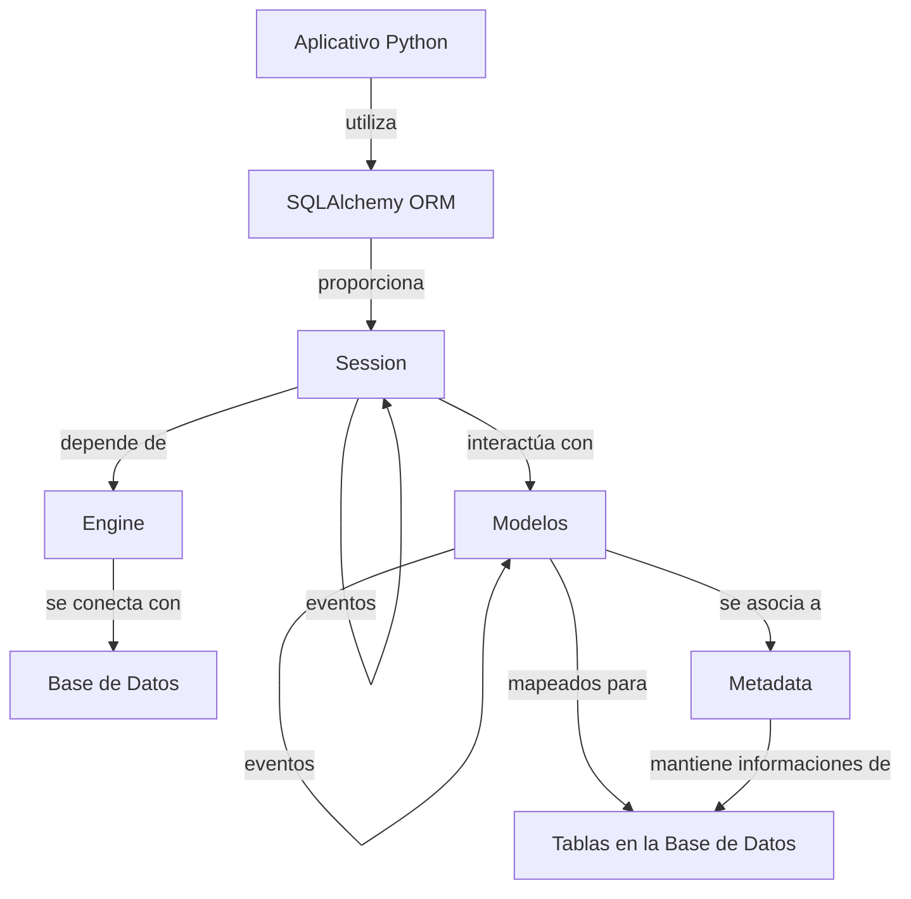

# Configurando la base de datos y gestionando migraciones con Alembic

---
Objetivos de esta clase:

- Introducción a SQLAlchemy y Alembic
- Instalando SQLAlchemy y Alembic
- Configurando y creando la base de datos
- Creando y localizando tablas utilizando SQLAlchemy
- Testeando la creación de tablas
- Eventos de SQLAlchemy
- Gestionando migraciones de la base de datos con Alembic



---

Con los endpoints de nuestra API ya establecidos, estamos, por ahora, utilizando una base de datos simulada, almacenando una lista en memoria. En esta clase, iniciaremos el proceso de configuración de nuestra base de datos real. Nuestra agenda incluye la instalación de SQLAlchemy, la definición del modelo de usuarios, y la ejecución de la primera migración con Alembic para una base de datos evolutiva. Además, exploraremos cómo desacoplar las configuraciones de la base de datos de la aplicación, siguiendo los principios de los 12 factores.

Antes de proseguir con la instalación y la configuración, es crucial entender algunos conceptos fundamentales sobre ORMs (*Object-Relational Mapping*).

### ¿Qué es un ORM y por qué usamos uno?

ORM significa Mapeo Objeto-Relacional. Es una técnica de programación que vincula (o mapea) objetos a registros de base de datos. En otras palabras, un ORM permite que interactúes con tu base de datos, como si estuvieras trabajando con objetos Python.

SQLAlchemy es un ejemplo de ORM. Permite que trabajes con bases de datos SQL de manera más natural para los programadores Python. En vez de escribir consultas SQL crudas, puedes usar métodos y atributos Python para manipular tus registros de base de datos.

¿Pero por qué usaríamos un ORM? Aquí están algunas razones:

- Abstracción de base de datos: Los ORMs permiten que cambies de un tipo de base de datos a otro con pocos cambios en el código.

- Seguridad: Los ORMs generalmente lidian con el escape de consultas y para prevenir inyecciones SQL, un tipo común de vulnerabilidad de seguridad.

- Eficiencia en el desarrollo: Los ORMs pueden generar automáticamente esquemas, realizar migraciones y otras tareas que serían demoradas de hacer manualmente.

### Configuraciones de entorno y los 12 factores

Una buena práctica en el desarrollo de aplicaciones es separar las configuraciones del código, especialmente para datos sensibles como credenciales de base de datos. Este enfoque resuelve dos problemas futuros:

1. **Variación entre entornos**: Las configuraciones suelen cambiar entre entornos diferentes (desarrollo, test y producción), y mezclarlas con el código puede tornar el proceso de cambio entre estos entornos complicado y propenso a errores.
2. **Seguridad**: Exponer credenciales de base de datos y otras informaciones sensibles en el código-fuente es una práctica de seguridad mala, pues si ocurriera una filtración comprometería el acceso a tus recursos.

Esta práctica está alineada con la metodología de los [12 factores](https://12factor.net/es/) (específicamente el 3º factor: [Config](https://12factor.net/es/config)), que recomienda almacenar configuraciones variables en el entorno y no en el código.

Para gestionar y separar nuestras configuraciones del código de forma segura y estructurada, usaremos `pydantic-settings`. Esta biblioteca permite que definas configuraciones tanto en variables de entorno como en archivos separados (como `.env`), evitando la escritura de configuraciones directamente en el código-fuente.

```shell title="$ Ejecución en la terminal!"
poetry add pydantic-settings
```

Ahora que entendemos mejor estos conceptos, comenzaremos instalando SQLAlchemy, un ORM que nos permite trabajar con bases de datos SQL de manera Pythónica. Además, Alembic, que es una herramienta de migración de base de datos, funciona muy bien con SQLAlchemy y nos ayudará a gestionar las alteraciones del esquema de nuestra base de datos.

```shell title="$ Ejecución en la terminal!"
poetry add sqlalchemy
```

¡Ahora estamos listos para sumergirnos en la configuración de nuestra base de datos! Vamos adelante.

## Lo básico sobre SQLAlchemy

SQLAlchemy es una biblioteca Python versátil, concebida para intermediar la interacción entre Python y bases de datos relacionales, como MySQL, PostgreSQL y SQLite. La biblioteca está constituida por dos partes principales: el Core y el ORM (Object Relational Mapper).

- **Core**: El Core de SQLAlchemy disponibiliza una interfaz SQL abstracta, que posibilita la manipulación de bases de datos relacionales de manera segura, alineada con las convenciones de Python. A través del Core, es posible construir, analizar y ejecutar instrucciones SQL, además de conectarse a diversos tipos de bases de datos utilizando la misma API.

- **ORM**: ORM, o Mapeo Objeto-Relacional, es una técnica que facilita la comunicación entre el código orientado a objetos y bases de datos relacionales. Con el ORM de SQLAlchemy, los desarrolladores pueden interactuar con la base de datos utilizando clases y objetos Python, eliminando la necesidad de escribir instrucciones SQL directamente.

Además del Core y del ORM, SQLAlchemy cuenta con otros componentes cruciales que serán foco de esta clase, la Engine y la Session:

### Engine

La 'Engine' de SQLAlchemy es el punto de contacto con la base de datos, estableciendo y gestionando las conexiones. Se instancia a través de la función `create_engine()`, que recibe las credenciales de la base de datos, la dirección de conexión (URI) y configura el pool de conexiones.

### Session

En cuanto a la persistencia de datos y consultas a la base de datos utilizando el ORM, la Session es la principal interfaz. Actúa como un intermediario entre la aplicación Python y la base de datos, mediada por la Engine. La Session se encarga de todas las transacciones, proporcionando una API para conducirlas.

Ahora que conocemos la Engine y la Session, vamos a explorar la definición de modelos de datos.

## Definiendo los Modelos de Datos con SQLAlchemy

Los modelos de datos definen la estructura de cómo los datos serán almacenados en la base de datos. En el ORM de SQLAlchemy, estos modelos se definen como clases Python que pueden ser heredadas o registradas (esto depende de cómo uses el ORM). Vamos a usar el registrador de tablas, que ya hace la conversión automática de las clases en [dataclasses](https://docs.python.org/es/3/library/dataclasses.html){:target="_blank"}

Cada clase que es registrada por el objeto `registry` es automáticamente mapeada a una tabla en la base de datos. Adicionalmente, la clase base incluye un objeto de metadatos que es una colección de todas las tablas declaradas. Este objeto se utiliza para gestionar operaciones como creación, modificación y exclusión de tablas.

Ahora definiremos nuestro modelo `User`. En el directorio `fast_zero`, crea un nuevo archivo llamado `models.py` e incluiremos el siguiente código en el archivo:

```python title="fast_zero/models.py" linenums="1"
from datetime import datetime
from sqlalchemy.orm import Mapped, mapped_as_dataclass, registry

table_registry = registry()


@mapped_as_dataclass(registry=table_registry)
class User:
    __tablename__ = 'users'

    id: Mapped[int]
    username: Mapped[str]
    password: Mapped[str]
    email: Mapped[str]
	created_at: Mapped[datetime]
```

Aquí, `Mapped` se refiere a un atributo Python que está asociado (o mapeado) a una columna específica en una tabla de base de datos. Por ejemplo, `#!python Mapped[int]` indica que este atributo es un entero que será mapeado a una columna correspondiente en una tabla de base de datos. De la misma forma, `#!python Mapped[str]` se referiría a un atributo de string que sería mapeado a una columna de string correspondiente. Este enfoque permite a SQLAlchemy realizar la conversión entre los tipos de datos Python y los tipos de datos de la base de datos, además de ofrecer una interfaz Pythónica para la interacción entre ellos.

En especial, debemos prestar atención al campo `__tablename__`. Se refiere al nombre que la tabla tendrá en la base de datos. Como generalmente un objeto en python representa solamente una entidad, usaré `#!python 'users'` en plural para representar la tabla.

### El uso del modelo

Si queremos usar este objeto, se comporta como una dataclass tradicional. Pudiendo ser instanciado de la forma tradicional:

```python title="Código de ejemplo"
eduardo = User(
    id=1,
    username='dunossauro',
    password='senha123',
    email='duno@ssauro.com',
    created_at=datetime.now()
)
```

Por defecto, todos los atributos necesitan ser especificados. Lo que puede no ser muy interesante, pues algunos datos deben ser rellenados por la base de datos. Como el identificador de la fila en la base o la hora en que el registro fue creado.

Para eso, necesitamos agregar más informaciones al modelo.

### Configuraciones de columnas

Cuando definimos tablas en la base de datos, las columnas pueden presentar propiedades específicas. Por ejemplo:

- Un valor que no debe repetirse en otros registros (`unique`)
- Valores por defecto para cuando no sean pasados (`default`)
- Identificadores para los registros (`primary_key`)

Para estos casos, SQLAlchemy cuenta con la función `mapped_column`. Dentro de ella, puedes definir diversas propiedades.

Para nuestro caso, me gustaría que `email` y `username` no se repitan en la base de datos y que las columnas `id` y `created_at` tuvieran el valor definido por la propia base de datos, cuando el registro fuera creado.

Para eso, vamos a aplicar algunos parámetros en las columnas usando `mapped_column`:

```py title="fast_zero/models.py" linenums="1" hl_lines="3-4 13-19"
from datetime import datetime

from sqlalchemy import func
from sqlalchemy.orm import Mapped, mapped_as_dataclass, mapped_column, registry

table_registry = registry()


@mapped_as_dataclass(registry=table_registry)
class User:
    __tablename__ = 'users'

    id: Mapped[int] = mapped_column(init=False, primary_key=True)#(1)!
    username: Mapped[str] = mapped_column(unique=True)#(2)!
    password: Mapped[str]
    email: Mapped[str] = mapped_column(unique=True)
    created_at: Mapped[datetime] = mapped_column(#(3)!
        init=False, server_default=func.now()
    )
```

1. `#!python init=False` dice que, cuando el objeto sea instanciado, ese parámetro no debe ser pasado. `#!python primary_key=True` dice que el campo `id` es la clave primaria de esa tabla.
2. `unique=True` dice que ese campo no debe repetirse en la tabla. Por ejemplo, si tuviéramos un username "dunossauro", no podemos tener otro con el mismo valor.
3. `server_default=func.now()` dice que, cuando la clase sea instanciada, el resultado de `func.now()` será el valor atribuido a ese atributo. En este caso, la fecha y hora en que fue instanciado.

De esta forma, unimos tanto el uso que queremos tener en python, cuanto la configuración esperada de la tabla en la base de datos. Los parámetros de mapeo dicen:

- `primary_key`: dice que el campo será la clave primaria de la tabla
- `unique`: dice que el campo solo puede tener un valor único en toda la tabla. No podemos tener un `username` repetido en la base, por ejemplo.
- `server_default`: ejecuta una función en el momento en que el objeto sea instanciado.

El campo `init` no tiene una relación directa con la base de datos, sino con la forma en que vamos a usar el objeto del modelo en el código. Dice que los atributos marcados con `init=false` no deben ser pasados en el momento en que `User` sea instanciado. Por ejemplo:

```python title="Código de ejemplo"
eduardo = User(
	username='dunossauro', password='senha123', email='duno@ssauro.com',
)
```

Por no pasar estos parámetros a `User`, SQLAlchemy se encargará de atribuir los valores a ellos de forma automática.

El campo `created_at` será rellenado por el resultado de la función pasada en `server_default`. El campo `id`, por contar con `primary_key=True`, será autorellenado con el id correspondiente cuando sea almacenado en la base de datos.

> Existen diversas opciones en esta función. En caso de que quieras ver más posibilidades de mapeo, aquí está la [referencia para más campos](https://docs.sqlalchemy.org/en/20/orm/mapping_api.html#sqlalchemy.orm.mapped_column){:target="_blank"}


## Testeando las Tablas

Antes de proseguir, una buena práctica sería crear un test para validar si toda la estructura de la base de datos funciona. Crearemos un archivo para validar eso: `test_db.py`.

A partir de aquí, puedes proseguir con la estructuración del contenido de ese archivo para definir los tests necesarios para validar tu modelo de usuario y su interacción con la base de datos.

### Antes de Escribir los Tests

A esta altura, si estuviéramos buscando solo cobertura, podríamos simplemente testear utilizando el modelo, y eso sería suficiente. Sin embargo, queremos verificar si toda nuestra interacción con la base de datos ocurrirá con éxito. Esto incluye saber si los tipos de datos en la tabla fueron mapeados correctamente, si es posible interactuar con la base de datos, si el ORM está estructurado adecuadamente con la clase base. Necesitamos garantizar que todo este esquema funcione.



En este diagrama, vemos la relación completa entre la aplicación Python y la base de datos. La conexión se establece a través del SQLAlchemy ORM, que proporciona una Session para interactuar con los Modelos. Estos modelos son mapeados a las tablas en la base de datos, mientras la Engine se conecta con la base de datos y depende de Metadata para mantener las informaciones de las tablas.

Por lo tanto, crearemos una fixture para poder usar todo este esquema siempre que sea necesario.

### Creando una Fixture para interacciones con la Base de Datos

Para testear la base, tenemos que hacer diversos pasos, y eso puede tornar nuestro test bastante grande. Una fixture puede ayudar a aislar toda esta configuración de la base de datos fuera del test. Así, evitamos repetir el mismo código en todos los tests y todavía garantizamos que cada test tenga su propia versión limpia de la base de datos.

Crearemos una fixture para la conexión con la base de datos llamada `session`:

```python title="tests/conftest.py"
import pytest
from fastapi.testclient import TestClient
from sqlalchemy import create_engine
from sqlalchemy.orm import Session

from fast_zero.app import app
from fast_zero.models import table_registry


@pytest.fixture
def client():
    return TestClient(app)


@pytest.fixture
def session():
    engine = create_engine('sqlite:///:memory:')#(1)!
    table_registry.metadata.create_all(engine)#(2)!

    with Session(engine) as session:#(3)!
        yield session#(4)!

    table_registry.metadata.drop_all(engine)#(5)!
    engine.dispose()#(6)!
```

Aquí, estamos utilizando SQLite como la base de datos en memoria para los tests. Esta es una práctica común en tests unitarios, pues la utilización de una base de datos en memoria es más rápida que una base de datos persistida en disco. Con SQLite en memoria, podemos crear y destruir bases de datos fácilmente, lo que es útil para aislar los tests y garantizar que los datos de un test no afecten a otros tests. Además, no necesitamos preocuparnos con la limpieza de los datos después de la ejecución de los tests, ya que la base de datos en memoria es descartada cuando el programa es finalizado.

¿Qué hace cada línea de la fixture?

1. `create_engine('sqlite:///:memory:')`: crea un mecanismo de base de datos SQLite en memoria usando SQLAlchemy. Este mecanismo será usado para crear una sesión de base de datos para nuestros tests.

2. `table_registry.metadata.create_all(engine)`: crea todas las tablas en la base de datos de test antes de cada test que usa la fixture `session`.

3. `Session(engine)`: crea una sesión `Session` para que los tests puedan comunicarse con la base de datos vía `engine`.

4. `yield session`: proporciona una instancia de Session que será inyectada en cada test que solicita la fixture `session`. Esta sesión será usada para interactuar con la base de datos de test.

5. `table_registry.metadata.drop_all(engine)`: después de cada test que usa la fixture `session`, todas las tablas de la base de datos de test son eliminadas, garantizando que cada test sea ejecutado contra una base de datos limpia.

6. `engine.dispose()`: cierra todas las conexiones abiertas asociadas al `engine`, liberando los recursos del sistema. Esto garantiza que el mecanismo de base de datos sea completamente finalizado después del test, evitando fugas de conexión y otros problemas relacionados a la persistencia de estado entre tests.

Resumiendo, esta fixture está configurando y limpiando una base de datos de test para cada test que la solicita, asegurando que cada test sea aislado y tenga su propio entorno limpio para trabajar. Esto es una buena práctica en tests de unidad, ya que queremos que cada test sea independiente y no afecte a los demás.

### Creando un Test para Nuestra Tabla

Ahora, en el archivo `test_db.py`, escribiremos un test para la creación de un usuario. Este test agrega un nuevo usuario a la base de datos, hace commit de los cambios, y después verifica si el usuario fue debidamente creado consultándolo por el nombre de usuario. Si el usuario fue creado correctamente, el test pasa. Caso contrario, el test falla, indicando que hay algo errado con nuestra función de creación de usuario.

```python title="tests/test_db.py" linenums="1"
--8<-- "aulas/codigos/04/tests/test_db.py"
```

1. El método `.add` de la sesión, agrega el registro a la sesión. El dato queda en un estado transiente. Todavía no fue agregado a la base de datos. Pero ya está reservado en la sesión. Es una aplicación del patrón de proyecto [Unidad de trabajo](https://martinfowler.com/eaaCatalog/unitOfWork.html){:target="_blank"}.
2. En el momento en que existen datos transientes en la sesión y queremos "performar" efectivamente las acciones en la base de datos. Usamos el método `.commit`.
3. El método `.scalar` se usa para performar búsquedas en la base (queries). Toma el primer resultado de la búsqueda y hace una operación de convertir el resultado de la base de datos en un Objeto creado por SQLAlchemy, en este caso, caso encuentre un resultado, convertirá en la clase `User`. La función de `select` es una función de búsqueda de datos en la base. En este caso estamos buscando en todos los `Users` donde (`where`) el nombre es igual a `#!python "alice"`.

### Ejecutando el test

La ejecución de tests es una parte vital del desarrollo de cualquier aplicación. Los tests nos ayudan a identificar y corregir problemas antes de que se tornen más serios. También proporcionan la confianza de que nuestros cambios no rompieron ninguna funcionalidad existente. En nuestro caso, ejecutaremos los tests para validar nuestros modelos de usuario y garantizar que estén funcionando como se espera.

Para ejecutar los tests, digita el siguiente comando:

```shell title="$ Ejecución en la terminal!"
poetry test
```

```{.console .no-copy}
# ...

tests/test_app.py::test_root_deve_retornar_ok_e_ola_mundo PASSED
tests/test_app.py::test_create_user PASSED
tests/test_app.py::test_read_users PASSED
tests/test_app.py::test_update_user PASSED
tests/test_app.py::test_delete_user PASSED
tests/test_db.py::test_create_user PASSED

---------- coverage: platform linux, python 3.11.3-final-0 -----------
Name                    Stmts   Miss  Cover
-------------------------------------------
fast_zero/__init__.py       0      0   100%
fast_zero/app.py           28      2    93%
fast_zero/models.py        11      0   100%
fast_zero/schemas.py       15      0   100%
-------------------------------------------
TOTAL                      54      2    96%
```

En este caso, podemos ver que todos nuestros tests pasaron con éxito. Esto significa que nuestra funcionalidad de creación de usuario está funcionando correctamente y que nuestro modelo de usuario está siendo correctamente persistido en la base de datos.

Aunque todo se esté encajando bien, este test no es muy bueno, pues no hace la validación del objeto como un todo. Conseguimos garantizar que toda la estructura de la base de datos funciona, sin embargo, todavía no conseguimos garantizar que todos los valores están correctos.

## Eventos del ORM

Aunque nuestros tests hayan sido ejecutados correctamente, tenemos un problema si queremos validar el objeto como un todo, por existir algunos campos de la tabla que escapan del mecanismo de creación del objeto `#!python (init=False)`.

Uno de estos casos es el campo `created_at`. Cuando configuramos el modelo, dejamos que la base de datos defina su horario y fecha actual para rellenar ese campo. ¿Existirá una forma de alterar este comportamiento durante los tests? ¿Para poder validar cuándo el objeto fue creado? La respuesta es sí.

SQLAlchemy tiene un sistema de eventos. Los eventos son bloques de código que pueden ser ejecutados en momentos específicos del ciclo de vida de los objetos del ORM. Podemos "escuchar" estos eventos y ejecutar funciones personalizadas (hooks) cuando ocurran.

```python
from sqlalchemy import event

def hook(mapper, connection, target): #(1)!
   ...


event.listen(User, 'before_insert', hook)  #(2)!
```

1. Cualquier función que sea usada como un hook del evento de `before_insert` tiene que recibir los parámetros `mapper`, `connection` y `target`, aunque no los use.
2. En este ejemplo el evento "escuchará" [*listen*] el modelo `User` y toda vez que el ORM vaya a insertar un registro de ese modelo en la base (`before_insert`) ejecutará la función `hook`.

La idea detrás de los eventos es simplemente pasar algún modelo o la sesión para que el ORM observe todas las veces en que una determinada operación fue ejecutada y si tiene algún hook siendo "escuchado" para aquella operación. Hablando de forma clara, todas las veces que `User` sea insertado en la base, antes de eso la función `hook` será ejecutada.

> Puedes buscar por otros eventos de mapeo en la [Documentación de SQLAlchemy](https://docs.sqlalchemy.org/en/20/orm/events.html#mapper-events){:target="_blank"}

### Evento para manipular el tiempo

Para hacer la validación de todos los campos del objeto durante los tests, podemos crear un evento que será ejecutado durante el test que haga que los registros insertados en ese test tengan el horario manipulado, facilitando la comparación con un `created_at` fijo:

```python title="tests/conftest.py" hl_lines="9 16 20"
from contextlib import contextmanager
from datetime import datetime

# ...
from sqlalchemy import create_engine, event

# ...

@contextmanager #(1)!
def _mock_db_time(*, model, time=datetime(2024, 1, 1)): #(2)!

    def fake_time_hook(mapper, connection, target): #(3)!
        if hasattr(target, 'created_at'):
            target.created_at = time

    event.listen(model, 'before_insert', fake_time_hook) #(4)!

    yield time #(5)!

    event.remove(model, 'before_insert', fake_time_hook) #(6)!
```

1. El decorador `#!python @contextmanager` crea un gestor de contexto para que la función `_mock_db_time` sea usada con un bloque `#!python with`. 
2. Todos los parámetros después de `*` deben ser llamados de forma nombrada, para quedar explícitos en la función. O sea `mock_db_time(model=User)`. Los parámetros no pueden ser llamados de forma posicional `_mock_db_time(User)`, eso acarreará un error.
3. Función para alterar el método `created_at` del objeto de target.
4. `event.listen` agrega un evento en relación a un `model` que será pasado a la función. Este evento es el `before_insert`, ejecutará una función (hook) antes de insertar el registro en la base de datos. El hook es la función `fake_time_hook`.
5. Retorna el datetime en la apertura del gestión de contexto.
6. Después del final del gestión de contexto el hook de los eventos es removido.

La idea detrás de esta función es ser un gestor de contexto (para ser llamado en un bloque `#!python with`). Toda vez que un registro de `model` sea insertado en la base de datos, si tiene el campo `created_at`, por defecto, el campo será cadastrado con su fecha pre-fijada '01/01/2024'. Facilitando el mantenimiento de los tests que necesitan de la comparación de fecha, pues será determinística.

#### Transformando el evento en una fixture

Ahora que tenemos la función gestora de contexto, para evitar el sistema de importación durante los tests, podemos crear una fixture para él. De forma bien simple, solamente retornando la función `_mock_db_time`:

```python title="tests/conftest.py"
@pytest.fixture
def mock_db_time():
    return _mock_db_time
```

De esta forma podemos hacer la llamada directa en el test.

### Agregando el evento al test

Ahora que tenemos una fixture para tratar el caso de la fecha de creación, podemos hacer la comparación del objeto completo:

```python title="tests/test_db.py" linenums="1" hl_lines="1 9 18 23"
from dataclasses import asdict

from sqlalchemy import select

from fast_zero.models import User


def test_create_user(session, mock_db_time):
    with mock_db_time(model=User) as time: #(1)!
        new_user = User(
            username='alice', password='secret', email='teste@test'
        )
        session.add(new_user)
        session.commit()

	user = session.scalar(select(User).where(User.username == 'alice'))

    assert asdict(user) == { #(2)!
        'id': 1,
        'username': 'alice',
        'password': 'secret',
        'email': 'teste@test',
        'created_at': time,  #(3)!
    }
```

1. Inicia el gestor de contexto `mock_db_time` usando el modelo `User` como base.
2. Convierte el `user` en un diccionario para simplificar la validación en el test.
3. Usa el time generado por `mock_db_time` para validar el campo `created_at`.

El test permanece prácticamente igual, con la diferencia de que todas las operaciones involucrando la creación de `User` en la base de datos suceden en el alcance de `mock_db_time`.

Esto hace que durante el `commit`, cuando los objetos son persistidos de la sesión para la base de datos, el evento de `before_insert` sea ejecutado para cada objeto del modelo pasado en `mock_db_time(model=*MODEL*)`.

Por cuenta del campo `created_at` ahora ser determinístico podemos hacer una comparación completa de los campos.

Para simplificar la comparación de todos los campos, como nuestros objetos de modelo son dataclasses, la función `dataclass.asdict()`, convierte una dataclass a un diccionario:

```python title="Estudiando la comparación"
    assert asdict(user) == {
        'id': 1,
        'username': 'alice',
        'password': 'secret',
        'email': 'teste@test',
        'created_at': time,
    }
```

Como el tiempo ahora es determinístico y contenido en nuestro gestor de contexto, podemos hacer la comparación exacta entre todos los campos. Inclusive `created_at`.

De esta forma, con nuestros modelos y tests de base de datos en orden, estamos listos para avanzar a la próxima fase de configuración de nuestra base de datos y gestión de migraciones.


## Configuración del entorno de la base de datos

Por fin, configuraremos nuestra base de datos. Primero, crearemos un nuevo archivo llamado `settings.py` dentro del directorio `fast_zero`. Aquí, usaremos Pydantic para crear una clase `Settings` que tomará las configuraciones de nuestro archivo `.env`. En este archivo, la clase `Settings` se define como:

```python title="fast_zero/settings.py"
from pydantic import Field
from pydantic_settings import BaseSettings, SettingsConfigDict


class Settings(BaseSettings):
    model_config = SettingsConfigDict( #(1)!
        env_file='.env', env_file_encoding='utf-8'#(2)!
    )

    DATABASE_URL: str = Field(init=False)#(3)!
```

1. `SettingsConfigDict`: es un objeto de pydantic-settings que carga las variables en un archivo de configuración. Por ejemplo, un `.env`.
2. Aquí definimos el camino para el archivo de configuración y el encoding de él.
3. `DATABASE_URL`: Esta variable será rellenada con el valor encontrado con el mismo nombre en el archivo `.env`. El `Field(init=False)`, dice que este atributo no será pasado en el momento en que el objeto sea instanciado, pues será proporcionado por la variable de entorno.

Ahora, definiremos el `DATABASE_URL` en nuestro archivo de entorno `.env`. Crea el archivo en la raíz del proyecto y agrega la siguiente línea:

```shell title=".env"
DATABASE_URL="sqlite:///database.db"
```

Con esto, cuando la clase `Settings` sea instanciada, cargará automáticamente las configuraciones del archivo `.env`.

Finalmente, agrega el archivo de base de datos, `database.db`, al `.gitignore` para garantizar que no sea incluido en el control de versión. Agregar informaciones sensibles o archivos binarios al control de versión es generalmente considerado una práctica mala.

```shell title="$ Ejecución en la terminal!"
echo 'database.db' >> .gitignore
```

## Instalando Alembic y Creando la Primera Migración

Antes de avanzar, es importante entender qué son las migraciones de base de datos y por qué son útiles. Las migraciones son una manera de hacer alteraciones o actualizaciones en la base de datos, como agregar una tabla o una columna a una tabla, o alterar el tipo de datos de una columna. Son extremadamente útiles, pues nos permiten mantener el control de todas las alteraciones hechas en el esquema de la base de datos a lo largo del tiempo. También nos permiten revertir a una versión anterior del esquema de la base de datos, si es necesario.

Ahora, comenzaremos instalando Alembic, que es una herramienta de migración de base de datos para SQLAlchemy. Usaremos Poetry para agregar Alembic a nuestro proyecto:

```shell title="$ Ejecución en la terminal!"
poetry add alembic
```

Después de la instalación de Alembic, necesitamos iniciarlo en nuestro proyecto. El comando de inicialización creará un directorio `migrations` y un archivo de configuración `alembic.ini`:

```shell title="$ Ejecución en la terminal!"
poetry run alembic init migrations
```

Con esto, la estructura de nuestro proyecto sufre algunas alteraciones y se crean nuevos archivos:

```{.plaintext hl_lines="3 10-14" .no-copy}
.
├── .env
├── alembic.ini
├── fast_zero
│  ├── __init__.py
│  ├── app.py
│  ├── models.py
│  ├── schemas.py
│  └── settings.py
├── migrations
│  ├── env.py
│  ├── README
│  ├── script.py.mako
│  └── versions
├── poetry.lock
├── pyproject.toml
├── README.md
└── tests
   ├── __init__.py
   ├── conftest.py
   ├── test_app.py
   └── test_db.py
```

En el archivo `alembic.ini`: quedan las configuraciones generales de nuestras migraciones. En la carpeta `migrations` se crearon dos archivos, uno llamado `env.py` que es responsable de cómo se harán las migraciones, y el otro llamado `script.py.mako` que es un template para las nuevas migraciones.

### Creando una migración automática

Con Alembic debidamente instalado e iniciado, ahora es el momento de generar nuestra primera migración. Pero, antes de eso, necesitamos garantizar que Alembic consiga acceder a nuestras configuraciones y modelos correctamente. Para eso, haremos algunas alteraciones en el archivo `migrations/env.py`.

En este archivo, necesitamos:

1. Importar las `Settings` de nuestro archivo `settings.py` y el `table_registry` de nuestros modelos.
2. Configurar la URL de SQLAlchemy para ser la misma que definimos en `Settings`.
3. Verificar la existencia del archivo de configuración de Alembic y, si está presente, leerlo.
4. Definir los metadatos de destino como `table_registry.metadata`, que es lo que Alembic utilizará para generar automáticamente las migraciones.

El archivo `migrations/env.py` modificado quedará así:

```python title="migrations/env.py" linenums="1"
from logging.config import fileConfig

from sqlalchemy import engine_from_config
from sqlalchemy import pool

from alembic import context

from fast_zero.models import table_registry
from fast_zero.settings import Settings

config = context.config
config.set_main_option('sqlalchemy.url', Settings().DATABASE_URL)

if config.config_file_name is not None:
    fileConfig(config.config_file_name)

target_metadata = table_registry.metadata

# other values from the config, defined by the needs of env.py,
# ...
```

Hechas estas alteraciones, estamos listos para generar nuestra primera migración automática. Alembic es capaz de generar migraciones a partir de los cambios detectados en nuestros modelos de SQLAlchemy.

Para crear la migración, utilizamos el siguiente comando:

```shell title="$ Ejecución en la terminal!"
poetry run alembic revision --autogenerate -m "create users table"
```

Este comando instruye a Alembic a crear una nueva revisión de migración en el directorio `migrations/versions`. La revisión generada contendrá los comandos SQL necesarios para aplicar la migración (crear la tabla de usuarios) y para revertir esa migración, caso sea necesario.

## Analizando la migración automática

Al crear una migración automática con Alembic, se genera un archivo dentro de la carpeta `migrations/versions`. El nombre de este archivo comienza con un ID de revisión (un hash único generado por Alembic), seguido de una breve descripción que proporcionamos en el momento de la creación de la migración, en este caso, `create_users_table`.

Vamos a analizar el archivo de migración:

```{.python title="migrations/versions/e018397cecf4_create_users_table.py" .no-copy}
"""create users table

Revision ID: e018397cecf4
Revises:
Create Date: 2023-07-13 03:43:03.730534

"""
from typing import Sequence, Union

from alembic import op
import sqlalchemy as sa


# revision identifiers, used by Alembic.
revision: str = 'e018397cecf4'
down_revision: Union[str, None] = None
branch_labels: Union[str, Sequence[str], None] = None
depends_on: Union[str, Sequence[str], None] = None


def upgrade() -> None:
    # ### commands auto generated by Alembic - please adjust! ###
    op.create_table('users',
    sa.Column('id', sa.Integer(), nullable=False),
    sa.Column('username', sa.String(), nullable=False),
    sa.Column('password', sa.String(), nullable=False),
    sa.Column('email', sa.String(), nullable=False),
    sa.Column('created_at', sa.DateTime(), server_default=sa.text('(CURRENT_TIMESTAMP)'), nullable=False),
    sa.PrimaryKeyConstraint('id'),
    sa.UniqueConstraint('email'),
    sa.UniqueConstraint('username')
    )
    # ### end Alembic commands ###


def downgrade() -> None:
    # ### commands auto generated by Alembic - please adjust! ###
    op.drop_table('users')
    # ### end Alembic commands ###
```

Este archivo describe los cambios a ser hechos en la base de datos. Usa el lenguaje core de SQLAlchemy, que es más bajo nivel que el ORM. Las funciones `upgrade` y `downgrade` definen, respectivamente, qué hacer para aplicar y para deshacer la migración. En nuestro caso, la función `upgrade` crea la tabla 'users' con los campos que definimos en `fast_zero/models.py` y la función `downgrade` la remueve.


#### Analizando la base de datos

Al crear la migración, Alembic tuvo que observar si ya existían migraciones anteriores en la base de datos. Como la base de datos no existía, creó una nueva base sqlite con el nombre que definimos en la variable de entorno `DATABASE_URL`. En este caso `database.db`.

Si miramos la estructura de carpetas, ese archivo ahora existe:

```{.plaintext hl_lines="4" .no-copy}
.
├── .env
├── alembic.ini
├── database.db
├── fast_zero
│  └── ...
├── migrations
│  └── ...
├── poetry.lock
├── pyproject.toml
├── README.md
└── tests
   └── ...
```

> Por el hecho de que sqlite3 es una base basada en un único archivo, en el momento de las migraciones, sqlalchemy hace la creación del archivo de base de datos caso no exista.

En el momento de la verificación, caso no exista la tabla de migraciones, será creada. La tabla de migraciones es nombrada como `alembic_version`.

Vamos a acceder al console de sqlite y verificar si eso fue hecho. Necesitamos llamar `sqlite3 nombre_del_archivo.db`:

```shell title="$ Ejecución en la terminal!"
sqlite3 database.db
```

??? tip "En caso de que no tengas SQLite instalado en tu máquina:"

	```shell title="Arch"
	pacman -S sqlite
	```

	```shell title="Debian/Ubuntu"
	sudo apt install sqlite3
	```

	```shell title="Mac"
	brew install sqlite
	```
     
	```shell title="Windows"
	winget install --id SQLite.SQLite
	```

Cuando ejecutamos ese comando, el console de sqlite será inicializado. Y dentro de él podemos ejecutar algunos comandos. Como hacer consultas, ver las tablas creadas, agregar datos, etc.

La cara del console es esta:
```{.sql .no-copy}
SQLite version 3.45.1 2024-01-30 16:01:20
Enter ".help" for usage hints.
sqlite>
```

Aquí puedes digitar comandos, de la misma forma en que hacemos en el terminal interactivo de python. El comando `.schema` nos muestra todas las tablas creadas en la base de datos:

```{.sql .no-copy}
sqlite> .schema
CREATE TABLE alembic_version (
	version_num VARCHAR(32) NOT NULL,
	CONSTRAINT alembic_version_pkc PRIMARY KEY (version_num)
);
```

En eso vemos que Alembic creó una tabla llamada `alembic_version` en la base de datos. En esa tabla tenemos un único campo llamado `version_num` que es el campo que marca la versión actual de la migración en la base.

Para ver la versión actual de la base, podemos ejecutar una búsqueda en el campo y ver el resultado:

```{.sql .no-copy}
sqlite> select version_num from alembic_version;
```

El resultado debe ser vacío, pues no aplicamos ninguna migración, solamente creó la tabla de migraciones.

Para salir del console de sqlite tenemos que digitar el comando `.quit`:

```{.sql .no-copy}
sqlite> .quit
```

Ahora que tenemos el terminal de vuelta, podemos aplicar las migraciones.

#### Aplicando la migración

Para aplicar las migraciones, usamos el comando `upgrade` del CLI de Alembic. El argumento `head` indica que queremos aplicar todas las migraciones que todavía no fueron aplicadas:

```shell title="$ Ejecución en la terminal!"
poetry run alembic upgrade head
```

Tendremos la siguiente respuesta:

```{.console .no-copy hl_lines="3"}
INFO  [alembic.runtime.migration] Context impl SQLiteImpl.
INFO  [alembic.runtime.migration] Will assume non-transactional DDL.
INFO  [alembic.runtime.migration] Running upgrade  -> e018397cecf4, create users table
```

Vemos en la última línea ejecutada la migración de código `e018397cecf4`, con el nombre `create users table`.

Ahora, si examinamos nuestra base de datos nuevamente:

```shell title="$ Ejecución en la terminal!"
sqlite3 database.db
```

Podemos verificar si la tabla `users` fue creada en el schema de la base:


```{.sql .no-copy hl_lines="6-15"}
sqlite> .schema
CREATE TABLE alembic_version (
	version_num VARCHAR(32) NOT NULL,
	CONSTRAINT alembic_version_pkc PRIMARY KEY (version_num)
);
CREATE TABLE users (
        id INTEGER NOT NULL,
        username VARCHAR NOT NULL,
        password VARCHAR NOT NULL,
        email VARCHAR NOT NULL,
        created_at DATETIME DEFAULT (CURRENT_TIMESTAMP) NOT NULL,
        PRIMARY KEY (id),
        UNIQUE (email),
        UNIQUE (username)
);
```

Si examinamos los datos de la tabla `alembic_version` podemos ver que el número de la migración es referente al valor creado en el archivo de migración `e018397cecf4_create_users_table.py`


```{.sql .no-copy hl_lines hl_lines="2"}
sqlite> select version_num from alembic_version;
e018397cecf4
sqlite> .quit
```

Con esto, finalizamos la creación de la base de datos. Recuerda que todos estos cambios que hicimos solo existen localmente en tu entorno de trabajo hasta ahora. Para ser compartidos con otras personas, necesitamos hacer commit de estos cambios en nuestro sistema de control de versión.

## Commit

Primero, verificaremos el status de nuestro repositorio para ver los cambios que hicimos:

```shell title="$ Ejecución en la terminal!"
git status
```

Verás una lista de archivos modificados o agregados. Las alteraciones deben incluir los archivos de migración que creamos, así como cualquier alteración que hayamos hecho en nuestros archivos de modelo y configuración.

A continuación, agregaremos todos los cambios al próximo commit:

```shell title="$ Ejecución en la terminal!"
git add .
```

Ahora, estamos listos para hacer el commit de nuestras alteraciones. Escribiremos un mensaje de commit que describe los cambios que hicimos:

```shell title="$ Ejecución en la terminal!"
git commit -m "feat(db): agrega primera migración Alembic y crea tabla de usuarios"
```

Finalmente, enviaremos los cambios al repositorio remoto:

```shell title="$ Ejecución en la terminal!"
git push
```

¡Y listo! Los cambios que hicimos fueron salvados en el histórico de Git y ahora están disponibles en GitHub.

## Ejercicios

1. Hacer una alteración en el modelo (tabla `User`) y agregar un campo llamado `updated_at`:
    - Este campo debe ser mapeado para el tipo `datetime`
	- Este campo no debe ser inicializado por defecto `init=False`
	- El valor por defecto debe ser `now`
	- Toda vez que la tabla sea actualizada este campo debe ser actualizado:
	    ```python
		mapped_column(onupdate=func.now())
		```
2. Altera el evento de tests (`mock_db_time`) para que sea contemplado en el mock el campo `updated_at` en la validación del test.
3. Crear una nueva migración autogenerada con alembic
4. Aplicar esa migración a la base de datos



## Código de esta lección



## Conclusión

En esta clase, dimos pasos significativos para preparar nuestro proyecto FastAPI para interactuar con una base de datos. Comenzamos definiendo nuestro primer modelo de datos, el `User`, utilizando SQLAlchemy. Además, conforme a las prácticas de Desarrollo Orientado por Tests (TDD), implementamos un test para asegurar que la funcionalidad de creación de un nuevo usuario en la base de datos esté operando correctamente.

Avanzamos para configurar el entorno de desarrollo, donde establecimos un archivo `.env` para almacenar nuestra `DATABASE_URL` y ajustamos SQLAlchemy para utilizar esa URL. Complementariamente, incluimos el archivo de la base de datos al `.gitignore` para evitar que sea rastreado por el control de versión.

En la última parte de esta clase, nos enfocamos en la instalación y configuración de Alembic, una herramienta de migración de base de datos para SQLAlchemy. Usando Alembic, creamos nuestra primera migración que, automáticamente, genera el esquema de la base de datos a partir de nuestros modelos SQLAlchemy.

Con estos pasos, nuestro proyecto está bien encaminado para comenzar a persistir datos. En la próxima clase, avanzaremos a la fase crucial de conectar SQLAlchemy a los endpoints de nuestro proyecto. Esto permitirá la realización de operaciones de CRUD en nuestros usuarios directamente a través de la API.

