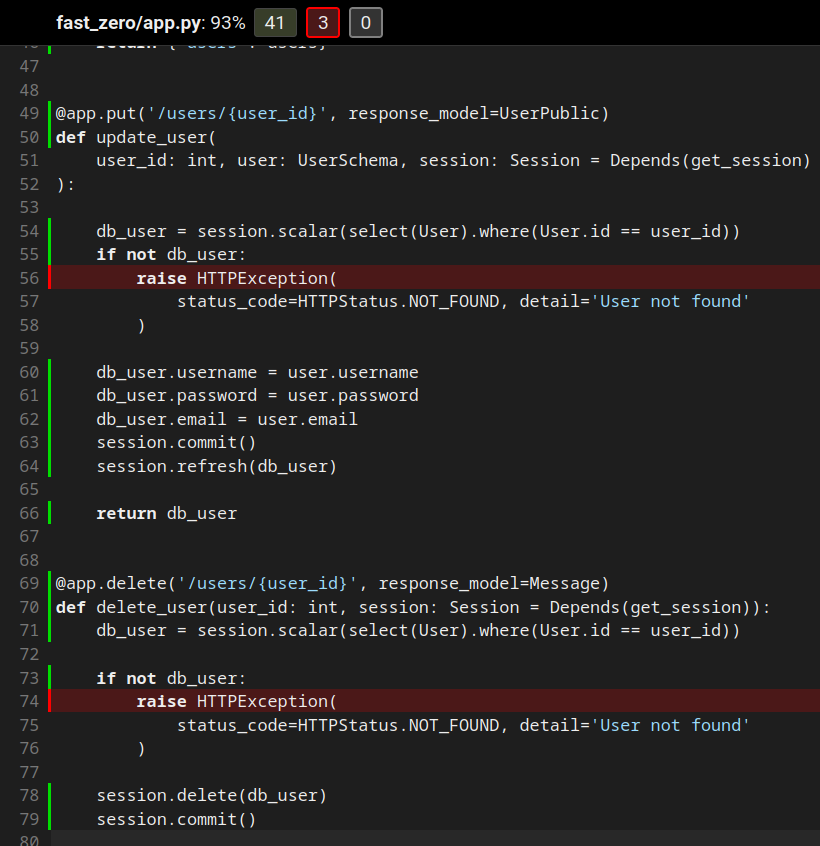
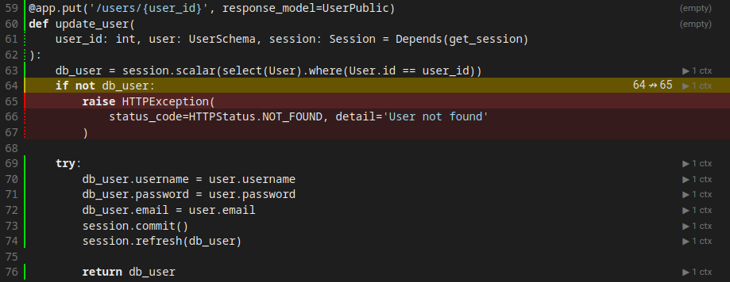
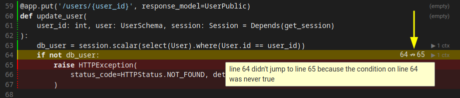

# Integrando la base de datos a la API

---
Objetivos de esta clase:

- Integrando SQLAlchemy a nuestra aplicación FastAPI
- Utilizando la función Depends para gestionar dependencias
- Modificando endpoints para interactuar con la base de datos
- Testeando los nuevos endpoints con Pytest y fixtures



---

Después de haber establecido nuestros modelos y migraciones en la clase anterior, es hora de dar un paso significativo: la integración de la base de datos real con nuestra aplicación FastAPI. Dejaremos atrás la base de datos simulada que utilizamos hasta ahora y nos dedicaremos a la implementación de una base de datos real y plenamente operacional. Además, adaptaremos la estructura de nuestros tests para que sean compatibles con la base de datos, incluyendo la creación de nuevas fixtures.

## Integrando SQLAlchemy a Nuestra Aplicación FastAPI

Para aquellos que no están familiarizados, SQLAlchemy es una biblioteca Python que facilita la interacción con una base de datos SQL. Lo hace ofreciendo una forma de trabajar con bases de datos que aprovecha la facilidad y el poder de Python, al mismo tiempo que mantiene la eficiencia y la flexibilidad de las bases de datos SQL.


Una pieza clave de SQLAlchemy es el concepto de una "sesión". Si eres nuevo en el mundo de las bases de datos, puedes pensar en la sesión como un carrito de compras virtual: conforme navegas por el sitio (o, en este caso, conforme tu código ejecuta), puedes agregar o remover ítems de ese carrito. Sin embargo, ningún cambio es realmente hecho hasta que decides finalizar la compra. En el contexto de SQLAlchemy, "finalizar la compra" es equivalente a hacer el commit de tus alteraciones.

La sesión en SQLAlchemy es tan poderosa que, en verdad, incorpora tres patrones de arquitectura importantes.

1. **Mapa de Identidad**: Imagina que estás comprando frutas en una tienda online. Cada fruta que agregas a tu carrito recibe un código de barras único, para que la tienda sepa exactamente qué fruta quieres. El Mapa de Identidad en SQLAlchemy es ese sistema de código de barras: garantiza que cada objeto en la sesión sea único y fácilmente identificable.

2. **Repositorio**: La sesión también actúa como un repositorio. Esto significa que es como un portero: controla todas las comunicaciones entre tu código Python y la base de datos. Todos los comandos que deseas enviar a la base de datos deben pasar por la sesión.

3. **Unidad de Trabajo**: Finalmente, la sesión actúa como una unidad de trabajo. Esto significa que mantiene el control de todas las alteraciones que quieres hacer en la base de datos. Si agregas una fruta a tu carrito y después cambias de idea y la remueves, la sesión recordará ambas acciones. Entonces, cuando finalmente decidas finalizar la compra, enviará todas tus alteraciones a la base de datos de una sola vez.

Entender estos conceptos es importante, pues nos ayuda a entender mejor cómo funciona SQLAlchemy y cómo podemos usarlo de forma más eficaz. Ahora que tenemos una idea de lo que es una sesión, configuraremos una para nuestro proyecto.

Para eso, crearemos la función `get_session` y también definiremos `Session` en el archivo `database.py`:

```python title="fast_zero/database.py" linenums="1"
from sqlalchemy import create_engine
from sqlalchemy.orm import Session

from fast_zero.settings import Settings

engine = create_engine(Settings().DATABASE_URL)


def get_session():#(1)!
    with Session(engine) as session:
        yield session
```

1. Cuando los tests sean ejecutados, esta línea nunca será cubierta. Pues los tests substituirán este bloque por una fixture en tiempo de ejecución [aquí](#testeando-el-endpoint-post-users-con-pytest-y-fixtures){:target="_blank"}. Una forma de escapar de eso y explicar al coverage que este bloque no deberá ser considerado en la cobertura es agregar el comentario `# pragma: no cover`. Esto hará que ignore este bloque en el conteo.

## Gestionando Dependencias con FastAPI

Así como la sesión SQLAlchemy, que implementa varios patrones arquitecturales importantes, FastAPI también usa un concepto de patrón arquitectural llamado "Inyección de Dependencia".

En el mundo del desarrollo de software, una "dependencia" es un componente que un módulo de software necesita para realizar su función. Imagina un módulo como una fábrica y las dependencias como las partes o materias-primas que la fábrica necesita para producir sus productos. En vez de que la fábrica tenga que buscar esas piezas por cuenta propia (lo que sería ineficiente), ellas son entregadas a la fábrica, listas para ser usadas. Este es el concepto de Inyección de Dependencia.

La Inyección de Dependencia permite que mantengamos un bajo nivel de acoplamiento entre diferentes módulos de un sistema. Las dependencias entre los módulos no son definidas en el código, sino por la configuración de una infraestructura de software (container) responsable de "inyectar" en cada componente sus dependencias declaradas.

En términos prácticos, lo que esto significa es que, en vez de que cada parte de nuestro código tenga que crear sus propias instancias de clases o servicios de los que depende (lo que puede llevar a duplicación de código y tornar los tests más difíciles), esas instancias son creadas una vez y después inyectadas donde son necesarias.

FastAPI proporciona la función `Depends` para ayudar a declarar y gestionar esas dependencias. Es una manera declarativa de decirle a FastAPI: "Antes de ejecutar esta función, ejecuta primero esa otra función y pásame el resultado". Esto es especialmente útil cuando tenemos operaciones que necesitan ser realizadas antes de cada request, como abrir una sesión de base de datos.


## Modificando el Endpoint POST /users

Ahora que tenemos nuestra sesión de base de datos gestionada por medio de FastAPI y de la inyección de dependencias, actualizaremos nuestros endpoints para poder aprovechar eso. Comenzaremos con la ruta de POST para la creación de usuarios. En vez de usarmos la base de datos falsa que creamos inicialmente, ahora haremos la inserción real de los usuarios en nuestra base de datos.

Para eso, vamos a modificar nuestro endpoint de la siguiente manera:

```python title="fast_zero/app.py"
from http import HTTPStatus

from fastapi import Depends, FastAPI, HTTPException
from sqlalchemy import select
from sqlalchemy.orm import Session

from fast_zero.database import get_session
from fast_zero.models import User
from fast_zero.schemas import Message, UserDB, UserList, UserPublic, UserSchema

# ...


@app.post('/users/', status_code=HTTPStatus.CREATED, response_model=UserPublic)
def create_user(user: UserSchema, session: Session = Depends(get_session)):#(1)!
    db_user = session.scalar(
        select(User).where(
            (User.username == user.username) | (User.email == user.email)#(2)!
        )
    )

    if db_user:
        if db_user.username == user.username:#(3)!
            raise HTTPException(
                status_code=HTTPStatus.CONFLICT,
                detail='Username already exists',
            )
        elif db_user.email == user.email:
            raise HTTPException(
                status_code=HTTPStatus.CONFLICT,
                detail='Email already exists',
            )

    db_user = User(
        username=user.username, password=user.password, email=user.email
    )
    session.add(db_user)
    session.commit()
    session.refresh(db_user)

    return db_user
```

1. `#!python session: Session = Depends(get_session)` dice que la función `get_session` será ejecutada antes de la ejecución de la función y el valor retornado por `get_session` será atribuido al parámetro `session`.
2. Hace una búsqueda por `User` donde (`where`) el username es igual al que vino en el request, o (`|`) el email es igual al que vino en el request. La búsqueda tiene el objetivo de encontrar un registro que tenga o el email o el username cadastrado. Pues, ellos son únicos en la base de datos. Necesitamos validar para ver si ya no constan en la base de datos.
3. Por cuenta del o (`|`), necesitamos validar qué es lo que ya existe en la base. Si es el username o si es el email

Vamos a analizar este código con un poco de calma, diversas cosas están sucediendo aquí, entonces, vamos a tener un poco más de cuidado en un "bloque a bloque":

- **La definición de la función**: la función `create_user` recibe un objeto del tipo `UserSchema` y una sesión SQLAlchemy, que es inyectada automáticamente por FastAPI usando el `Depends`. La función `Depends` ejecuta la función `get_session` y el valor retornado por el `#!python yield` es atribuido al parámetro `session`:
      ```python
      @app.post('/users/', status_code=HTTPStatus.CREATED, response_model=UserPublic)
      def create_user(user: UserSchema, session: Session = Depends(get_session)):
      ```
- **Búsqueda en la base de datos**: el primer paso de la solicitud es la verificación de los campos que definimos como `unique` en el [modelo Users](04.md/#configuraciones-de-columnas){:target="_blank"}. Entonces, haremos una búsqueda por los dos campos que definimos como únicos. `email` y `username`. Para ver si alguno de ellos ya fue registrado en la base anteriormente:
      ```python
	  db_user = session.scalar(
          select(User).where(
              (User.username == user.username) | (User.email == user.email)
          )
      )
	  ```
- **Validación existencial de registro**: la función `scalar` puede retornar un objeto o `#!python None`. Entonces hacemos una validación para ver si el registro fue encontrado. Caso sea encontrado hacemos dos validaciones. Si el `username` o el `email` ya existe en la base, levanta un `#!python raise`. Un error es retornado para avisar que o el campo `email`, o el campo `username` ya constan en la base de datos.
      ```python
	  if db_user:
          if db_user.username == user.username:
              raise HTTPException(
                  status_code=HTTPStatus.CONFLICT,
                  detail='Username already exists',
              )
          elif db_user.email == user.email:
              raise HTTPException(
                  status_code=HTTPStatus.CONFLICT,
                  detail='Email already exists',
              )
	  ```
- **Inserción del registro en la base**: por fin, caso ninguno de los campos únicos ya exista en la base de datos, el registro es insertado en la base.
      ```python
	  db_user = User(
          username=user.username, password=user.password, email=user.email
	  )#(1)!
	  session.add(db_user)#(2)!
	  session.commit()#(3)!
	  session.refresh(db_user)#(4)!
      ```

	  1. Crea un objeto `User` usando los valores recibidos en la solicitud.
	  2. Agrega el objeto en la sesión.
	  3. Persiste los datos en la base de datos.
	  4. Hace una actualización del objeto `db_user` con los campos que fueron rellenados por la base de datos. Como el `id`, que es una clave primaria auto incremental de la base de datos.

Al final de eso, tenemos una integración entre el método POST de la API y una inserción en la base de datos.

### Testeando el Endpoint POST /users con Pytest y Fixtures

Ahora que nuestra ruta de POST está funcionando con la base de datos real, necesitamos actualizar nuestros tests para reflejar ese cambio. Como estamos usando la inyección de dependencias, necesitamos también usar esa funcionalidad en nuestros tests para poder inyectar la sesión de base de datos de test.

Alteraremos nuestra fixture `client` para substituir la función `get_session` que estamos inyectando en el endpoint por la sesión de la base en memoria que ya habíamos definido para base de datos.

```python title="tests/conftest.py" linenums="1" hl_lines="17"
import pytest
from fastapi.testclient import TestClient
from sqlalchemy import create_engine, event
from sqlalchemy.orm import Session

from fast_zero.app import app
from fast_zero.database import get_session
from fast_zero.models import table_registry


@pytest.fixture
def client(session):
    def get_session_override():#(1)!
        return session

    with TestClient(app) as client:
        app.dependency_overrides[get_session] = get_session_override#(2)!
        yield client

    app.dependency_overrides.clear()#(3)!

# ...
```

1. Creamos una función para retornar nuestra fixture de [`session`](04.md/#creando-una-fixture-para-interacciones-con-la-base-de-datos){:target="_blank"} definida anteriormente.
2. Substitui la función `get_session` que usamos para la aplicación real, por nuestra función que retorna la fixture de tests.
3. Limpia la sobrescritura que hicimos en el app para usar la fixture de `session`.

Con eso, cuando FastAPI intente inyectar la sesión en nuestros endpoints, inyectará la sesión de test que definimos, en vez de la sesión real. Y como estamos usando una base de datos en memoria para los tests, nuestros tests no van a interferir en los datos reales de nuestra aplicación.

```python title="tests/test_app.py"
def test_create_user(client):
    response = client.post(
        '/users',
        json={
            'username': 'alice',
            'email': 'alice@example.com',
            'password': 'secret',
        },
    )
    assert response.status_code == HTTPStatus.CREATED
    assert response.json() == {
        'username': 'alice',
        'email': 'alice@example.com',
        'id': 1,
    }
```

Ahora que tenemos nuestra fixture configurada, actualizaremos nuestro test `test_create_user` para usar el nuevo cliente de test y verificar que el usuario está siendo realmente creado en la base de datos.

```shell title="$ Ejecución en la terminal!"
poetry test

# ...

tests/test_app.py::test_root_deve_retornar_ok_e_ola_mundo PASSED
tests/test_app.py::test_create_user FAILED
```

Nuestro test todavía no consigue ser ejecutado, pero existe un motivo para eso.

#### Threads y conexiones

En el entorno de tests de FastAPI, la aplicación y los tests pueden correr en threads diferentes. Esto puede llevar a un error con SQLite, pues los objetos SQLite creados en una thread solo pueden ser usados en la misma thread.

Para contornar eso, agregaremos los siguientes parámetros en la creación de la `engine`:

1. `connect_args={'check_same_thread': False}`: esta configuración desactiva la verificación de que el objeto SQLite está siendo usado en la misma thread en que fue creado. Esto permite que la conexión sea compartida entre threads diferentes sin llevar a errores.

2. `poolclass=StaticPool`: este parámetro hace que la engine use un pool de conexiones estático, o sea, reutilice la misma conexión para todas las solicitudes. Esto garantiza que las dos threads usen el mismo canal de comunicación, evitando errores relacionados al uso de diferentes conexiones en threads diferentes.

Así, nuestra fixture debe quedar de esta forma:

```python title="tests/conftest.py"
from sqlalchemy.pool import StaticPool

# ...

@pytest.fixture
def session():
    engine = create_engine(
        'sqlite:///:memory:',
        connect_args={'check_same_thread': False},
        poolclass=StaticPool,
    )
    table_registry.metadata.create_all(engine)

    with Session(engine) as session:
		yield session

    table_registry.metadata.drop_all(engine)
    engine.dispose()
```

Después de realizar estos cambios, podemos ejecutar nuestros tests y verificar si están pasando. Sin embargo, aunque el test `test_create_user` haya pasado, necesitamos ahora ajustar los otros endpoints para que también utilicen nuestra sesión de base de datos.

```shell title="$ Ejecución en la terminal!"
poetry test

# ...

tests/test_app.py::test_create_user PASSED
tests/test_app.py::test_read_users FAILED
tests/test_app.py::test_update_user FAILED

# ...

```


En los próximos pasos, vamos a realizar estas modificaciones para garantizar que toda nuestra aplicación esté usando la base de datos real.

## Modificando el Endpoint GET /users

Ahora que tenemos nuestra base de datos configurada y funcionando, es el momento de actualizar nuestro endpoint de GET para interactuar con la base de datos real. En vez de trabajar con una lista ficticia de usuarios, queremos buscar los usuarios directamente de nuestra base de datos, permitiendo una interacción dinámica y real con los datos.

```python title="fast_zero/app.py" hl_lines="3"
@app.get('/users/', response_model=UserList)
def read_users(
    skip: int = 0, limit: int = 100, session: Session = Depends(get_session)
):
    users = session.scalars(select(User).offset(skip).limit(limit)).all()
    return {'users': users}
```

En este código, agregamos algunas funcionalidades esenciales para la búsqueda de datos. Los parámetros `offset` y `limit` son utilizados para paginar los resultados, lo que es especialmente útil cuando se tiene un gran volumen de datos. 

- `offset` permite saltar un número específico de registros antes de comenzar a buscar, lo que es útil para implementar la navegación por páginas.
- `limit` define el número máximo de registros a ser retornados, permitiendo que controles la cantidad de datos enviados en cada respuesta.

Los parámetros siendo pasados en la función, como `skip` y `limit`, se tornan parámetros de [query](https://en.wikipedia.org/wiki/Query_string){:target="_blank"}. Si miramos en el swagger. Podemos ver que esto ahora es parametrizable durante la llamada:

{: .center .shadow width=600}

Esto hace que las llamadas para el endpoint puedan ser realizadas de esta forma: `http://localhost:8000/users/?skip=0&limit=100`. Pasando `skip=0` o `limit=100`. Estos valores pueden cambiar la cantidad y los registros que serán retornados por la base de datos. Por defecto serán retornados `100` registros iniciando en el `0`.

> Recomiendo que insertes diversos valores en la base de datos y testees la variación de los parámetros. Puede ser bastante divertido.

Estas adiciones tornan nuestro endpoint más flexible y optimizado para lidiar con diferentes escenarios de uso.

### Testeando el Endpoint GET /users

Con el cambio para la base de datos real, nuestra base de datos de test será siempre reseteada para cada test. Por lo tanto, no podemos más ejecutar el test que teníamos antes, pues no habrá usuarios en la base. Para verificar si nuestro endpoint está funcionando correctamente, crearemos un nuevo test que solicita una lista de usuarios de una base vacía:

```python title="tests/test_app.py"
def test_read_users(client):
    response = client.get('/users')
    assert response.status_code == HTTPStatus.OK
    assert response.json() == {'users': []}
```

Ahora que tenemos nuestro nuevo test, podemos ejecutarlo para verificar si nuestro endpoint GET está funcionando correctamente. Con este nuevo test, la función `test_read_users` debe pasar.

```shell title="$ Ejecución en la terminal!"
poetry test

# ...

tests/test_app.py::test_create_user PASSED
tests/test_app.py::test_read_users PASSED
tests/test_app.py::test_update_user FAILED
```

Sin embargo, es claro, queremos también testear el caso en que existen usuarios en la base. Para eso, crearemos una nueva fixture que crea un usuario en nuestra base de datos de test.

### Creando una fixture para User

Para crear esta fixture, aprovecharemos nuestra fixture de sesión de SQLAlchemy, y crearemos un nuevo usuario a partir de ella:

```python title="tests/conftest.py"
from fast_zero.models import User, table_registry

# ...

@pytest.fixture
def user(session):
    user = User(username='Teste', email='teste@test.com', password='testtest')
    session.add(user)
    session.commit()
    session.refresh(user)

    return user
```

Con esta fixture, siempre que necesitemos de un usuario en nuestros tests, podemos simplemente pasar `user` como un argumento para nuestros tests, y Pytest se encargará de crear un nuevo usuario para nosotros.

Ahora podemos crear un nuevo test para verificar si nuestro endpoint está retornando el usuario correcto cuando existe un usuario en la base:

```python title="tests/test_app.py"
from fast_zero.schemas import UserPublic

# ...


def test_read_users_with_users(client, user):
    user_schema = UserPublic.model_validate(user).model_dump()
    response = client.get('/users/')
    assert response.json() == {'users': [user_schema]}
```

Ahora podemos correr nuestro test nuevamente y verificar si está pasando:

```shell title="$ Ejecución en la terminal!"
poetry test

# ...

tests/test_app.py::test_create_user PASSED
tests/test_app.py::test_read_users PASSED
tests/test_app.py::test_read_users_with_users FAILED
```

Sin embargo, aunque nuestro código parezca correcto, podemos encontrar un problema: Pydantic no consigue convertir directamente nuestro modelo SQLAlchemy a un modelo Pydantic. Resolveremos eso ahora.


### Integrando el Schema al Model

La integración directa del ORM con nuestro esquema Pydantic no es inmediata y exige algunas modificaciones. Pydantic, por defecto, no sabe cómo lidiar con los modelos de SQLAlchemy, lo que nos lleva al error observado en los tests.

La solución para ese problema es hacer una alteración en el esquema `UserPublic` que utilizamos, para que pueda reconocer y trabajar con los modelos de SQLAlchemy. Esto permite la conversión directa de objetos de SQLAlchemy en esquemas Pydantic.

Para eso, agregaremos la línea `model_config = ConfigDict(from_attributes=True)` a nuestro esquema:

```py title="fast_zero/schemas.py" hl_lines="9"
from pydantic import BaseModel, ConfigDict, EmailStr

# ...

class UserPublic(BaseModel):
    id: int
    username: str
    email: EmailStr
    model_config = ConfigDict(from_attributes=True)
```

De esta forma la conversión entre modelos y schemas puede suceder. Vamos a ejecutar los tests para validar:

```shell title="$ Ejecución en la terminal!"
poetry test

# ...

tests/test_app.py::test_root_deve_retornar_ok_e_ola_mundo PASSED
tests/test_app.py::test_create_user PASSED
tests/test_app.py::test_read_users PASSED
tests/test_app.py::test_read_users_with_users PASSED
tests/test_app.py::test_update_user FAILED
```

Ahora que tenemos nuestro endpoint GET funcionando correctamente y testeado, podemos seguir para el endpoint PUT, y continuar con el proceso de actualización de nuestros endpoints.

## Modificando el Endpoint PUT /users

Ahora, modificaremos el endpoint de PUT para soportar la base de datos, como hicimos con los endpoints POST y GET:

```python title="fast_zero/app.py" hl_lines="12-15"
@app.put('/users/{user_id}', response_model=UserPublic)
def update_user(
    user_id: int, user: UserSchema, session: Session = Depends(get_session)
):

    db_user = session.scalar(select(User).where(User.id == user_id))
    if not db_user:
        raise HTTPException(
			status_code=HTTPStatus.NOT_FOUND, detail='User not found'
		)

    db_user.username = user.username
    db_user.password = user.password
    db_user.email = user.email
    session.commit()
    session.refresh(db_user)

	return db_user
```

Semejante a lo que hicimos antes, estamos inyectando la sesión de SQLAlchemy en nuestro endpoint y utilizándola para buscar el usuario a ser actualizado. Si el usuario no es encontrado, retornamos un error 404.

Las líneas destacadas muestran que estamos atribuyendo nuevos valores a los atributos `username`, `password` y `email`. Esta operación, seguida de un commit, altera los valores existentes en la base. Es como si la atribución nueva, fuera una actualización del dato de la tabla.

Antes de partir para el próximo paso, al ejecutar nuestro linter, él apuntará un error informando que importamos `UserDB` pero, nunca lo usamos.

```shell title="$ Ejecución en la terminal!"
poetry lint
fast_zero/app.py:9:40: F401 [*] `fast_zero.schemas.UserDB` imported but unused
Found 1 error.
[*] 1 fixable with the `--fix` option.
--- fast_zero/app.py
+++ fast_zero/app.py
@@ -6,7 +6,7 @@
 
 from fast_zero.database import get_session
 from fast_zero.models import User
-from fast_zero.schemas import Message, UserDB, UserList, UserPublic, UserSchema
+from fast_zero.schemas import Message, UserList, UserPublic, UserSchema
 
 app = FastAPI()
 

Would fix 1 error.
```

Esto ocurre porque la ruta PUT era la única que estaba utilizando UserDB, y ahora que modificamos esta ruta, podemos remover UserDB de nuestros imports y también excluir su definición en el archivo `fast_zero/schemas.py`

??? note "Sobre el archivo `fast_zero/schemas.py`"
    En caso de que quedes en duda sobre qué remover, tu archivo `fast_zero/schemas.py` debe estar parecido con esto, después de la remoción de `UserDB`:

	```python title="schemas.py" linenums="1"
	from pydantic import BaseModel, ConfigDict, EmailStr


    class Message(BaseModel):
        message: str


    class UserSchema(BaseModel):
        username: str
        email: EmailStr
        password: str


    class UserPublic(BaseModel):
        id: int
        username: str
        email: EmailStr
		model_config = ConfigDict(from_attributes=True)


    class UserList(BaseModel):
        users: list[UserPublic]
	```

### Agregando el test del PUT

También necesitamos alterar el test para el endpoint de PUT, para que exista un usuario en la base para ser alterado:

```python title="tests/test_app.py" hl_lines="1"
def test_update_user(client, user): #(1)!
    response = client.put(
        '/users/1',
        json={
            'username': 'bob',
            'email': 'bob@example.com',
            'password': 'mynewpassword',
        },
    )
    assert response.status_code == HTTPStatus.OK
    assert response.json() == {
        'username': 'bob',
        'email': 'bob@example.com',
        'id': 1,
    }
```

1. Agregaremos la fixture `user` que ya efectúa la creación de un registro en la base de datos.

### El caso del conflicto

Aunque parezca que está todo cierto y el test esté siendo ejecutado con éxito. Existe, sin embargo, un caso que no fue pensado en este update. Algunos datos en nuestro modelo (`username` y `email`) están marcados como `unique` en la base de datos. Lo que puede ocasionar un error en potencial, caso alguien altere esos valores para un valor ya existente.

Por ejemplo, imagina que dos personas se cadastraron en nuestra aplicación. Una con `#!py {'username': 'faustino'}` y otra con `#!py {'username': 'dunossauro'}`. Hasta ese momento, no tendríamos ningún problema.

¿Pero qué sucedería si "faustino" hiciera un update y quisiera llamarse "dunossauro"?

Vamos a iniciar la escritura de un escenario de tests que contemple eso para quedar más claro:

```python title="tests/test_app.py" hl_lines="1"
def test_update_integrity_error(client, user):
    # Creando un registro para "fausto"
    client.post( #(1)!
        '/users',
        json={
            'username': 'fausto',
            'email': 'fausto@example.com',
            'password': 'secret',
        },
    )

    # Alterando el user.username de la fixture para fausto
    response_update = client.put( #(2)!
        f'/users/{user.id}',
        json={
            'username': 'fausto',
            'email': 'bob@example.com',
            'password': 'mynewpassword',
        },
    )
```

1. Creando un user con el `username` siendo "fausto"
2. Alterando el user existente en la base para usar el mismo username de "fausto"

Aunque sin escribir ningún `#!py assert` en este test, si ejecutamos los tests, fallará:

```shell title="$ Ejecución en la terminal!" hl_lines="12 13"
poetry test

# ...

tests/test_app.py::test_root_deve_retornar_ok_e_ola_mundo PASSED
tests/test_app.py::test_create_user PASSED
tests/test_app.py::test_read_users PASSED
tests/test_app.py::test_read_users_with_users PASSED
tests/test_app.py::test_update_user FAILED

================================ short test summary info =================================
FAILED tests/test_app.py::test_update_integrity_error - sqlalchemy.exc.IntegrityError:
(sqlite3.IntegrityError) UNIQUE constraint failed: users.username
[SQL: UPDATE users SET username=?, password=?, email=? WHERE users.id = ?]
[parameters: ('fausto', 'mynewpassword', 'bob@example.com', 1)]
(Background on this error at: https://sqlalche.me/e/20/gkpj)
!!!!!!!!!!!!!!!!!!!!!!!!!!!!!!! stopping after 1 failures !!!!!!!!!!!!!!!!!!!!!!!!!!!!!!!
```

El error fue iniciado por sqlalchemy. Como podemos constatar en el mensaje de error: `#!python sqlalchemy.exc.IntegrityError: (sqlite3.IntegrityError) UNIQUE constraint failed: users.username.`

Traduciendo de forma literal, dijo que tenemos un problema de integridad: `falla en la restricción UNIQUE: users.username`. Esto sucede, pues tenemos la restricción UNIQUE en el campo `username` de la tabla `users`. Cuando agregamos el mismo nombre a un registro que ya existía, causamos un error de integridad.

Una forma de evitar el error es contando con la posibilidad de que suceda. Para eso, podríamos crear un flujo esperando esa excepción en el endpoint. Algo como:


```python title="fast_zero/app.py" hl_lines="1 25-29"
from sqlalchemy.exc import IntegrityError

# ...

@app.put('/users/{user_id}', response_model=UserPublic)
def update_user(
    user_id: int, user: UserSchema, session: Session = Depends(get_session)
):

    db_user = session.scalar(select(User).where(User.id == user_id))
    if not db_user:
        raise HTTPException(
			status_code=HTTPStatus.NOT_FOUND, detail='User not found'
		)

    try:
        db_user.username = user.username
        db_user.password = user.password
        db_user.email = user.email
        session.commit()
        session.refresh(db_user)

        return db_user

    except IntegrityError: #(1)!
        raise HTTPException(
            status_code=HTTPStatus.CONFLICT, #(2)!
            detail='Username or Email already exists'
        )
```

1. Este error será levantado en el caso de que la instrucción de `session.commit()` no consiga efectuar la persistencia.
2. Conflicto es el status code para `#!python 409`, cuando existe un conflicto en la solicitud en relación al estado pretendido por la solicitud.

Ahora tenemos una validación para que los conflictos sucedan por cuenta de los campos marcados como `unique`. Toda vez que eso suceda, la API retornará el código `#!python 409` con el json `#!python {'detail': 'Username or Email already exists'}`.

Sabiendo eso, podemos retornar al test y agregar las instrucciones de `#!python assert` para garantizar esas condiciones:

```python title="tests/test_app.py"
def test_update_integrity_error(client, user):
    # ...

	assert response_update.status_code == HTTPStatus.CONFLICT
    assert response_update.json() == {
        'detail': 'Username or Email already exists'
    }
```

Ejecutando los tests, todo debe funcionar correctamente:

```shell title="$ Ejecución en la terminal!"
poetry test

# ...

tests/test_app.py::test_root_deve_retornar_ok_e_ola_mundo PASSED
tests/test_app.py::test_create_user PASSED
tests/test_app.py::test_read_users PASSED
tests/test_app.py::test_read_users_with_users PASSED
tests/test_app.py::test_update_user PASSED
```

## Modificando el Endpoint DELETE /users

A continuación, modificamos el endpoint DELETE de la misma manera:

```python title="fast_zero/app.py" hl_lines="10"
@app.delete('/users/{user_id}', response_model=Message)
def delete_user(user_id: int, session: Session = Depends(get_session)):
    db_user = session.scalar(select(User).where(User.id == user_id))

    if not db_user:
        raise HTTPException(
			status_code=HTTPStatus.NOT_FOUND, detail='User not found'
		)

    session.delete(db_user)#(1)!
    session.commit()

    return {'message': 'User deleted'}
```

1. El método `delete` de la session agrega una operación de deleción en la sesión. En la secuencia el método `commit` tiene que ser llamado para que la operación sea performada.

En este caso, estamos nuevamente usando la sesión de SQLAlchemy para encontrar el usuario a ser deletado y, en seguida, excluimos ese usuario de la base de datos.

### Agregando tests para DELETE

Así como para el endpoint PUT, necesitamos alterar el test para nuestro endpoint DELETE, pues no existe un `user` en la base:

```python title="tests/test_app.py" hl_lines="1"
def test_delete_user(client, user):
    response = client.delete('/users/1')
    assert response.status_code == HTTPStatus.OK
    assert response.json() == {'message': 'User deleted'}
```

## Cobertura y tests no hechos

Con la base de datos ahora en funcionamiento, podemos verificar la cobertura de código del archivo `fast_zero/app.py`. Si miramos la imagen abajo, vemos que todavía hay algunos casos que no testeamos. Por ejemplo, ¿qué sucede cuando intentamos actualizar o excluir un usuario que no existe?

{: .center .shadow width=600 }

Estos tres casos quedan como [ejercicios](#ejercicios){:target="_blank"} para quien está acompañando este curso.

Sin embargo, ahora que tenemos diversas ramificaciones sucediendo en el código, por cuenta de los bloques `#!py if`, podemos experimentar más un recurso proveniente de la cobertura. La cobertura de "branch", el report de ella nos ayuda a entender los condicionales y saber cuáles condiciones fueron o no atendidas.

Lo que necesitamos hacer es agregar `--cov-branch` en la configuración de pytest. De esta forma:

```toml title="pyproject.toml"
[tool.pytest]
pythonpath = ['.']
addopts = ['-p', 'no:warnings', '--cov=fast_zero', '--cov-context=test', '--cov-branch']
```


Ahora, al ejecutar los tests, vemos en el shell dos nuevas columnas en la tabla `Branch` y `BrPart`:

```bash
Name                    Stmts   Miss Branch BrPart  Cover
---------------------------------------------------------
fast_zero/__init__.py       0      0      0      0   100%
fast_zero/app.py           57     10     12      3    72%
fast_zero/database.py       4      0      0      0   100%
fast_zero/models.py        12      0      0      0   100%
fast_zero/schemas.py        6      0      0      0   100%
fast_zero/settings.py       5      0      0      0   100%
---------------------------------------------------------
TOTAL                      84     10     12      3    80%
```

`Branch` nos dice básicamente cuántos `#!py if`s existen en el código. Por ejemplo, en `app.py` tenemos `#!py 12`. Junto a esa métrica, tenemos también `BrPart`. Que puede ser entendido como condicionales que no fueron correspondidos. Por ejemplo, una expresión `#!py if` puede ser verdadera o falsa. Cuando nuestros tests pasan solo uno de los casos, nos dice qué parte de la branch no fue cubierta. O sea, solo hicimos el caso verdadero o el falso.

En el HTML esto queda bastante visible y nos dice qué parte no fue cubierta, usando una línea amarilla y un aviso diciendo qué condición no fue satisfecha por los tests:

{: .center .shadow width=600 }

Al pasar el mouse por la línea amarilla (hover), el report va a indicar cuál de las condiciones no fue satisfecha:

{: .center .shadow width=600 }

En este caso, si traducida el mensaje de forma literal: "línea 64 no saltó para línea 65 porque la condición en la línea 64 nunca fue verdadera".

---

Además, no debemos olvidar de remover la implementación de la base de datos falsa `database = []` que usamos inicialmente y remover también las definiciones de `TestClient` en `test_app.py`, pues todo está usando las fixtures ahora!


## Randomización/Aislamiento de tests

Ahora que tenemos toda esta estructura construida vía fixture `session`, garantizando que la base de datos siempre está limpia entre los tests, es un buen momento para retomar la conversación sobre los aislamientos de los tests que comenzamos en la [clase 03](03.md#aislamiento-de-los-tests), el real motivo de haber construido esta fixture de esta forma.

Es esperado ahora que los tests pasen independientemente de la orden, pero necesitamos garantizar eso. Vamos allá:

```shell title="$ Ejecución en la terminal!"
poetry test --random-order

tests/test_app.py::test_root_deve_retornar_ok_e_ola_mundo PASSED
tests/test_app.py::test_read_users_with_users PASSED
tests/test_app.py::test_update_integrity_error PASSED
tests/test_app.py::test_update_user PASSED
tests/test_app.py::test_read_users PASSED
tests/test_app.py::test_delete_user PASSED
tests/test_app.py::test_create_user PASSED
tests/test_db.py::test_create_user PASSED
```

Esto muestra que los tests están aislados unos de los otros, aunque puedas querer ejecutarlos más una vez, solo para tener certeza (claro que no es necesario, pero es divertido).

### Configurando la randomización

Si queremos que los tests corran en orden randómica todas las veces, podríamos agregar eso en la configuración en `pyproject.toml`. Así como acabamos de hacer con la configuración de cobertura:

```toml title="pyproject.toml"
[tool.pytest]
pythonpath = ['.']
addopts = ['-p', 'no:warnings', '--cov=fast_zero', '--cov-context=test', '--cov-branch', '--random-order']
```

Así, toda vez que pytest sea llamado, por el `poe` o solamente vía `pytest`, los tests serán randomizados:

```shell title="$ Ejecución en la terminal!"
poetry test

========== test session starts ==========

Using --random-order-bucket=module
Using --random-order-seed=941419 #(1)!
```

1. Seed generado por esta ejecución.

Una cosa importante de notar en la randomización es que un nuevo valor de `seed` es siempre presentado cuando el test es ejecutado. Esto puede ayudarnos a correr la misma orden en el futuro. Caso exista alguna interferencia generada por la randomización. Es una capa más de prevención.

---

De esta forma, es posible confirmar que la orden de los tests no importa, pues están de hecho aislados. La ejecución de cada test es independiente una de la otra.

## Commit

Ahora que terminamos la actualización de nuestros endpoints, haremos el commit de nuestras alteraciones. El proceso es el siguiente:

```shell title="$ Ejecución en la terminal!"
git add .
git commit -m "feat(api): actualiza endpoints para usar base de datos real"
git push
```

Con eso, terminamos la actualización de nuestros endpoints para usar nuestra base de datos real.


## Ejercicios

1. Escribir un test para el endpoint de POST (create_user) que contemple el escenario donde el username ya fue registrado. Validando el error `#!python 409`;
2. Escribir un test para el endpoint de POST (create_user) que contemple el escenario donde el e-mail ya fue registrado. Validando el error `#!python 409`;
3. Actualizar los tests creados en los ejercicios 1 y 2 de la [clase 03](03.md/#ejercicios){:target="_blank"} para soportar la base de datos;
4. Implementar la base de datos para el endpoint de listado por id, creado en el ejercicio 3 de la [clase 03](03.md/#ejercicios){:target="_blank"}.



## Código de esta lección



## Conclusión

¡Felicitaciones por llegar al final de esta clase! Diste un paso significativo en el desarrollo de nuestra aplicación, substituyendo la implementación de la base de datos falsa por la integración con una base de datos real usando SQLAlchemy. También vimos cómo ajustar nuestros tests para considerar esta nueva realidad.

En esta clase, abordamos cómo modificar los endpoints para interactuar con la base de datos real y cómo utilizar la inyección de dependencias de FastAPI para gestionar nuestras sesiones de SQLAlchemy. También discutimos la importancia de los tests para garantizar que nuestros endpoints están funcionando correctamente, y cómo las fixtures de Pytest pueden auxiliarnos en la preparación del entorno para estos tests.

Además, nos deparamos con situaciones donde Pydantic y SQLAlchemy no interactúan perfectamente bien, y cómo solucionar esos casos.

Al final de esta clase, debes estar confortable en integrar una base de datos real a una aplicación FastAPI, saber cómo escribir tests robustos que lleven en consideración la interacción con la base de datos, y estar ciente de posibles desafíos al trabajar con Pydantic y SQLAlchemy juntos.